# Java 基础

## Java SE vs Java EE

| 对比项   | Java SE                                                      | Java EE（Jakarta EE）                                        |
| :------- | ------------------------------------------------------------ | ------------------------------------------------------------ |
| 定义     | Java 平台的标准版，提供基础的 Java 编程能力和核心 API，是 Java 技术的基础。 | Java 平台的企业版，基于 Java SE 构建，为开发企业级应用提供了一系列的 API 和服务。 |
| 目标用户 | 适用于开发桌面应用程序、命令行工具、小型服务器应用等基础 Java 程序的开发者。 | 主要面向企业级应用开发，如大型电子商务网站、企业资源规划（ERP）系统、客户关系管理（CRM）系统等。 |
| API 范围 | 包含核心的类库，如字符串处理、集合框架、输入输出、多线程、网络编程等基础功能的 API。 | 除了包含 Java SE 的所有 API 外，还提供了大量用于企业级开发的 API，如 Servlet、JSP、EJB、JMS、JPA 等，用于处理分布式系统、事务管理、消息传递等复杂业务。 |
| 应用场景 | 桌面应用程序，如 Java 编写的文本编辑器、图像处理工具等；小型服务器应用，如简单的 Web 服务器、文件服务器等。 | 大型企业级 Web 应用，如电商平台的订单处理系统、银行的网上银行系统等；分布式系统，如企业内部的分布式文件存储系统、分布式计算系统等。 |
| 开发难度 | 相对较低，因为其 API 主要集中在基础功能上，开发人员只需要掌握基本的 Java 语法和核心类库即可进行开发。 | 相对较高，需要掌握更多的企业级开发知识和技术，如分布式系统设计、事务管理、安全认证等，并且要熟悉各种企业级 API 的使用。 |
| 部署环境 | 可以部署在各种操作系统上，如 Windows、Linux、Mac OS 等，对硬件资源的要求相对较低。 | 通常需要部署在支持 Java EE 规范的应用服务器上，如 Tomcat、WebLogic、WebSphere 等，对硬件资源和服务器配置的要求较高。 |

## JVM vs JDK vs JRE

| 对比项         | JVM                                                          | JDK                                                          | JRE                                                          |
| -------------- | ------------------------------------------------------------ | ------------------------------------------------------------ | ------------------------------------------------------------ |
| 定义           | Java 虚拟机，是运行 Java 程序的核心，负责加载字节码文件，并将字节码解释或编译成机器码在不同平台上执行。 | Java 开发工具包，是 Java 开发人员用于开发 Java 程序的工具集，包含了 JRE 和一系列开发工具。 | Java 运行时环境，提供了运行 Java 程序所必需的所有组件，包括 JVM、Java 核心类库以及支持文件。 |
| 作用           | 执行 Java 字节码，提供与平台无关的运行环境，使得 Java 程序能够实现 “一次编写，到处运行”。 | 提供开发 Java 程序所需的工具，如编译器、调试器等，方便开发人员进行代码编写、编译、调试等工作。 | 为 Java 程序提供运行时的环境支持，确保 Java 程序能够在不同的操作系统上正确运行。 |
| 包含关系       | JVM 是 JRE 的核心部分。                                      | JDK 包含 JRE，JRE 包含 JVM。                                 | JRE 包含 JVM 和 Java 核心类库等。                            |
| 使用场景       | 所有 Java 程序的运行都依赖 JVM，无论是 Java SE、Java EE 还是 Java ME 应用。 | 主要用于 Java 开发人员进行应用程序开发，包括桌面应用、Web 应用、移动应用等各种类型的 Java 项目开发。 | 用于在已安装 JRE 的设备上运行 Java 程序，普通用户如果只需要运行 Java 程序，只需安装 JRE 即可。 |
| 是否可独立安装 | 一般不单独安装，通常作为 JRE 或 JDK 的一部分被安装。         | 可独立安装，开发人员在开发 Java 项目时，需要在开发机器上安装 JDK。 | 可独立安装，当用户需要运行 Java 程序，但不需要进行开发时，可单独安装 JRE。 |

##  什么是字节码?采用字节码的好处是什么?

Java 语言通过字节码的方式，在一定程度上解决了传统解释型语言执行效率低的问题。

| 对比项            | 编译器                                                       | 解释器                                                       |
| ----------------- | ------------------------------------------------------------ | ------------------------------------------------------------ |
| 是否在 JVM 中     | 部分在。**JVM 中有即时编译器（JIT Compiler）**，它**是** JVM 的一部分，用于将字节码编译为本地机器码以提高执行效率。但通常所说的 Java 编译器（如 javac）是独立于 JVM 的，用于将 Java 源文件编译成字节码文件。 | 在。解释器是 JVM 的一部分，负责将字节码解释执行，即将字节码逐条解释成机器码并执行。 |
| 主要功能          | 将 Java 源文件转化为字节码文件（外部编译器）；将字节码文件中的部分字节码编译为本地机器码（JVM 中的即时编译器），以提高程序执行速度。 | 读取字节码文件，将字节码解释为机器码并执行，使得 Java 程序能够在不同平台上运行。 |
| 与 JVM 的交互方式 | 外部编译器与 JVM 在编译阶段没有直接交互，它生成的字节码文件是 JVM 的输入。JVM 中的即时编译器在运行时根据需要将字节码编译为本地机器码，与 JVM 的执行引擎等组件密切协作。 | 解释器作为 JVM 的一部分，直接与 JVM 的其他组件协作，如类加载器、执行引擎等，在执行字节码时进行解释和执行操作。 |
| 作用              | **判断时否是热点代码，如果是，编译一次后进行本地缓存，提高程序执行效率（即时编译器）**；将 Java 源代码转化为 JVM 能够理解的字节码（外部编译器）。 | 实现 Java 程序的跨平台执行，让字节码在不同的硬件和操作系统上都能被正确执行。 |


| **特性** | **解释器**                     | **JIT 编译器**                   |
| -------- | ------------------------------ | -------------------------------- |
| 执行方式 | 逐行解释执行，**不生成机器码** | 编译热点代码为机器码并缓存       |
| 启动速度 | 快                             | 稍慢（需编译热点代码）           |
| 执行性能 | 较低                           | 较高（针对热点代码优化）         |
| 适用场景 | 短生命周期、一次性执行的程序   | 长时间运行、性能要求高的应用程序 |
| 优化能力 | 无                             | 有（运行时优化）                 |

> [!TIP]
>
> **为什么两者都存在？**
>
> 主流的HotSpot JVM采用了解释器和 JIT 编译器相结合的策略，称为“分层编译”（Tiered Compilation）。初始时，程序由解释器执行，快速启动；随着程序运行，JIT 编译器识别并优化热点代码，提升性能。
>
> **可以理解为**：大多数 JVM 以解释器 + JIT 编译为主要手段，部分支持或引入 AOT 编译技术。

##  AOT编译器和JIT编译器区别

| 特性             | AOT                                                          | JIT                                                          |
| ---------------- | ------------------------------------------------------------ | ------------------------------------------------------------ |
| **编译时机**     | 程序运行前                                                   | 程序运行时（将热点代码（频繁执行的代码）**编译为本地机器码**） |
| **启动速度**     | 快                                                           | 较慢                                                         |
| **运行时优化**   | 有限                                                         | 强大                                                         |
| **内存占用**     | 较低                                                         | 较高                                                         |
| **动态特性支持** | **较差**                                                     | **完全支持**                                                 |
| **适用场景**     | 启动快、资源受限的场景，**如云原生应用**                     | 长时间运行、高性能需求的场景                                 |
| **典型工具**     | `jaotc`（Graal 编译器：**解释器 + JIT 编译器 + AOT 编译器**） | HotSpot JIT 编译器                                           |

##  Java 和 C++ 的重要区别

| 特性             | Java                               | C++                            |
| ---------------- | ---------------------------------- | ------------------------------ |
| **面向对象**     | 完全面向对象                       | 支持多范式                     |
| **运行机制**     | 解释执行（JVM）                    | 编译为机器码                   |
| **内存管理**     | 自动垃圾回收                       | 手动管理                       |
| **指针支持**     | 不支持                             | 支持                           |
| **多重继承**     | 不支持（通过接口实现）             | 支持                           |
| **跨平台性**     | 强（一次编译，到处运行）           | 弱（需重新编译）               |
| **性能**         | 较低（受 JVM 影响）                | 较高（接近硬件）               |
| **典型应用场景** | 企业级应用、Web 开发、Android 应用 | 游戏开发、嵌入式系统、系统编程 |

##  标识符和关键字

标识符：类，方法，变量的名称；

关键字：内置的具有特殊意义的标识符。

##  移位运算符

优点：高效，节省内存。

`<<` :**左移运算符**，向左移若干位，高位丢弃，低位补零。`x << n`,相当于 x 乘以 2 的 n 次方(不溢出的情况下)。

`>>` :**带符号右移**，向右移若干位，**高位补符号位**，低位丢弃。正数高位补 0,负数高位补 1。`x >> n`,相当于 x 除以 2 的 n 次方。

`>>>` :**无符号右移**，忽略符号位，空位都以 0 补齐。

------

若发生位数**溢出**：当 int 类型（4*8）左移/右移位数大于等于 32 位操作时，会先求余（%）后再进行左移/右移操作。也就是说左移/右移 32 位相当于不进行移位操作（32%32=0），左移/右移 42 位相当于左移/右移 10 位（42%32=10）。

###  原码，反码，补码

| 原码 | 符号位 + 绝对值 | 符号位 + 绝对值        | 直观但存在两个零，运算复杂      |
| :--- | --------------- | ---------------------- | ------------------------------- |
| 反码 | 原码相同        | 符号位不变，其余位取反 | 仍存在两个零，运算较复杂        |
| 补码 | 原码相同        | 反码 + 1               | 消除歧义0，简化减法运算，效率高 |

------

##  continue、break 和 return 的区别是什么？

1. `continue`：指跳出当前的这一次循环，继续下一次循环。
2. `break`：指跳出整个循环体，继续执行循环下面的语句。

3. `return`：用于跳出所在方法，结束该方法的运行。

##  数据类型

###  基本数据类型

| 基本类型 | 位数                     | 字节数 | 默认值   | 取值范围                                                     |
| -------- | ------------------------ | ------ | -------- | ------------------------------------------------------------ |
| byte     |                          |        |          | -128 ~ 127                                                   |
| short    |                          |        |          | -32768（-2^15） ~ 32767（2^15 - 1）                          |
| int      |                          |        |          | -2147483648 ~ 2147483647                                     |
| long     |                          |        | L        | -9223372036854775808（-2^63） ~ 9223372036854775807（2^63 - 1） |
| char     |                          | **2**  | '\u0000' | ~ 65535（2^16 - 1）                                          |
| float    |                          |        | f        | E - 45 ~ 3.4028235E38                                        |
| double   |                          |        | d        | E - 324 ~ 1.7976931348623157E308                             |
| boolean  | 未明确规定，通常认为是 1 |        | false    | true 或 false                                                |

###  基本数据类型与包装类的区别

| **定义**          | 原始数据类型           | 对象封装类型                    |
| ----------------- | ---------------------- | ------------------------------- |
| **存储位置**      | 栈（局部变量）         | 堆                              |
| **使用场景**      | 数值计算、内存敏感场景 | 泛型、POJO 类                   |
| **自动装箱/拆箱** | 支持                   | 支持                            |
| **比较方式**      | `==`比较值             | `==`比较引用，`.equals()`比较值 |
| **性能**          | 高效                   | 较低                            |

###  包装类缓存机制

> [!TIP]
>
> **缓存的触发条件**
>
> 重要的是，这个缓存机制只在特定情况下触发：
>
> 1. **自动装箱**
> 2. **使用 valueOf() 方法**创建包装类对象时
>
> 使用 `new` 关键字显式创建对象时，缓存机制不会生效，而是始终创建新对象。

包装类型的缓存机制通过对象池的方式，对一定范围内的值进行缓存。当需要创建一个包装对象时，如果该值在缓存范围内，则**直接返回**缓存的对象，而不是创建新的实例。

因此：**所有整型包装类对象之间值的比较，全部使用 equals 方法比较**。

| `Byte`      | -128 到 127      |
| ----------- | ---------------- |
| `Short`     | -128 到 127      |
| `Integer`   | -128 到 127      |
| `Long`      | -128 到 127      |
| `Character` | 到 127           |
| `Boolean`   | `true`和 `false` |

###  自动装箱与拆箱

装箱：实质是调用了 包装类的`valueOf()`方法；

拆箱：实质是调用了 `xxxValue()`方法。

**如果频繁拆装箱的话，也会严重影响系统的性能。**

###  浮点数精度问题

浮点数没有办法用二进制精确表示，因此，浮点数之间的等值判断：

**基本数据类型不能用 == 来比较；**

**包装数据类型不能用 equals 来判断。**

####  使用BigDecimal解决精度问题

> [!TIP]
>
> 1. 使用**以 String类型**的构造函数
>
> 2. 比较时使用**compareTo()**方法
>
> 3. **不可变性：**
>
>    与 String 类似，BigDecimal 是不可变的，所有操作都会返回**新的 BigDecimal 实例**，而不是修改原对象。这保证了线程安全，但在大量计算时会产生大量临时对象。

BigDecimal 在内部主要由三部分组成：

1. **unscaled value (BigInteger)**: 存储数值的精确表示，不考虑小数点
2. **scale (int)**: 小数点右侧的位数
3. **precision (int)**: 总共的有效数字位数

例如，数值 "123.45" 的内部表示为：

- unscaled value: 12345 (BigInteger)
- scale: 2
- precision: 5

BigDecimal 的核心数据存储依赖于 BigInteger，而 BigInteger 内部使用 int 数组来存储大整数.

####  运算原理

BigDecimal 的运算过程遵循精确算术规则：

- 加减法：需要先对齐小数点（调整 scale），然后对 unscaled value 进行运算
  - 例如：1.23 + 4.5 先调整为 1.23 + 4.50，然后计算 123 + 450 = 573，再应用 scale = 2，结果为 5.73
- 乘法：unscaled values 相乘，scales 相加
  - 例如：1.23 × 4.5，计算 123 × 45 = 5535，新 scale = 2 + 1 = 3，结果为 5.535
- 除法：需要处理可能的无限小数，因此必须指定精度或舍入模式
  - unscaled values 相除，scales 相减，根据需要调整结果的 scale

| 对比项            | 详情                                                         |
| ----------------- | ------------------------------------------------------------ |
| 问题描述          | 在 Java 中，像 `float` 和 `double` 这类浮点数类型采用 IEEE 754 标准来表示，在表示某些十进制小数时，无法精确表示，这会造成运算结果出现精度丢失的情况。例如，`0.1 + 0.2` 的计算结果就不是精确的 `0.3`。 |
| `BigDecimal` 原理 | `BigDecimal` 借助任意精度的整数 **BigInteger**来存储数字的未缩放值，同时用一个 **int**类型的 `scale` 来表示小数点的位置。这种方式让它能够精确地表示任意大小和精度的十进制数，从而避免了浮点数表示法带来的精度问题。 |
| 解决方式          | 创建 `BigDecimal` 对象时，建议使用**以 String类型**为参数的构造函数，因为使用 `double` 类型作为参数时，仍可能会引入精度问题。之后，使用 `BigDecimal` 提供的 `add()`、`subtract()`、`multiply()` 和 `divide()` 等方法进行精确的数学运算。进行**比较**时，使用**compareTo()**方法。是因为 `equals()` 方法不仅仅会比较值的大小（value）还会比较精度（scale）（即1和1.0不相等），而 `compareTo()` 方法比较的时候会忽略精度。 |

```java
//（1）指定一个误差范围，两个浮点数的差值在此范围之内，则认为是相等的。
float a = 1.0F - 0.9F;
float b = 0.9F - 0.8F;
float diff = 1e-6F;
if (Math.abs(a - b) < diff) {
	System.out.printin(true");
｝
// (2) 使用BigDecimal来定义值，再进行浮点数的运算操作。
BigDecimal a = new BigDecimal ("1.0");
BigDecimal b = new BigDecimal ("0.9");
BigDecimal c = new BigDecimal ("0.8");
BigDecimal x = a.subtract(b);
BigDecimal y = b.subtract(c);
if (x. compareTo(y) == 0) {
	System.out.printin("true");
}
```

##  成员变量，局部变量的重要区别？

|                | 成员变量                                                     | 局部变量                           |
| -------------- | ------------------------------------------------------------ | ---------------------------------- |
| **定义位置**   | 类中，方法外                                                 | 方法内、方法参数或代码块中         |
| **内存位置**   | 堆内存（或方法区静态区）                                     | 栈内存                             |
| **生命周期**   | 随对象或类存在                                               | 随方法调用存在                     |
| **默认值**     | 有默认值（如 `0`、`false`等）                                | 无默认值，需显式赋值               |
| **作用范围**   | 整个类中可用                                                 | 仅在定义的方法或代码块中可用       |
| **访问修饰符** | 可以                                                         | 不可以                             |
| **并发访问**   | 可以                                                         | 线程私有，不存在并发访问问题       |
| **垃圾回收**   | 随对象一起被垃圾回收（实例变量）静态变量通常在类卸载时才会被回收 | 方法执行完毕即可被回收，不受GC管理 |

##  关键字static，final，abstract

###  static 的作用

- **定义** ：`static` 用于修饰类的成员（变量、方法、代码块或内部类），使其与类本身绑定，而不是与具体的实例绑定 。
- 主要特点 ：
  - **静态变量** ：属于类，所有实例共享同一份内存空间，可以通过 `类名.变量名` 直接访问。
  - **静态方法** ：属于类，不能直接访问非静态成员（因为非静态成员依赖于实例）。
  - **静态代码块** ：在类加载时执行一次，通常用于初始化静态资源。
  - **静态内部类** ：不依赖外部类的实例，可以直接通过 `外部类.内部类` 访问。

------

###  final 的作用

- **定义** ：`final` 关键字表示“最终的”，用于修饰类、方法或变量，使其不可被修改或继承 。
- 主要特点 ：
  - **修饰变量** ：变量值一旦赋值后不可更改（常量）。
  - **修饰方法** ：方法不能被子类重写。
  - **修饰类** ：类不能被继承。

------

###  abstract 的作用

- **定义** ：`abstract` 关键字用于声明抽象类或抽象方法，表示该类或方法只有定义而没有具体实现 。
- 主要特点 ：
  - **抽象类** ：不能被实例化，只能被继承，通常包含抽象方法和普通方法。
  - **抽象方法** ：只有声明，没有方法体，必须由子类实现。

只见过`static + final`！！！

| `static + final`            | 允许   | 静态常量或静态不可重写方法，语义兼容 。                      |
| --------------------------- | ------ | ------------------------------------------------------------ |
| `static + abstract`         | 不允许 | 静态方法可以直接调用，而抽象方法需要子类实现，语义冲突 。    |
| `final + abstract`          | 不允许 | `final`表示不可修改，`abstract`表示必须实现，语义矛盾 。     |
| `static + final + abstract` | 不允许 | `static`和 `abstract`冲突，`final`和 `abstract`冲突，无法同时满足 |

###  抽象类和接口的区别

|                    | 抽象类                         | 接口                                                         |
| ------------------ | ------------------------------ | ------------------------------------------------------------ |
| **设计目的**       | 对类的抽象，用于描述共性特征。 | 对行为的抽象，用于定义规范或能力。                           |
| **继承/实现**      | 单继承，使用 `extends`。       | 多实现，使用 `implements`。                                  |
| **成员变量**       | 可以包含普通成员变量（状态）。 | 默认为 `public static final`常量。                           |
| **方法实现**       | 可以包含具体方法和抽象方法。   | Java 8 之前只能包含抽象方法，Java 8 后可以包含默认方法和静态方法 |
| **方法访问修饰符** | 方法可以有各种访问修饰符       | 方法默认为 public abstract，Java 8后的默认方法用 default 修饰 |

##  重写与重载

> [!TIP]
>
> 关于 **重写的返回值类型** 这里需要额外多说明一下，上面的表述不太清晰准确：如果方法的返回类型是 void 和基本数据类型，则返回值重写时不可修改。但是如果方法的返回值是引用类型，重写时是可以返回该引用类型的子类的。

- 静态方法不能被重写，因为静态方法属于类级别，不是实例级别的行为。如果子类定义了一个与父类静态方法签名相同的方法，这实际上是隐藏（Hiding），而不是重写 。

|                | 重载                         | 重写                               |
| -------------- | ---------------------------- | ---------------------------------- |
| **发生位置**   | 同一个类中                   | 子类对父类方法的重新定义           |
| **方法名**     | 必须相同                     | 必须相同                           |
| **参数列表**   | 必须不同（类型、数量或顺序） | 必须相同                           |
| **返回值类型** | 可以相同或不同               | 必须相同或为父类返回值类型的子类型 |
| **访问权限**   | 无限制                       | 子类方法权限不能更严格             |
| **多态性**     | 编译时多态性                 | 运行时多态性                       |
| **静态方法**   | 可以重载                     | 不能重写（只能隐藏）               |

synchronized锁是本地锁！！！只在一个jvm下有用，如果是集群的情况下，即存在多个jvm，本地锁会失去原子性

##  面向对象和面向过程

##  继承

##  引用拷贝，深拷贝，浅拷贝

##  == 和 equals()

##  hashCode() 有什么用

###  为什么 JDK 还要同时提供hashCode()和 equals()这两个方法

###  重写 equals()必须重写hashCode()

##  String, StringBuffer, StringBuilder

###  String

####  不可变性

####  字符串常量池

####  [String s1 = new String("abc");这句话创建了几个字符串对象？](https://javaguide.cn/java/basis/java-basic-questions-02.html#string-s1-new-string-abc-这句话创建了几个字符串对象)

####  [String#intern 方法有什么作用?](https://javaguide.cn/java/basis/java-basic-questions-02.html#string-intern-方法有什么作用)

####  “+”运算时发生了什么？

**主要在于字符串的值在编译期是否确定！！！**

#####  字符串常量之间（值确定）

#####  常量/变量和变量之间（值不确定）

###  三者区别

###  字符串拼接用“+” 还是 StringBuilder?

##  异常


###  [Exception 和 Error 有什么区别？](https://javaguide.cn/java/basis/java-basic-questions-03.html#exception-和-error-有什么区别)

###  [Checked Exception 和 Unchecked Exception 有什么区别？](https://javaguide.cn/java/basis/java-basic-questions-03.html#checked-exception-和-unchecked-exception-有什么区别)

###  [try-catch-finally 如何使用？](https://javaguide.cn/java/basis/java-basic-questions-03.html#try-catch-finally-如何使用)

####  使用细节

####  finally一定被执行吗

####   `try-with-resources`

##  泛型

> 注意: `public static < E > void printArray( E[] inputArray )` 一般被称为静态泛型方法;在 java 中泛型只是一个占位符，必须在传递类型后才能使用。**类在实例化时才能真正的传递类型参数**，由于静态方法的加载先于类的实例化，也就是说类中的泛型还没有传递真正的类型参数，静态的方法的加载就已经完成了，所以静态泛型方法是没有办法使用类上声明的泛型的。只能使用自己声明的 `<E>`

##  注解（声明式接口）

```java

```

##  通配符

##  SPI

定义了一组接口，但不提供实现。实现由第三方提供并在运行时动态加载。

**SPI实际应用**：

- JDBC：数据库驱动加载
- SLF4J：日志实现加载

###  SPI和API

> [!IMPORTANT]
>
> - API是"向外"的接口，定义了你的代码如何被他人使用
> - SPI是"向内"的接口，定义了你的系统如何被他人扩展

| 特性               | API                  | SPI                               |
| ------------------ | -------------------- | --------------------------------- |
| **调用方向**       | 调用方调用实现方     | 实现方扩展调用方                  |
| **接口与实现关系** | 接口与实现绑定在一起 | 接口与实现解耦，实现在运行时发现  |
| **控制权**         | API提供者控制实现    | SPI使用者定义接口，提供者提供实现 |
| **使用场景**       | 需要使用特定功能     | 需要扩展系统功能                  |
| **主要目的**       | 提供功能给调用者     | 为系统提供可扩展点                |
| **依赖方向**       | 应用依赖API          | 服务提供者依赖SPI                 |

**JDBC例子**：

- API：`Connection`, `Statement`, `ResultSet` 等接口供应用调用
- SPI：`Driver` 接口供数据库厂商实现

**日志框架例子**：

- API：SLF4J提供的Logger接口供应用使用
- SPI：SLF4J定义的接口供Log4j、Logback等实现

##  序列化和反序列化

> [!IMPORTANT]
>
> - **序列化**：将数据结构或对象转换成可以存储或传输的形式，通常是二进制字节流，也可以是 JSON, XML 等文本格式
> - **反序列化**：将在序列化过程中所生成的数据转换为原始数据结构或者对象的过程
> - 序列化协议属于 TCP/IP 协议应用层的一部分。
> - `static` 变量因为不属于任何对象(Object)，所以无论有没有 `transient` 关键字修饰，均不会被序列化。

**四层结构：**网络接口，网络，传输，应用


###  [如果有些字段不想进行序列化怎么办？](https://javaguide.cn/java/basis/java-basic-questions-03.html#如果有些字段不想进行序列化怎么办)

##  IO

###  IO 设计模式总结

####  装饰器模式

> [!TIP]
>
> 装饰器类和被装饰的对象都实现同一个接口，装饰器类中包含一个对被装饰对象的引用，在装饰器类的方法中，先执行自身特有的逻辑，再调用被装饰对象的方法。**每装饰一层，都会增加一个功能。**

**装饰器（Decorator）模式** 可以在不改变原有对象的情况下拓展其功能，在一些继承关系比较复杂的场景（IO 这一场景各种类的继承关系就比较复杂）更加实用，这种设计可以组合多种功能，非常优雅灵活。

```java
InputStream input = new FileInputStream("data.txt");
input = new BufferedInputStream(input); // 装饰：增加缓冲功能
input = new GZIPInputStream(input);     // 装饰：增加解压功能
input = new CipherInputStream(input, cipher); // 装饰：增加加密功能
```

```java
public interface FileUploader {
    void upload(MultipartFile file);
}

public class SimpleUploader implements FileUploader {
    public void upload(MultipartFile file) {
        System.out.println("上传文件");
    }
}

// 装饰器A：记录日志
public class LogUploaderDecorator implements FileUploader {
    private final FileUploader uploader;
    public LogUploaderDecorator(FileUploader uploader) { this.uploader = uploader; }
    public void upload(MultipartFile file) {
        System.out.println("记录上传日志");
        uploader.upload(file);
    }
}

// 装饰器B：权限校验
public class AuthUploaderDecorator implements FileUploader {
    private final FileUploader uploader;
    public AuthUploaderDecorator(FileUploader uploader) { this.uploader = uploader; }
    public void upload(MultipartFile file) {
        System.out.println("校验权限");
        uploader.upload(file);
    }
}

// 使用
FileUploader uploader = new SimpleUploader();
uploader = new LogUploaderDecorator(uploader);
uploader = new AuthUploaderDecorator(uploader);
uploader.upload(file);
// 依次输出 校验权限， 记录上传日志， 上传文件
```

####  适配器模式

> [!IMPORTANT]
>
> 更侧重于让接口不兼容而不能交互的类可以一起工作。适配器模式本质上是**接口转换器**
>
> > 它让我可以复用已有代码，而不用强行改已有类
>
> > 典型应用如**Java IO中的 InputStreamReader**

**适配器（Adapter Pattern）模式** 主要用于接口互不兼容的类的协调工作。适配器模式中存在被适配的对象或者类称为 **适配者(Adaptee)** ，作用于适配者的对象或者类称为**适配器(Adapter)** 。

####  工厂模式

####  观察者模式

###  IO 模型详解

当应用程序发起 I/O 调用后，会经历两个步骤：

- 内核等待 I/O 设备准备好数据
- 内核将数据从内核空间拷贝到用户空间。

UNIX 系统下， IO 模型一共有 5 种：**同步阻塞 I/O**、**同步非阻塞 I/O**、**I/O 多路复用**、**信号驱动 I/O** 和**异步 I/O**。

####  Java中的BIO 模型

**BIO 属于同步阻塞 IO 模型** 。

同步阻塞 IO 模型中，应用程序发起 `read` 调用后，会一直阻塞，直到内核把数据拷贝到用户空间。


####  同步非阻塞 IO 模型

同步非阻塞 IO 模型中，应用程序会**一直**发起 `read` 调用，等待数据从内核空间拷贝到用户空间的这段时间里，线程依然是阻塞的，直到在内核把数据拷贝到用户空间。

相比于同步阻塞 IO 模型，同步非阻塞 IO 模型确实有了很大改进。通过轮询操作，避免了一直阻塞。

但是，这种 IO 模型同样存在问题：**应用程序不断进行 I/O 系统调用轮询数据是否已经准备好的过程是十分消耗 CPU 资源的。**


####  **I/O 多路复用模型**

IO 多路复用模型中，线程首先发起 `select` 调用，询问内核数据是否准备就绪，等内核把数据准备好了，用户线程再发起 `read` 调用。`read` 调用的过程（数据从内核空间 -> 用户空间）还是阻塞的。


####  Java中的 NIO 模型

> [!IMPORTANT]
>
> > Java NIO 本质上实现了 **多路复用 IO 模型**
>
> > 也符合「Reactor 模式」
>
> > 它通过 **Selector + Channel** 让一个线程同时管理多个连接，显著提升并发处理能力


Java NIO 属于：

➡️ **多路复用 IO 模型** (Multiplexing IO)

➡️ **Reactor 模型**（典型实现）

**Reactor 模型特点**

- 主线程 (Reactor) 监听事件
- 有事件（连接、读、写）时，分发给对应 handler 处理

####  [AIO (Asynchronous I/O)](https://javaguide.cn/java/io/io-model.html#aio-asynchronous-i-o)

异步 IO 是基于事件和回调机制实现的，也就是应用操作之后会直接返回，不会堵塞在那里，**只有整个 I/O 操作彻底完成后，系统才会通过回调、Future 等方式通知应用层** 。


####  BIO NIO AIO区别（Java三种方式）

> [!IMPORTANT]
>
> **I/O 多路复用模型**是数据准备就绪后，操作系统发送`ready`； **AIO**是操作系统完成数据拷贝后，回调，通知应用层。


| 特点     | BIO          | NIO                  | AIO                 |
| -------- | ------------ | -------------------- | ------------------- |
| 类型     | 同步阻塞     | 同步非阻塞           | 异步非阻塞          |
| 连接处理 | 每连接一线程 | 一个线程管理多个连接 | 异步回调            |
| 资源占用 | 高           | 低                   | 较低                |
| 实现     | Socket       | Channel + Selector   | AsynchronousChannel |

##  集合相关


###  红黑树

> [!TIP]
>
> 自平衡的二叉搜索树。
>
> 根叶黑，不红红，黑路同，叶子空。


###  散列表

**将拉链的链表改造成红黑树提高查找性能，并且防止DDos攻击。**


###  HashMap

> [!TIP]
>
> **HashMap采取懒加载，创建对象时并不初始化table数组，第一次添加时才初始化容量为16。**
>
> **扩容时，key的总数量达到阈值就扩容，而不是table数组中的key达到阈值！！！！**
>
> 因为经过计算，在hash函数设计合理的情况下，发生hash碰撞8次的几率为百万分之6（泊松分布），概率说话。。因为8够用了，至于为什么转回来是6，因为如果hash碰撞次数在8附近徘徊，会一直发生链表和红黑树的转化，为了预防这种情况的发生。


####  put方法 

**🟠Step 1：判断 table 是否为空**

- 是：第一次添加，执行 resize() 初始化数组（默认容量为16）。
- 否：已初始化过，跳过。

 **🟠 Step 2：计算 key 的 hash 值，确定数组索引位置** i

 **🟠 Step 3：判断** table[i]是否为 null

- 是：直接在该位置插入节点，判断是否超过阈值（threshold = 容量 × 0.75），若超过则 resize。
- 否：进入冲突处理。

**🟠 Step 4：判断该位置是链表还是红黑树**

- 红黑树：使用红黑树方式插入（红黑树内部包括key的去重）。
- 链表：
  - 遍历链表：
    - 如果 key 已存在：覆盖 value。
    - 否则：插入链尾。
      - 插入后判断链表长度是否 > 8 且数组长度 ≥ 64：
        - 是：转换为红黑树。
        - 否：维持链表结构。


####  扩容方法


> [!IMPORTANT]
>
> **为什么数组的索引从0开始，从1不行吗？**
>
> 数组在内存中查找元素的时候，是有一个寻址公式的：
> $$
> arr[i] = baseAddress + i * dataTypeSize，
> arr[i] = baseAddress + （i-1） * dataTypeSize
> $$
> 如果改成1，寻址公式中会多一次减法操作（后面的），降低CPU的性能。
>
> **ArrayList的底层？**
>
> - ArrayList底层是用动态的数组实现的。
> - 默认无参构造方法，ArrayList初始容量为0，在第一次添加元素时扩展为 **10**；指定容量构造方法，根据传入的参数设置初始容量。
> - ArrayList在进行扩容的时候是原来容量的**1.5倍**，每次扩容都需要拷贝数组。
>
> **面试题-ArrayList list=new ArrayList(10)中的list扩容几次？**
>
> 该语句只是声明和实例了一个 ArrayList，指定了容量为 10，未扩容 。
>
> **如何实现数组和List之间的转换？**
>
> - 数组转List ，使用JDK中java.util.Arrays工具类的asList方法
> - List转数组，使用List的toArray方法。（无参toArray方法返回 Object数组，传入初始化长度的数组对象，返回该对象数组。）
>
> **用Arrays.asList转List后，如果修改了数组内容，list受影响吗？**
>
> **List用toArray转数组后，如果修改了List内容，数组受影响吗？**
>
> Arrays.asList转换list之后，如果修改了数组的内容，list会受影响。因为它的底层使用的Arrays类中的一个内部类ArrayList来构造的集合，在这个集合的构造器中，把我们传入的这个数组进行了包装而已，最终指向的都是同一个内存地址；list用了toArray转数组后，如果修改了list内容，数组不会影响。当调用了toArray以后，在底层是它是进行了数组的拷贝，跟原来的元素就没啥关系了，所以即使list修改了以后，数组也不受影响。
>
> **ArrayList和LinkedList的区别是什么？**
>
> - 底层数据结构
>
>   - ArrayList 是动态数组的数据结构实现
>   - LinkedList 是双向链表的数据结构实现
>
> - 操作数据效率
>
>   - ArrayList按照下标查询的时间复杂度O(1)【内存是连续的，根据寻址公式】， LinkedList不支持下标查询
>   - 查找（未知索引）： ArrayList需要遍历，链表也需要遍历，时间复杂度都是O(n)
>   - 新增和删除
>     - ArrayList尾部插入和删除，时间复杂度是O(1)；其他部分增删需要挪动数组，时间复杂度是O(n)
>     - LinkedList头尾节点增删时间复杂度是O(1)，其他都需要遍历链表，时间复杂度是O(n)
>
> - 内存空间占用
>
>   - ArrayList底层是数组，内存连续，节省内存
>   - LinkedList 内存不连续，是双向链表需要存储数据，和两个指针，更占用内存
>
> - 线程安全
>
>   - ArrayList和LinkedList都不是线程安全的
>
>   - 如果需要保证线程安全，有两种方案：
>
>     - 在方法内使用，局部变量则是线程安全的
>     - 使用线程安全的ArrayList和LinkedList
>
>     
>
> **说一下HashMap的实现原理？**
>
> 底层使用hash表数据结构，即数组和链表或红黑树，当链表长度大于8 ，并且数组长度达到64时，将链表转化为红黑树。扩容 resize( ) 时，红黑树拆分成的树的结点数小于等于临界值6个，则退化成链表。（jdk1.8）
>
> - 当我们往HashMap中put元素时，利用hash函数计算出key的数组下标。
>
> - 如果hash值相同，此时有两种情况。
>
>   - 如果key相同，则覆盖原始值；
>
>   - 如果key不同（出现冲突），则将当前的key-value放入链表或红黑树中 
>
> - 获取时，直接找到hash值对应的下标，然后遍历链表或者红黑树。
>
> **HashMap的jdk1.7和jdk1.8有什么区别？**
>
> -  之前采用的是数据结构是链表和数组相结合。
> - 链表插入时，1.7是头插法，1.8是尾插法。
> -  扩容时需要重新计算每个元素的哈希值并重新插入到新数组中，开销较大。
>
> **HashMap的put方法的具体流程？**
>
> > HashMap 在添加数据时，首先判断底层数组是否为空，如果为空会初始化一个长度为16的数组；接着根据 key 的 hash 值计算索引位置。如果该位置为空，则直接插入；如果不为空，就说明发生 hash 冲突。冲突情况下会判断当前位置是链表还是红黑树：
>
> - > 如果是链表，会遍历链表查找 key 是否已存在，存在就覆盖，不存在就插入到链尾；
>
> - > 插入后如果链表长度超过8且数组长度大于等于64，就会将链表转换为红黑树，以优化查询效率；
>
> - > 如果是红黑树，则以树的方式插入。
>
> > 添加完成后，还会判断 size 是否超过阈值 threshold（容量×0.75），超过就扩容。
>
> **HashMap的扩容机制？**
>
> > HashMap 的扩容是通过 resize 方法实现的。当 size 超过 threshold（容量 * 0.75）时，就会触发扩容，容量变为原来的 2 倍。JDK 1.8 中使用了 (hash & oldCap) 的方式判断节点是否需要移动到新位置，这样可以避免重新计算 hash，提高效率。如果是链表，会被拆成两个链表；如果是红黑树，则使用 TreeNode 的 split 方法维持树结构（**拆分两个子链表 → 判断数量<6？ → 退化 or 保持树 → 挂桶**），扩容过程中旧数组中的数据将迁移到新数组中。注意：拆分成两个子链表时，链表的节点类型是TreeNode，如果后面确定退化成链表，在转成Node。
> >
> > 只需要判断一个 bit 位即可决定是否迁移（因为，`oldCap` 是2的n次幂，只有一个 bit 为 1，所以 `hash & oldCap` 的结果要么是 0，要么是非 0，只需要判断`oldCap`对高位对应的`hash`位置，是不是1.）
>
> **HashMap的寻址算法？**
>
> hash函数是先拿到通过key 的hashcode，是32位的int值，然后让hashcode的高16位和低16位进行异或操作（(h = key.hashCode()) ^ (h >>> 16)）。目的是使hash值更加均匀，减少hash冲突。最后通过 (n-1)&hash 得到数组索引。
>
> **为何HashMap的数组长度一定是2的次幂？**
>
> - 计算索引时效率更高：如果是 2 的 n 次幂可以使用位与运算index = hash & (capacity - 1)代替取模运算。
> - 扩容时重新计算索引效率更高： hash & oldCap == 0 的元素留在原来位置 ，否则新位置 = 旧位置 + oldCap。
>
> **HashMap在1.7情况下的多线程死循环问题？**
>
> jdk7的的数据结构是：数组+链表，在数组进行扩容的时候，因为链表是头插法，在进行数据迁移的过程中，有可能导致死循环。
>
> 比如说，现在有两个线程
>
> 线程一：读取到当前的hashmap数据，数据中一个链表，在准备扩容时，线程二介入
>
> 线程二：也读取hashmap，直接进行扩容。因为是头插法，链表的顺序会进行颠倒过来。比如原来的顺序是AB，扩容后的顺序是BA，线程二执行结束。
>
> 线程一：继续执行的时候就会出现死循环的问题。
>
> 线程一先将A移入新的链表，再将B插入到链头，由于另外一个线程的原因，B的next指向了A，
>
> 所以B->A->B,形成循环。
>
> 当然，JDK 8 将扩容算法做了调整，不再将元素加入链表头（而是保持与扩容前一样的顺序），**尾插法**，就避免了jdk7中死循环的问题。
>
> **HashSet与HashMap的区别？**
>
> - HashSet实现了Set接口，仅存储对象；HashMap实现了 Map接口，存储的是键值对
> - HashSet底层其实是用HashMap实现存储的，它将元素存储为 `HashMap` 的键（Key），而值（Value）是一个固定的占位对象（`PRESENT`）。（HashSet所以能够保证值唯一，比如set.add("Apple");底层执行的是map.put(“Apple”, PRESENT);）
> - HashSet存储的值唯一，HashMap允许value值相同，但是key唯一
>
> **HashTable与HashMap的区别？**
>
> | 区别           | HashTable                             | HashMap                |
> | -------------- | ------------------------------------- | ---------------------- |
> | 初始容量       |                                       |                        |
> | 数据结构       | 数组+链表                             | 数组+链表+红黑树       |
> | 是否可以为null | Key和value都不能为null                | 可以为null             |
> | hash算法       | key的hashCode()                       | 二次hash（“高位运算”） |
> | 扩容方式       | 当前容量翻倍 +1（采取素数，减少碰撞） | 当前容量翻倍           |
> | 线程安全       | 同步(synchronized)的，线程安全        | 非线程安全             |
>
> 在实际开中不建议使用HashTable，在多线程环境下可以使用**ConcurrentHashMap**类。

##  多线程相关

###  创建线程池的四种方式

继承`Thread`类

```java
class MyThread extends Thread {
    @Override
    public void run() {
        System.out.println("Thread running via extending Thread class");
    }
}

public class Main {
    public static void main(String[] args) {
        MyThread thread = new MyThread();
        thread.start(); // 启动线程
    }
}
```

实现 `Runnable` 接口

```java
class MyRunnable implements Runnable {
    @Override
    public void run() {
        System.out.println("Thread running via implementing Runnable interface");
    }
}

public class Main {
    public static void main(String[] args) {
        Thread thread = new Thread(new MyRunnable());
        thread.start(); // 启动线程
    }
}
```

实现`Callable`接口

```java
import java.util.concurrent.Callable;
import java.util.concurrent.FutureTask;

class MyCallable implements Callable<Integer> {
    @Override
    public Integer call() throws Exception {
        System.out.println("Thread running via implementing Callable interface");
        return 123; // 返回结果
    }
}

public class Main {
    public static void main(String[] args) throws Exception {
      	// task.get()方法执行时会阻塞主线程
        FutureTask<Integer> task = new FutureTask<>(new MyCallable());
        Thread thread = new Thread(task);
        thread.start(); // 启动线程
        System.out.println("Result: " + task.get()); // 获取返回值
    }
}
```

线程池

```java
public class MyExecutors implements Runnable{
 
     @Override
     public void run() {
         System.out.println("MyRunnable...run...");
     }
 
     public static void main(String[] args) {
 
         // 创建线程池对象
         ExecutorService threadPool = Executors.newFixedThreadPool(3);
         threadPool.submit(new MyExecutors()) ;
 
         // 关闭线程池
         threadPool.shutdown();
 
     }
 
 }
```

| 方式                     | 特点                                     |
| ------------------------ | ---------------------------------------- |
| **继承 `Thread` 类**     | 简单直接，但不支持多继承。               |
| **实现 `Runnable` 接口** | 避免单继承限制，推荐使用。               |
| **实现 `Callable` 接口** | 支持返回值和异常处理，适合复杂任务。     |
| **线程池**               | 适合高并发场景，避免频繁创建和销毁线程。 |

|              | runnable                              | callable                         |
| ------------ | ------------------------------------- | -------------------------------- |
| **方法名称** | `run()`。                             | `call()`。                       |
| **返回值**   | 无返回值（`void`）。                  | 支持返回值，返回类型由泛型指定。 |
| **异常处理** | 不能抛出受检异常，内部try catch处理。 | 可以抛出受检异常。               |

> [!TIP]
>
> 实现runnable，callable接口，创建线程时，需要将实现类的实例对象作为构造函数的参数传入。
>
>  threadPool.submit(new MyExecutors()) ;方法执行时也需要将实现类的实例对象作为参数传入。

###  线程的六状态

#### 易混点：

1. **BLOCKED vs WAITING**

   → BLOCKED 等锁，WAITING 等条件 (不一样！)

2. **WAITING vs TIMED_WAITING**

   → WAITING 无限等，TIMED 有超时

3. **RUNNABLE 包含「运行中+可运行」**

   → 不等于「正在运行」 (操作系统调度)


###  线程执行顺序

####  使用 `join()` 方法

```java
public class ThreadOrderWithJoin {
    public static void main(String[] args) throws InterruptedException {
        Thread t1 = new Thread(() -> System.out.println("T1 is running"));
        Thread t2 = new Thread(() -> System.out.println("T2 is running"));
        Thread t3 = new Thread(() -> System.out.println("T3 is running"));

        t1.start();
        t1.join(); // 等待 T1 完成

        t2.start();
        t2.join(); // 等待 T2 完成

        t3.start();
        t3.join(); // 等待 T3 完成
    }
}
```

####  使用 `CountDownLatch`

**`CountDownLatch` 通过计数器控制线程的执行顺序。每个线程在完成任务后调用 `countDown()`，其他线程通过 `await()` 等待计数器归零。**

```java
import java.util.concurrent.CountDownLatch;

public class ThreadOrderWithCountDownLatch {
    public static void main(String[] args) throws InterruptedException {
        CountDownLatch latch1 = new CountDownLatch(1);
        CountDownLatch latch2 = new CountDownLatch(1);

        Thread t1 = new Thread(() -> {
            System.out.println("T1 is running");
            latch1.countDown(); // 计数减一
        });

        Thread t2 = new Thread(() -> {
            try {
                latch1.await(); // 等待 T1 完成
            } catch (InterruptedException e) {
                Thread.currentThread().interrupt();
            }
            System.out.println("T2 is running");
            latch2.countDown(); // 计数减一
        });

        Thread t3 = new Thread(() -> {
            try {
                latch2.await(); // 等待 T2 完成
            } catch (InterruptedException e) {
                Thread.currentThread().interrupt();
            }
            System.out.println("T3 is running");
        });

        t1.start();
        t2.start();
        t3.start();
    }
}
```

####  使用 `synchronized` 和 `wait()`/`notifyAll()`

**使用共享变量 `state` 控制线程的执行顺序。每个线程在满足条件时执行，并通过 `notifyAll()`唤醒其他线程。**

```java
public class ThreadOrderWithWaitNotify {
    private static final Object lock = new Object();
    private static int state = 0;

    public static void main(String[] args) {
        Thread t1 = new Thread(() -> {
            synchronized (lock) {
                while (state != 0) {
                    try {
                        lock.wait(); // 等待状态为 0
                    } catch (InterruptedException e) {
                        Thread.currentThread().interrupt();
                    }
                }
                System.out.println("T1 is running");
                state++;
                lock.notifyAll(); // 唤醒其他线程
            }
        });

        Thread t2 = new Thread(() -> {
            synchronized (lock) {
                while (state != 1) {
                    try {
                        lock.wait(); // 等待状态为 1
                    } catch (InterruptedException e) {
                        Thread.currentThread().interrupt();
                    }
                }
                System.out.println("T2 is running");
                state++;
                lock.notifyAll(); // 唤醒其他线程
            }
        });

        Thread t3 = new Thread(() -> {
            synchronized (lock) {
                while (state != 2) {
                    try {
                        lock.wait(); // 等待状态为 2
                    } catch (InterruptedException e) {
                        Thread.currentThread().interrupt();
                    }
                }
                System.out.println("T3 is running");
            }
        });

        t1.start();
        t2.start();
        t3.start();
    }
}
```

####  使用单线程线程池

```java
import java.util.concurrent.ExecutorService;
import java.util.concurrent.Executors;

public class ThreadOrderWithSingleThreadPool {
    public static void main(String[] args) {
        ExecutorService executor = Executors.newSingleThreadExecutor();

        executor.submit(() -> System.out.println("T1 is running"));
        executor.submit(() -> System.out.println("T2 is running"));
        executor.submit(() -> System.out.println("T3 is running"));

        executor.shutdown();
    }
}
```

###  停止一个正在运行的线程

**使用退出标志，使线程正常退出**

```java
public class MyInterrupt1 extends Thread {

    volatile boolean flag = false ;     // 线程执行的退出标记

    @Override
    public void run() {
        while(!flag) {
            System.out.println("MyThread...run...");
            try {
                Thread.sleep(3000);
            } catch (InterruptedException e) {
                e.printStackTrace();
            }
        }
    }

    public static void main(String[] args) throws InterruptedException {

        // 创建MyThread对象
        MyInterrupt1 t1 = new MyInterrupt1() ;
        t1.start();

        // 主线程休眠6秒
        Thread.sleep(6000);

        // 更改标记为true
        t1.flag = true ;

    }
}
```

stop方法，已经废弃。

**使用interrupt方法中断线程**。

```java
package com.itheima.basic;

public class MyInterrupt3 {

    public static void main(String[] args) throws InterruptedException {

        //1.打断阻塞的线程（会抛异常）
        Thread t1 = new Thread(()->{
            System.out.println("t1 正在运行...");
            try {
                Thread.sleep(5000);
            } catch (InterruptedException e) {
                e.printStackTrace();
            }
        }, "t1");
        t1.start();
        Thread.sleep(500);
        t1.interrupt();
        System.out.println(t1.isInterrupted());


        //2.打断正常的线程
        Thread t2 = new Thread(()->{
            while(true) {
                Thread current = Thread.currentThread();
                boolean interrupted = current.isInterrupted();
                if(interrupted) {
                    System.out.println("打断状态："+interrupted);
                    break;
                }
            }
        }, "t2");
        t2.start();
        Thread.sleep(500);
        // t2.interrupt();

    }
}
```

###  synchronized关键字的底层原理（可重入，重量级-通过锁升级，非公平锁）

> [!TIP]
>
> **EntryList列表中的线程竞争获取对象锁。**

| 使用位置 | 示例                                       | 锁住的对象              |
| -------- | ------------------------------------------ | ----------------------- |
| 普通方法 | `public synchronized void method()`        | 当前实例对象（this）    |
| 静态方法 | `public static synchronized void method()` | 类的 Class 对象（类锁） |
| 代码块   | `synchronized(obj) { ... }`                | 指定对象 obj            |

`synchronized` 的核心是 JVM 内部的 **Monitor（监视器）对象** ，每个 Java 对象都与一个 Monitor 关联。


找到这个类的class文件，在class文件目录下执行`javap -v SyncTest.class`，反编译效果如下：


> [!TIP]
>
> - **有两个monitorexit的原因，第二个monitorexit是为了防止锁住的代码抛异常后不能及时释放锁**
> - 下面8的整数倍指字节（64位）。

#### 🧩 对象头（Object Header）

每个 Java 对象在内存中都有一个**对象头（Object Header）** ，其中包含：

- **Mark Word** ：存储哈希码、GC 分代年龄、锁状态等信息。
- **Klass Pointer** ：指向类元数据的指针。

> 在 HotSpot 虚拟机中，`Mark Word` 是实现锁机制的核心结构。 

#### 🧩 锁的状态（偏向锁、轻量级锁、重量级锁）

JVM 对 `synchronized` 的优化非常丰富，根据竞争情况不同，锁会经历以下几个状态变化：

| 状态                                | 描述                                                         |
| ----------------------------------- | ------------------------------------------------------------ |
| **无锁状态**                        | 默认状态，对象未被任何线程锁定                               |
| **偏向锁（Biased Locking）**        | 如果只有一个线程访问同步块，直接偏向该线程，提高性能         |
| **轻量级锁（Lightweight Locking）** | 多个线程**交替执行**同步块时，通过 CAS 操作获取锁，避免阻塞  |
| **重量级锁（Heavyweight Locking）** | 线程竞争激烈时，升级为互斥锁（Mutex），未获取锁的线程进入阻塞等待 |

> 这些状态的变化是由 JVM 自动完成的，称为 **锁升级（Lock Escalation）** ，不可逆。 


> [!TIP]
>
> **可重入时，释放锁先将计数减一，即Lock Record中为null时，最后释放锁，通过cas再次交换Lock Record地址和Mark Word。**
>
> 偏向锁仅通过CAS记录线程 ID，不涉及 Lock Record 交换。轻量级锁通过 **交换 Mark Word 和 Lock Record 地址** 实现锁获取，依赖 CAS。

#### 🧩 偏向锁

- 当锁对象第一次被线程获取时，JVM 会通过 **CAS** 将 **线程 ID**和 **epoch** 写入 Mark Word，并设置偏向模式标志位（`101`）。
- 如果 CAS 成功，锁进入偏向模式，**后续该线程重入时只需检查 Mark Word 中的线程 ID**，无需任何同步操作。

#### 🧩 轻量级锁加锁流程：

1. 线程在栈帧中创建一个 **Lock Record（锁记录）** 。
2. 将对象头的 Mark Word 拷贝到 Lock Record 中（Displaced Mark Word）。
3. 使用 CAS 尝试将对象头中的 Mark Word 替换为指向 Lock Record 的指针。
   - 成功：获得锁，进入同步块。
   - 失败：
     - 检查对象头是否已经指向当前线程的 Lock Record（重入）
     - 尝试自旋
     - 否则说明存在竞争，升级为 **重量级锁**

#### 🧩 重量级锁

- 当轻量级锁竞争失败时，JVM 会创建一个 **Monitor 对象**（与锁对象关联），并将 Mark Word 指向它（状态标志为 `10`）。
- 未抢到锁的线程会被放入 Monitor 的 **阻塞队列**，涉及 **用户态到内核态的切换**。


#### 区别：

| **锁类型** | **触发条件**         | **Mark Word 内容**  | **栈帧 Lock Record** | **线程状态**      |
| ---------- | -------------------- | ------------------- | -------------------- | ----------------- |
| 偏向锁     | 只有一个线程反复加锁 | 线程ID              | 不需要               | 无需CAS，直接执行 |
| 轻量级锁   | 多线程交替（无竞争） | 指向Lock Record指针 | 需要创建             | 自旋CAS尝试       |
| 重量级锁   | 高竞争、自旋失败     | 指向Monitor对象指针 | 需要创建             | 阻塞，等待唤醒    |

#### 流程总结：

**①** **偏向锁 (Biased Lock)**

> **条件**：对象首次被某个线程访问

> **目的**：单线程反复加锁解锁 → 避免CAS开销

- Mark Word 通过CAS写入 **当前线程ID**

  之后该线程进入同步块 → **无需CAS / Lock Record**，只需检查mark word是否是自己的线程id

> **膨胀触发条件**：

> 另一个线程尝试竞争同一对象锁 → 偏向锁撤销

 **②** **轻量级锁 (Lightweight Lock)**

> **条件**：多个线程交替加锁 

> **目的**：自旋+CAS尝试加锁，比重量级锁切换快

- 当前线程在**栈帧中创建 Lock Record**

- 复制对象 Mark Word 到 Lock Record

- 尝试CAS将对象 Mark Word 指向 Lock Record

  (成功 → 获取锁，失败 → 自旋尝试)

> **膨胀触发条件**：

> 多个线程同时竞争，频繁自旋失败 → 认为竞争激烈

**③**  **重量级锁 (Heavyweight Lock)**

> **条件**：高竞争，轻量级锁自旋失败

> **目的**：引入 OS 层面阻塞唤醒机制，避免CPU资源浪费

- Mark Word 变为指向 **Monitor 对象** 的指针
- Monitor 维护 EntryList (锁等待队列)
- 线程进入阻塞状态 (挂起，等待唤醒)


###  JMM

> [!IMPORTANT]
>
> > **JMM (Java Memory Model)** 规定了 **Java多线程程序中变量的可见性、读写顺序、原子性**，以及线程之间**如何共享数据**
> >
> > **JMM解决了什么问题？**
> >
> > 多线程环境下，**CPU缓存、编译器优化**导致：
> >
> > - **线程间变量不可见**
> > - **指令乱序执行**
> >
> > JMM定义了规则，**保证程序并发正确性**
> >
> > **面试官喜欢追问**
> >
> > > 「JMM和volatile关系？」
> >
> > > 答：JMM定义了模型，volatile是实现JMM中**可见性 + 有序性**的关键工具
> >
> > > 「JMM和synchronized关系？」
> >
> > > 答：synchronized基于JMM，提供**原子性+可见性+有序性** (锁释放前会刷新主内存)

#### 📚 **JMM三大核心特性 (直接背这个)**

| **特性**   | **解释**                         | **关键词**                       |
| ---------- | -------------------------------- | -------------------------------- |
| **原子性** | 操作不可中断                     | synchronized, lock, volatile部分 |
| **可见性** | 线程对变量修改，其他线程立即可见 | volatile, synchronized, final    |
| **有序性** | 程序执行顺序与代码顺序一致       | volatile, happens-before关系     |

- **主内存 (Main Memory)** → 所有线程共享的变量
- **工作内存 (Working Memory)** → 每个线程有私有副本

JMM 的 **Happens-Before 原则** ：

- 如果一个操作 A 是对 volatile 变量的写操作，另一个操作 B 是对该变量的读操作，且 A Happens-Before B，则 B 能看到 A 的结果。


###  CAS


###  volatile关键字

> [!TIP]
>
> **下面示例，线程t1修改后，对t2是可见的，但是对t3不可见了。因为JIT对t3线程的代码做了优化。**
>
> **在多线程编程中，指令重排序是为了优化性能而由编译器或处理器自动调整指令执行顺序的行为。**
>
> 多线程编程的三大核心特性是：**原子性（Atomicity）、可见性（Visibility）、有序性（Ordering）**。

**有序性：**程序执行的顺序符合代码的先后顺序（避免指令重排序带来的问题）。

`volatile` 是 Java 提供的轻量级同步机制，主要用于 **保证可见性** 和 **禁止指令重排序**，但它 **不保证原子性**。

#### **保证可见性**

- 强制所有读写操作直接作用于 **主内存**，而不是 CPU 缓存。
- 当一个线程修改 `volatile` 变量时，其他线程能 **立即** 看到最新值。


#### 保证有序性


> [!TIP]
>
> **加在x上，则不可以。下面是使用技巧：**


| **写屏障** | 确保屏障前的写操作不会被重排序到屏障之后。 |
| ---------- | ------------------------------------------ |
| **读屏障** | 确保屏障后的读操作不会被重排序到屏障之前   |

###   AQS

#### **AQS的核心组成**

> [!TIP]
>
> 注意：CLH是等待获取锁的队列，

1. **`state`（同步状态）**
   - 一个 `volatile int` 变量，表示锁的状态（如 `ReentrantLock` 中 `state=0` 表示无锁，`state>0` 表示被占用）。
   - 通过 `getState()`、`setState()` 和 `compareAndSetState()`（CAS）进行原子操作。
2. **CLH 双向队列（等待队列）**
   - 采用 **FIFO** 机制，存储竞争失败的线程（封装为 `Node` 节点）。
   - 每个 `Node` 包含线程引用、等待状态（`waitStatus`）和前驱/后继指针。
3. **两种资源共享模式**
   - **独占模式（Exclusive）**：同一时间仅允许一个线程持有锁（如 `ReentrantLock`）。
   - **共享模式（Shared）**：允许多个线程同时访问（如 `Semaphore`、`CountDownLatch`）。

#### CLH **核心特点**

- **FIFO（先进先出）**：保证线程按申请锁的顺序获取锁，避免饥饿问题。
- **自旋等待**：线程在获取锁前会不断轮询前驱节点的状态，而非直接阻塞。
- **双向链表结构**：每个节点（`Node`）包含前驱（`prev`）、后继（`next`）指针及线程信息


###  ReentrantLock


###  synchronized和Lock有什么区别 ?

> [!TIP]
>
> **synchronized vs Lock** 是“使用层面”区别，**Lock**下面有`ReentrantLock`等。
>
> **synchronized vs AQS** 是“实现机制”区别。
>
> **AQS 是 ReentrantLock、Semaphore、CountDownLatch** 等 **Lock** 类的底层实现框架。
>
> > **synchronized靠JVM，Lock靠AQS，AQS靠CAS+队列**

 Java 中，`Lock` 是一个接口，位于 `java.util.concurrent.locks` 包下，它为实现锁机制提供了一种更灵活、更强大的方式。`Lock` 接口定义了一系列方法，用于控制锁的获取和释放，常见的实现类有 `ReentrantLock`、`ReentrantReadWriteLock.ReadLock` 和 `ReentrantReadWriteLock.WriteLock`等。以下是 `Lock` 接口的一些主要方法：

- `lock()`：用于获取锁，如果锁不可用，线程将被阻塞直到锁被释放。
- `unlock()`：用于释放锁。
- `tryLock()`：尝试获取锁，如果锁可用则立即获取并返回 `true`，否则返回 `false`，**不会阻塞线程**。
- `tryLock(long time, TimeUnit unit)`：在指定的时间内尝试获取锁，如果在该时间内锁可用则获取并返回 `true`，否则返回 `false`。
- `lockInterruptibly()`：可中断地获取锁，在获取锁的过程中如果线程被中断，会抛出 `InterruptedException`。

**`Lock`支持可中断、超时获取、公平锁。**

| **特性**             | synchronized                       | Lock **(ReentrantLock等)**   |
| -------------------- | ---------------------------------- | ---------------------------- |
| **是否内置语法**     | 是 (Java关键字)                    | 否 (Java类)                  |
| **实现方式**         | JVM层面 (对象头MarkWord + Monitor) | JDK层面 (AQS)                |
| **可重入性**         | 支持                               | 支持                         |
| **公平性选择**       | 不可控 (默认非公平)                | 可选择公平/非公平            |
| **可中断性**         | 不支持 (不可中断等待)              | 支持 (lockInterruptibly)     |
| **是否可超时**       | 不支持                             | 支持 (tryLock)               |
| **是否支持条件变量** | 不支持 (只能 wait/notify)          | 支持 (多个Condition队列)     |
| **调试和监控**       | JVM内部，不可监控                  | 可监控 (Lock状态/等待队列等) |
| **性能优化**         | JVM自动 (偏向锁、轻量锁、自旋锁等) | 手动 (策略灵活，但代码复杂)  |

###  `ReentrantLock`，`Semaphore`、`CountDownLatch`区别？

> Lock独占，Semaphore限量，Latch等人。
>
> 原理都是 AQS + CAS

| **特性**             | **ReentrantLock**           | **Semaphore**                             | **CountDownLatch**          |
| -------------------- | --------------------------- | ----------------------------------------- | --------------------------- |
| **核心作用**         | 可重入互斥锁 (互斥访问资源) | 信号量 (限流/限并发)                      | 闭锁 (等待多个任务完成)     |
| **许可数量**         | (互斥)                      | N (可多个许可)                            | N (计数倒数到0)             |
| **state**            | 重入次数                    | 剩余许可数                                | 剩余计数                    |
| **可重入性**         | 支持 (同线程可多次加锁)     | 不支持                                    | 不支持                      |
| **释放方式**         | unlock() (必须与lock匹配)   | release() (释放许可)                      | **不能重置** (一次性倒数完) |
| **是否阻塞其他线程** | 是 (加锁阻塞其他线程)       | 是 (许可不足时阻塞)                       | 是 (await()等待倒数完毕)    |
| **典型场景**         | 互斥访问共享资源            | 限流/限并发控制 (eg. 控制5个线程同时访问) | 主线程等待多个子任务完成    |
| **可重用性**         | 是                          | 是                                        | **否** (倒数完毕后废弃)     |

###  java中死锁诊断

> [!TIP]
>
> 死锁的产生条件按照操作系统中的四个必要条件去回答。


###  ConcurrentHashMap

 **数据结构：**

| **JDK 1.7**                                                  | **JDK 1.8**                                          |
| :----------------------------------------------------------- | :--------------------------------------------------- |
| **Segment 分段锁 + HashEntry 数组 + 链表**                   | **Node 数组 + 链表 / 红黑树**                        |
| 采用 **分段锁（Segment，不会扩容）**，每个 Segment 是一个独立的哈希表（类似 HashMap） | 移除 Segment，直接使用 **数组 + 链表 / 红黑树** 结构 |
| 每个 Segment 继承 `ReentrantLock`，锁住整个 Segment          | 锁粒度细化到 **单个 Node（链表头或红黑树根节点）**   |
| 链表长度超过阈值不会转换结构                                 | 链表长度 **> 8** 时转为 **红黑树**（提高查询效率）   |

**锁机制：**

| **JDK 1.7**                                           | **JDK 1.8**                         |
| :---------------------------------------------------- | :---------------------------------- |
| **ReentrantLock（分段锁）**                           | **`synchronized + CAS`**            |
| 每个 Segment 是一个 `ReentrantLock`，锁住整个 Segment | 仅锁住单个 Node（链表头或红黑树根） |


###  面试题

> [!IMPORTANT]
>
> **并发和并行？**
>
> | 特性     | 并发                             | 并行                             |
> | -------- | -------------------------------- | -------------------------------- |
> | **定义** | 多个任务在同一时间段内交替执行。 | 多个任务在同一时间点上同时执行。 |
>
> **创建线程池的几种方式？**
>
> 继承Thread类（不灵活）、实现runnable接口、实现Callable接口、线程池创建线程。通常情况下，我们项目中都会采用线程池的方式创建线程。
>
> **runnable 和 callable 有什么区别？**
>
> - Runnable 接口run方法没有返回值；Callable接口call方法有返回值，是个泛型，和Future、FutureTask配合可以用来获取异步执行的结果。
> - Callable接口的call()方法允许抛出异常；而Runnable接口的run()方法的异常只能在内部消化，不能继续上抛。
>
> **线程的 run()和 start()有什么区别？**
>
> - 直接调用 `run()` 方法并不会创建新线程，而是以普通方法调用的方式在当前线程中执行代码。
> - 调用 `start()` 方法会创建一个新的线程，并让 JVM 调用 `run()` 方法在新线程中执行任务。
>
> **线程包括哪些状态，状态之间是如何变化的？**
>
> 新建、可运行、终结、阻塞、等待和有时限等待六种。
>
> 关于线程的状态切换情况比较多。我分别介绍一下：
>
> 1. **新建 → 可运行**
>
>    线程对象创建后，调用 start() 进入可运行状态 (等待CPU调度)
>
> 2. **可运行 → 终结**
>
>    线程执行完毕或异常退出，进入终结状态
>
> 3. **可运行 ↔ 阻塞**
>
>    线程获取锁失败 → 进入阻塞状态 (等待锁)
>
>    锁释放后 → 回到可运行状态
>
> 4. **可运行 ↔ 等待**
>
>    线程持锁但条件不满足 → 调用 wait() 释放锁进入等待状态
>
>    被 notify()/notifyAll() 唤醒 → 回到可运行状态
>
> 5. **可运行 ↔ 有时限等待**
>
>    调用 sleep()、wait(timeout)、join(timeout) → 进入有时限等待
>
>    超时自动恢复 → 回到可运行状态
>
> **新建 T1、T2、T3 三个线程，如何保证它们按顺序执行？**
>
> | 方法                                         | 特点                                                       |
> | -------------------------------------------- | ---------------------------------------------------------- |
> | **`join()` 方法**                            | 简单直接，适合少量线程的场景。                             |
> | **`CountDownLatch`**                         | 提供灵活的线程协调机制，适用于复杂的线程依赖关系。         |
> | **`synchronized` 和 `wait()`/`notifyAll()`** | 通过线程间通信（共享变量）实现精确控制，但代码复杂度较高。 |
> | **单线程线程池**                             | 自动管理任务顺序，适合需要线程池管理的场景                 |
>
> **notify()和 notifyAll()有什么区别？**
>
> notifyAll：唤醒所有wait的线程。
>
> notify：只随机唤醒一个 wait 线程。（唤醒机制与JVM有关，主流虚拟机HotSpot中的notify
>
> 的唤醒规则是顺序的，会按照线程的休眠顺序，依次唤醒线程。）
>
> **在 java 中 wait 和 sleep 方法的不同？**
>
> 共同点
>
> - wait() ，wait(long) 和 sleep(long) 的效果都是让当前线程进入阻塞状态
>
> 不同点
>
> - | **对比项**     | **`wait()`**                       | **`sleep()`**        |
>   | :------------- | :--------------------------------- | :------------------- |
>   | **所属类**     | `Object`                           | `Thread`             |
>   | **锁释放**     | 释放锁                             | 不释放锁             |
>   | **唤醒方式**   | 需 `notify()`/`notifyAll()` 或超时 | 自动唤醒（时间到期） |
>   | **同步块要求** | 必须在 `synchronized` 块中调用     | 无需同步块           |
>   | **适用场景**   | 线程间协作                         | 单纯让线程暂停执行   |
>
> **如何停止一个正在运行的线程？**
>
> 有三种方式可以停止线程
>
> - 使用退出标志，使线程正常退出，也就是当run方法完成后线程终止
> - 使用stop方法强行终止（不推荐，方法已作废）
> - 使用interrupt方法中断线程（配合interrupted使用，主动调用interrupt方法的线程，将interrupted变量设置为true；打断阻塞的线程会抛异常）
>
> **synchronized关键字的底层原理？**
>
> 底层依赖于 JVM 的 **Monitor（监视器）机制** 和 **对象头中的 Mark Word** 实现。synchronized 属于悲观锁。
>
> synchronized 因为需要依赖于JVM级别的Monitor ，相对性能也比较低。
>
> monitor内部维护了三个变量
>
> - WaitSet：关联处于Waiting状态的线程
> - EntryList：关联处于Blocked状态的线程
> - Owner：关联持有锁的线程
>
> 只有一个线程获取到的标志就是在monitor中设置成功了Owner，一个monitor中只能有一个Owner
>
> 在上锁的过程中，如果有其他线程也来抢锁，则进入EntryList 进行阻塞，当获得锁的线程执行完了，释放了锁，就会唤醒EntryList 中等待的线程竞争锁，竞争的时候是非公平的。
>
> **你谈谈 JMM（Java 内存模型）？**
>
> - 所有的共享变量都存储于主内存(计算机的RAM)这里所说的变量指的是实例变量和类变量。不包含局部变量，因为局部变量是线程私有的，因此不存在竞争问题。
> - 每一个线程还存在自己的工作内存，线程的工作内存，保留了被线程使用的变量的工作副本。
> - 线程对变量的所有的操作(读，写)都必须在工作内存中完成，而不能直接读写主内存中的变量，不同线程之间也不能直接访问对方工作内存中的变量，线程间变量的值的传递需要通过主内存完成。
>
> **什么是CAS?**
>
> CAS 的全称是 Compare-And-Swap，即比较并交换。它是一种无锁编程的核心机制，通过比较内存中的值是否等于预期值来决定是否更新为新值。CAS 的优势在于它的原子性和无锁特性，能够有效减少线程间的竞争开销。典型的应用场景包括 `AtomicInteger` 和自旋锁等，它的底层依赖Unsafe类直接调用操作系统的cas指令。不过，CAS 也存在一些问题，比如 ABA 问题和自旋开销，这些问题需要通过引入版本号（AtomicStampedReference类引入时间戳），设置最大自旋次数来解决。 
>
> **请谈谈你对 volatile 的理解**
>
> volatile 是一个关键字，可以修饰类的成员变量和静态成员变量，主要有两个功能
>
> - 第一：保证了不同线程对这个变量进行操作时的可见性，即一个线程修改了某个变量的值，这新值对其他线程来说是立即可见的，volatile关键字会强制将修改的值立即写入主存。
> - 第二： 禁止进行指令重排序，可以保证代码执行有序性。底层实现原理是，添加了一个**内存屏障**，通过插入内存屏障禁止在内存屏障**前后**的指令执行重排序优化。
>
> **什么是AQS?**
>
> AQS的话，其实就一个jdk提供的类AbstractQueuedSynchronizer，是阻塞式锁和相关的同步器工具的框架。
>
> （how1）AQS 的核心是一个 FIFO 双向队列（CLH 队列），用于管理等待获取资源的线程。
>
> （how2）它通过一个 volatile int state 变量表示同步状态（如锁是否被占用、信号量的许可数量等），并通过 CAS（Compare-And-Swap） 操作保证状态的原子性修改。
>
> （feature）AQS 定义了两类同步模式：
>
> - 独占模式（Exclusive）
>
> ​	同一时刻只有一个线程能获取资源（如 `ReentrantLock`）。
>
> - 共享模式（Shared）
>
> ​	允许多个线程同时获取资源（如 `Semaphore`、`CountDownLatch`）。
>
> **ReentrantLock？**
>
> ReentrantLock是一个可重入锁:，调用 lock 方 法获取了锁之后，再次调用 lock，是不会再阻塞，内部直接增加重入次数 就行了，标识这个线程已经重复获取一把锁而不需要等待锁的释放。
>
> ReentrantLock是属于juc包下的类，属于api层面的锁，跟synchronized一样，都是悲观锁。通过lock()用来获取锁，unlock()释放锁。
>
> 它的底层实现原理主要利用**CAS+AQS队列**来实现。它支持公平锁和非公平锁，两者的实现类似
>
> 构造方法接受一个可选的公平参数（**默认非公平锁**），当设置为true时，表示公平锁，否则为非公平锁。公平锁的效率往往没有非公平锁的效率高。
>
> **synchronized和Lock有什么区别 ?**
>
> 第一，语法层面
>
> - synchronized 是关键字，源码在 jvm 中，用 c++ 语言实现，退出同步代码块锁会自动释放
> - Lock 是接口，源码由 jdk 提供，用 java 语言实现，需要手动调用 unlock 方法释放锁
>
> 第二，功能层面
>
> - 二者均属于悲观锁、都具备基本的互斥、同步、锁重入功能
> - Lock 提供了许多 synchronized 不具备的功能，例如获取等待状态、公平锁、可打断、可超时、多条件变量，同时Lock 可以实现不同的场景，如 ReentrantLock， ReentrantReadWriteLock
>
> 第三，性能层面
>
> - 在没有竞争时，synchronized 做了很多优化，如偏向锁、轻量级锁，性能不赖
> - 在竞争激烈时，Lock 的实现通常会提供更好的性能（因为Lock减少了内核态和用户态的切换，以及超时和中断机制）
>
> **java中如何解决死锁？**
>
> 
>
> 我们可以先通过jps来查看当前java程序运行的进程id
>
> 然后通过jstack来查看这个进程id，就能展示出来死锁的问题，并且，可以定位代码的具体行号范围，我们再去找到对应的代码进行排查就行了。
>
> **ConcurrentHashMap？**
>
> ConcurrentHashMap 是一种线程安全的高效Map集合，jdk1.7和1.8也做了很多调整。
>
> - JDK1.7的底层采用是**分段的数组**+**链表** 实现
> - JDK1.8 采用的数据结构跟HashMap1.8的结构一样，数组+链表/红黑二叉树。
>
> 在jdk1.7中 ConcurrentHashMap 里包含一个 Segment 数组。Segment 的结构和HashMap类似，是一 种数组和链表结构，一个 Segment 包含一个 HashEntry 数组，每个 HashEntry 是一个链表结构 的元素，每个 Segment 守护着一个HashEntry数组里的元素，当对 HashEntry 数组的数据进行修 改时，必须首先获得对应的 Segment的锁。
>
> Segment 是一种可重入的锁 ReentrantLock，每个 Segment 守护一个HashEntry 数组里得元 素，当对 HashEntry 数组的数据进行修改时，必须首先获得对应的 Segment 锁
>
> 在jdk1.8中的ConcurrentHashMap 做了较大的优化，性能提升了不少。首先是它的数据结构与jdk1.8的hashMap数据结构完全一致。其次是放弃了Segment臃肿的设计，取而代之的是采用Node + CAS + Synchronized来保 证并发安全进行实现，synchronized只锁定当前链表或红黑二叉树的首节点（**桶位为空用CAS操作，不为空用synchronized**），这样只要hash不冲突，就不会产生并发 , 效率得到提升
>
> **导致并发程序出现问题的根本原因是什么（如何保证多线程执行安全）**
>
> Java并发编程有三大核心特性，分别是原子性（🔒解决）、可见性（volatile）和有序性（volatile）。

##  线程池相关

###  七大核心参数


###  线程池执行原理

#### **流程拆解**：

1. **优先使用核心线程**
   - 如果当前线程数 < `corePoolSize`，直接创建新线程（核心线程）执行任务。
2. **任务入队**
   - 如果核心线程已满，任务进入阻塞队列（`workQueue`）等待。
3. **创建临时线程**
   - 如果队列已满且线程数 < `maximumPoolSize`，创建临时线程执行任务。
4. **触发拒绝策略**
   - 如果队列和线程池均满，执行拒绝策略（如抛异常、丢弃任务等）。


#### 拒绝策略：

| 策略类                | 行为                               |
| :-------------------- | :--------------------------------- |
| `AbortPolicy`（默认） | 抛出 `RejectedExecutionException`  |
| `CallerRunsPolicy`    | 由提交任务的线程直接执行任务       |
| `DiscardPolicy`       | 静默丢弃任务，不抛异常             |
| `DiscardOldestPolicy` | 丢弃队列中最旧的任务，然后重试提交 |

###  常见的阻塞队列


> [!TIP]
>
> **有界：使用构造函数时传入参数，ArrayBlockingQueue强制传参数，而LinkedBlockingQueue默认参数是Integer.MAX_VALUE，使用默认参数有风险！**


###  线程池种类


`DelayedWorkQueue`：队列中的任务只有在到达指定的延迟时间后才能被取出执行。


#### 为什么不建议使用Excutors

| **工厂方法**                  | **隐患**                                                     |
| ----------------------------- | ------------------------------------------------------------ |
| **newFixedThreadPool(n)**     | 使用 LinkedBlockingQueue (无界队列)，任务无限堆积，容易内存泄露/OOM |
| **newSingleThreadExecutor()** | 同上，LinkedBlockingQueue (无界队列)，单线程执行慢时任务堆积更严重 |
| **newCachedThreadPool()**     | 线程数**理论无限增长** (Integer.MAX_VALUE)，高并发下快速耗尽CPU/内存，导致系统崩溃 |
| **newScheduledThreadPool()**  | DelayedWorkQueue，也是无界队列，定时任务堆积风险             |

> **推荐 手动创建 ThreadPoolExecutor**


###  线程池的使用场景


> [!IMPORTANT]
>
> **这个可以结合鸡翅club回答：处理点赞，收藏，评论，排行榜时（需要用到Future来获取每个线程执行之后的结果才行）；保存搜索记录，采用异步的方式，调用异步方法的时候，直接从线程池中获取线程使用**


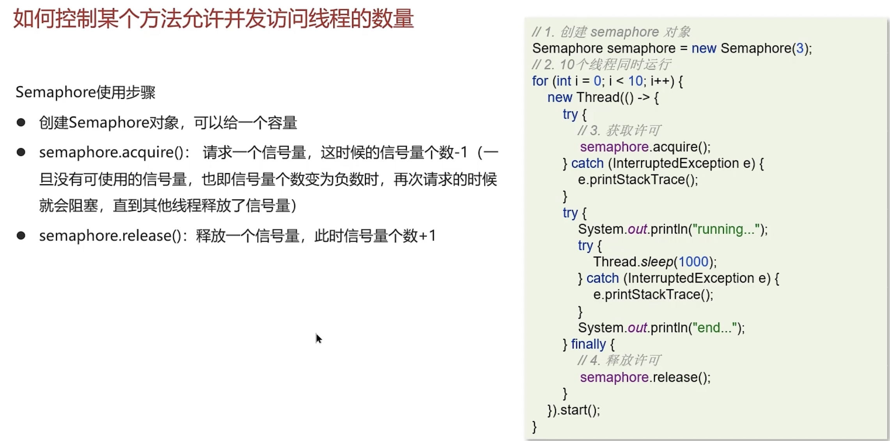

###  ThreadLocal

> [!IMPORTANT]
>
> > **ThreadLocal 作用：让变量在每个线程里有独立副本，线程间互不干扰**
> >
> > > **每个线程 (Thread)** 都维护一个 **ThreadLocalMap (key=ThreadLocal实例，value=线程内独享变量值)**
> > >
> > > > **ThreadLocal key 是弱引用，value 是强引用 → key 被GC回收后 value 可能泄漏**
>
> **ThreadLocal操作时，在ThreadLocalMap中通过key找到的自己的value去操作。**

#### 关键类结构

```java
public class ThreadLocal<T> {
  
  // ......
  static class ThreadLocalMap {
        /**
         * The entries in this hash map extend WeakReference, using
         * its main ref field as the key (which is always a
         * ThreadLocal object).  Note that null keys (i.e. entry.get()
         * == null) mean that the key is no longer referenced, so the
         * entry can be expunged from table.  Such entries are referred to
         * as "stale entries" in the code that follows.
         */
        static class Entry extends WeakReference<ThreadLocal<?>> {
            /** The value associated with this ThreadLocal. */
            Object value;

            Entry(ThreadLocal<?> k, Object v) {
                super(k);
                value = v;
            }
        }

        /**
         * The initial capacity -- MUST be a power of two.
         */
        private static final int INITIAL_CAPACITY = 16;

        /**
         * The table, resized as necessary.
         * table.length MUST always be a power of two.
         */
        private Entry[] table;
    
    // ......
  }
	// ......
}
```


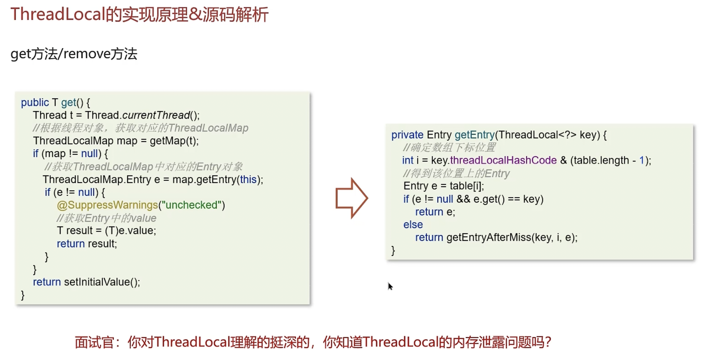


#### 四种引用类型（按强度排序）

| 类型                           | 强度 | 是否影响GC                                    | 用途                    |
| ------------------------------ | ---- | --------------------------------------------- | ----------------------- |
| **强引用（StrongReference）**  | 最强 | 只要存在强引用指向对象，GC 就不会回收该对象。 | 默认引用方式            |
| **软引用（SoftReference）**    | 次之 | ✅ 否（内存不足时才回收）                      | 缓存场景                |
| **弱引用（WeakReference）**    | 更弱 | ✅ 否（GC 时立即回收）                         | ThreadLocal、Map 缓存等 |
| **虚引用（PhantomReference）** | 最弱 | ✅ 否（无法获取对象）                          | 跟踪对象被回收的过程    |

##### 🧩  **从代码写法上区分**

```java
// 强引用，obj = null; 才可能被回收
Object strong = new Object();

// 软引用，当内存不足时才会被回收（JVM 抛出 OOM 前会尝试回收软引用对象）。
SoftReference<Object> soft = new SoftReference<>(new Object());

// 弱引用，只要发生 GC，不管内存是否紧张，都会被回收。
WeakReference<Object> weak = new WeakReference<>(new Object());

// 虚引用，不能通过 .get() 获取对象本身（永远返回 null）。主要用于跟踪对象被回收的过程，通常配合 ReferenceQueue 使用。
ReferenceQueue<Object> queue = new ReferenceQueue<>();
PhantomReference<Object> phantom = new PhantomReference<>(new Object(), queue);
```

##### 🧩  补充说明

- **ReferenceQueue** ：
  - 可以与软、弱、虚引用一起使用；
  - 当对象被回收后，对应的引用对象会被放入该队列中，可用于监听回收事件。

###  区分 JMM 和 ThreadLocal

| 特性           | JMM                                 | ThreadLocal                |
| -------------- | ----------------------------------- | -------------------------- |
| 目的           | 多线程间共享变量的同步和一致性      | 每个线程拥有自己的变量副本 |
| 是否共享数据   | ✅ 是                                | ❌ 否                       |
| 主要解决的问题 | 可见性、有序性、原子性              | 避免线程间干扰             |
| 关键字支持     | `volatile`, `synchronized`, `final` | 无关键字，通过 API 实现    |

###  面试题

> [!IMPORTANT]
>
> **线程中的参数？**
>
> 在线程池中一共有7个核心参数：
>
> 1. corePoolSize 核心线程数目 - 池中会保留的最多线程数
> 2. maximumPoolSize 最大线程数目 - 核心线程+救急线程的最大数目
> 3. keepAliveTime 生存时间 - 救急线程的生存时间，生存时间内没有新任务，此线程资源会释放
> 4. unit 时间单位 - 救急线程的生存时间单位，如秒、毫秒等
> 5. workQueue - 当没有空闲核心线程时，新来任务会加入到此队列排队，队列满会创建救急线程执行任务
> 6. threadFactory 线程工厂 - 可以定制线程对象的创建，例如设置线程名字、是否是守护线程等
> 7. handler 拒绝策略 - 当所有线程都在繁忙，workQueue 也放满时，会触发拒绝策略
>
> 拒绝策略有4种，当线程数过多以后，第一种是抛异常、第二种是由调用者执行任务、第三是丢弃当前的任务，第四是丢弃最早排队任务。默认是直接抛异常。
>
> **线程池执行原理？**
>
> 在使用execute方法提交一个Runnable对象时：
>
> 1. 会先判断当前线程池Q中的线程数是否小于corePooISize
> 2. 如果小于则创建新线程并执行runnable
> 3. 如果大于或者等于，则尝试将Runnable加入到workQueue中
> 4. 如果workQueue没满，则将Runnable正常入队，等待执行
> 5. 如果workQueue满了，则会入队失败，那么会尝试继续增加线程（救急线程）
> 6. 判断当前线程池中的线程数是否小于maximumpoolSize
> 7. 如果小于，则创建新线程（救急线程）并执行任务
> 8. 同时救急线程和核心线程执行完当前任务后，会从阻塞队列workQueue选取任务执行
> 9. 如果大于等于，则执行拒绝策略，拒绝此Runnable
>
> **线程池中有哪些常见的阻塞队列？**
>
> Jdk中提供了很多阻塞队列，开发中常见的有两个：`ArrayBlockingQueue`和`LinkedBlockingQueue`
>
> `ArrayBlockingQueue`和`LinkedBlockingQueue`是Java中两种常见的阻塞队列，它们在实现和使用上有一些关键的区别。
>
> 首先，**有界无界问题**，`ArrayBlockingQueue`是一个有界队列，它在创建时必须指定容量，并且这个容量不能改变。而`LinkedBlockingQueue`默认是无界的，但也可以在创建时指定最大容量，使其变为有界队列。
>
> 其次，它们在**内部数据结构**上也有所不同。`ArrayBlockingQueue`是基于数组实现的，而`LinkedBlockingQueue`则是基于链表实现的。这意味着`ArrayBlockingQueue`在访问元素时可能会更快，因为它可以直接通过索引访问数组中的元素。而`LinkedBlockingQueue`则在添加和删除元素时可能更快，因为它不需要移动其他元素来填充空间。
>
> 另外，它们在**加锁机制**上也有所不同。`ArrayBlockingQueue`使用一把锁来控制对队列的访问，这意味着读写操作都是互斥的。而`LinkedBlockingQueue`则使用两把锁，一把用于控制读操作，另一把用于控制写操作，这样可以提高并发性能。
>
> **如何设置核心线程数（https://www.yuque.com/jingdianjichi/kwag7a/wt0yaa4osiheqwua）？**
>
> 简单回答可以如下：
>
> ① 高并发、任务执行时间短 -->（ CPU核数+1 ），减少线程上下文的切换
>
> ② 并发不高、任务执行时间长
>
> - IO密集型的任务 --> (CPU核数 * 2 + 1)
> - 计算密集型任务 --> （ CPU核数+1 ）
>
> ③ 并发高、业务执行时间长，解决这种类型任务的关键不在于线程池而在于整体架构的设计，看看这些业务里面某些数据是否能做缓存是第一步，增加服务器是第二步，至于线程池的设置，设置参考（2）
>
> **线程池的种类有哪些？**
>
> 在jdk中默认提供了4中方式创建线程池
>
> 第一个是：newCachedThreadPool创建一个可缓存线程池，如果线程池长度超过处理需要，可灵活回收空闲线程，若无可回收，则新建线程。 
>
> 第二个是：newFixedThreadPool 创建一个定长线程池，可控制线程最大并发数，超出的线程会在队列中等待。 
>
> 第三个是：newScheduledThreadPool 创建一个定长线程池，支持定时及周期性任务执行。 
>
> 第四个是：newSingleThreadExecutor 创建一个单线程化的线程池，它只会用唯一的工作线程来执行任 务，保证所有任务按照指定顺序(FIFO, LIFO, 优先级)执行。
>
> **为什么不要用Executors创建线程池？**
>
> 
>
> 一般推荐使用ThreadPoolExecutor来自定义创建线程池。
>
> **使用场景**
>
> 见1.15.5
>
> **谈谈你对ThreadLocal的理解**
>
> **候选人**：
>
> 嗯，是这样的~~
>
> ThreadLocal 主要功能有两个，第一个是可以实现资源对象的线程隔离，让每个线程各用各的资源对象，第二个是实现了线程内的资源共享
>
> **面试官**：好的，那你知道ThreadLocal的底层原理实现吗？
>
> **候选人**：
>
> 嗯，知道一些~
>
> 在ThreadLocal内部维护了一个一个 ThreadLocalMap 类型的成员变量，用来存储资源对象
>
> 当我们调用 set 方法，就是以 ThreadLocal 自己作为 key，资源对象作为 value，放入当前线程的 ThreadLocalMap 集合中
>
> 当调用 get 方法，就是以 ThreadLocal 自己作为 key，到当前线程中查找关联的资源值
>
> 当调用 remove 方法，就是以 ThreadLocal 自己作为 key，移除当前线程关联的资源值
>
> **面试官**：好的，那关于ThreadLocal会导致内存溢出这个事情，了解吗？
>
> **候选人**：
>
> 嗯，我之前看过源码，我想一下~~
>
> 是因为ThreadLocalMap 中的 key 被设计为弱引用，它是被动的被GC调用释放key，不过关键的是只有key可以得到内存释放，而value不会，因为value是一个强引用（内存泄漏的根本原因是 **Key 的弱引用与 Value 的强引用** 的混合使用，导致生命周期不一致）。
>
> 可以在使用ThreadLocal 时都把它作为静态变量（即强引用），因此无法被动依靠 GC 回收；建议主动的remove 释放 key，这样就能避免内存溢出。

#  redis

##  缓存问题

###  缓存三兄弟

####  缓存穿透

**缓存穿透** 是指用户请求的数据既不在 Redis 缓存中，也不在数据库中，导致每次请求都会直接查询数据库，最终返回空结果。

**解决方法：**

- **缓存空值：**
  - 将空结果缓存到 Redis 中，并设置一个较短的过期时间（大量无效 key，可能会占用缓存空间）。
- **布隆过滤器：**
  - 对请求的 key 进行预检查。布隆过滤器是一种高效的数据结构（位图，只存key），可以在极低的空间复杂度下判断某个 key 是否可能存在（可能误判）。

| **解决方案** | 使用布隆过滤器、缓存空值 |
| ------------ | ------------------------ |

> [!IMPORTANT]
>
> **什么是缓存穿透？怎么解决？**
>
> 缓存穿透是指查询一个一定不存在的数据，由于存储层查不到数据因此不写入缓存，这将导致这个不存在的数据每次请求都要到 DB 去查询。通常都会用布隆过滤器来解决它。

> [!IMPORTANT]
>
> **布隆过滤器？**
>
> 布隆过滤器用于检索元素是否在集合中，我们采用 Redisson 实现。其底层原理为：初始化一个位图（较大的二进制数组，初始值都为 0），当一个 key 到来，通过 3 次 hash 计算，将结果对数组长度取模得到数组下标，把对应位置的值从 0 改为 1，以此标记该 key 存在。查找时流程相同。 布隆过滤器存在误判情况，可设置误判率，通常控制在 5% 以内。要降低误判率，需增加位图长度。不过，5% 以内的误判率在多数项目中是可接受的，能避免高并发时数据库压力过大。 

####  缓存击穿

**缓存击穿** 是指某个热点数据（即访问频率非常高的数据）过期的瞬间，大量请求同时涌入数据库查询该数据，导致数据库压力骤增。

| 解决方案         | 方法                                                         |
| ---------------- | ------------------------------------------------------------ |
| **设置永不过期** | 对热点数据不设置过期时间，通过后台线程定期更新缓存数据。（高可用，可能数据不一致） |
| **使用互斥锁**   | 使用分布式锁确保只有一个线程能够加载数据到缓存中。（强一致，性能低） |

> [!IMPORTANT]
>
> **什么是缓存击穿？怎么解决？**
>
> 缓存击穿是指在高并发场景下，某个热点数据的缓存过期或被删除，导致大量请求直接访问数据库，给数据库带来巨大压力，甚至可能引发宕机。
>
> - 设置永不过期的热点数据：
>
>   对某些热点数据，可以设置其缓存永不过期，避免因缓存失效导致数据库压力激增。
>
> - 互斥锁（Mutex Lock）：
>
>   当缓存失效时，使用互斥锁确保只有一个请求去数据库加载数据，其他请求等待该请求完成后，直接从缓存中获取数据。

####  缓存雪崩

**缓存雪崩** 是指大量缓存数据在同一时间失效或过期，导致系统突然收到大量缓存未命中的请求，这些请求直接打到数据库上，引发数据库压力骤增，甚至可能导致系统崩溃。

| **设置随机过期时间**   | 为缓存设置随机过期时间，分散缓存失效的时间点。               |
| ---------------------- | ------------------------------------------------------------ |
| **构建高可用缓存集群** | 使用 Redis 集群或哨兵模式，提升缓存系统的可靠性。            |
| **添加多级缓存**       | Guava。                                                      |
| **服务熔断与限流**     | 触发熔断机制或限流控制，保护数据库免受高并发请求的冲击。（gateway） |

> [!IMPORTANT]
>
> **什么是缓存雪崩？怎么解决？**
>
> 缓存雪崩是指在同一时段大量的缓存key同时失效或者Redis服务宕机，导致大量的请求到达数据库，带来巨大的压力。
>
> 解决方案主要是，可以将缓存失效时间分散开。比如，可以在原有的失效时间基础上增加一个随机值，比如1-5分钟随机。这样，每一个缓存的过期时间的重复率就会降低，就很难引发集体失效的事件。

###  双写一致性（mysql的数据如何与redis进行同步）

无论**先更新 MySQL，再更新 Redis**还是**先删除 Redis 缓存，再更新 MySQL**，都会导致不一致。

**延迟双删**

> 缓存双删策略能**大大降低**脏数据概率，但不能**绝对保障强一致性**，尤其在高并发读写场景，依然可能因为**时序问题、失败重试、分布式延迟**等导致数据短暂不一致

- 流程 ：
  - 删除 Redis 缓存。
  - 更新 MySQL 数据库。
  - 延迟一段时间后再次删除 Redis 缓存，以确保缓存中没有旧数据。
- 数据不一致：
  - 例如，线程 A 先删除缓存，准备更新数据库，在这期间线程 B 查询缓存，发现无数据后从数据库读取旧数据并写入缓存，随后线程 A 更新数据库并执行第二次缓存删除，但此时缓存中旧数据已被线程 B 写入 。
- 常用优化手段包括**加锁保护、失败重试、版本控制**

| **双写策略** | 包括先更新 MySQL 再更新 Redis、先删除 Redis 再更新 MySQL、延迟双删等。 |
| ------------ | ------------------------------------------------------------ |
| **异步通知** | 通过MQ（要保证可靠）或者canal（监听mysql的binlog）。         |

```
MySQL 
 └── binlog (记录所有数据变更)

Canal Server (伪装从库)
 └── 订阅binlog
 └── 发送 binlog 事件 → Canal Client (消费端)

Canal Client (你写的代码)
 └── 解析binlog 变更事件 (如 UPDATE/DELETE)
 └── 根据变更 → 自动刷新 Redis 缓存
```

> **Canal Server** 只是负责抓取 MySQL 的 binlog 并转发

> **Canal Client (消费端)** 是你自己写的业务逻辑，拿到变更数据后「自动更新Redis」

> [!IMPORTANT]
>
> **双写一致性？**
>
> 在近期项目中（举例说明），
>
>  **1️⃣**  **强一致性 (Redisson 分布式锁)**
>
> - 读数据 → 加**共享锁 (读锁)**
> - 写数据 → 加**排他锁 (写锁)**
> - **保障读写互斥**，防止写期间被读到脏数据
> - **注意点**：读写操作需使用**同一把锁 (同一个key)**，否则锁不生效
>
> > **适用场景**：强一致性要求高，读写频率均衡的数据
>
>  **2️⃣**  **最终一致性 (Canal + 异步同步)**
>
> ​	异步：不等对方确认；同步：等待对方确认。
>
> - 项目对部分数据允许 **短暂延迟** (99% 业务场景可接受)
> - 采用**阿里 Canal 组件**，实现**数据库更新→缓存同步**
> - **实现方式**：
>   - Canal 伪装为 MySQL 从库，订阅 binlog
>   - 数据变更后，Canal 实时捕捉变更，转发给客户端
>   - Canal 客户端读取 binlog → 刷新Redis缓存
> - **优点**：无须改动业务代码，仅需部署 Canal 服务
>
> > **适用场景**：读远大于写，数据延迟可容忍的数据 (如商品价格等)
>
> **那这个主备延迟？**
>
> > **MySQL主库 的 binlog → Canal Server (伪装从库)** 之间的**binlog同步延迟**，需关注 binlog积压 和 Canal lag（同步延迟）
>
> **消费端/客户端更新缓存时的幂等处理？**
>
> > 消费端幂等 = 处理重复消息，避免缓存重复写/错写
>
> > → 删除操作天然幂等，更新操作做时间戳判断
>
> **那这个排他锁是如何保证读写、读读互斥的呢？**
>
> 其实排他锁底层使用的也是`SETNX`，它保证了同时只能有一个线程操作方法。 
>
> **你听说过延时双删吗？为什么不用它呢？**
>
> 延迟双删，如果是写操作，我们先把缓存中的数据删除，然后更新数据库，最后再延时删除缓存中的数据。其中，这个延时多久不太好确定。在延时的过程中，可能会出现脏数据，并不能保证强一致性，所以没有采用它。
>
> **延时双删 VS Canal**
>
> > 缓存双删策略和 Canal方案 都能解决**数据库与缓存一致性问题**，但适用场景和权衡点不同
>
> > 如果业务对**强一致性要求高** (如支付、订单)，我更倾向用**缓存双删**，虽然需要改代码，但实时性高
>
> > 如果业务允许**短暂不一致** (如商品信息、排行榜)，我更倾向用**Canal方案**，不侵入业务代码，维护简单
>
> > 实际项目中，我们也有**混合方案**：关键表用双删，非关键表用Canal同步
> >
> > **终极口诀 (快速背)**
> >
> > > **强一致用双删，读多写少靠Canal**
> >
> > > **改代码选双删，低侵入选Canal**

###  持久化

在Redis中提供了两种数据持久化的方式：1) RDB；2) AOF。

#### ✅ RDB（Redis Database）

**📌 简介：**

- RDB 是一种 **快照（snapshot）持久化方式** 。
- 它会在指定的时间间隔内将内存中的数据集快照写入磁盘（通常是一个 `dump.rdb` 文件）。

**🔧 工作原理：**

1. Redis 主进程通过 `fork()` 创建一个子进程；
2. 子进程将当前内存中的数据库数据写入临时的 RDB 文件；
3. 写入完成后替换旧的 RDB 文件。

####  ✅ AOF（Append Only File）

 **📌 简介：**

- AOF 是一种 **日志追加持久化方式** 。
- Redis 会将每一个写操作命令（如 `SET`, `DEL` 等）以协议格式文本的方式追加到文件中。

 🔧 工作原理：

1. Redis 接收到写命令后，在内存执行的同时，将命令追加到 AOF 缓冲区；
2. 根据配置策略（如每秒同步、每次写都同步），将缓冲区内容写入磁盘；
3. Redis 重启时优先加载 AOF 文件来恢复数据。


| 特性           | RDB                                                        | AOF                               |
| -------------- | ---------------------------------------------------------- | --------------------------------- |
| **原理**       | 生成内存快照并保存为二进制文件。                           | 追加记录每个写操作到日志文件。    |
| **文件大小**   | 文件体积小，紧凑。                                         | 文件体积较大，可能膨胀。          |
| **恢复速度**   | 恢复速度快，适合大规模数据恢复。                           | 恢复速度慢，需重放日志。          |
| **数据安全性** | 数据丢失风险较高，快照之间的时间间隔可能导致部分数据丢失。 | 数据完整性高，几乎不会丢失数据。  |
| **性能影响**   | 性能高，但 `fork`子进程可能对资源有一定消耗。              | 性能较低，尤其是 `always`策略下。 |

> [!IMPORTANT]
>
> **这两种持久化方式有什么区别呢？**
>
> RDB是一个快照文件。它是把redis内存存储的数据写到磁盘上。当redis实例宕机恢复数据的时候，可以从RDB的快照文件中恢复数据。AOF的含义是追加文件。当redis执行写命令的时候，都会存储到这个文件中。当redis实例宕机恢复数据的时候，会从这个文件中再次执行一遍命令来恢复数据。
>
> **这两种方式，哪种恢复的比较快呢？**
>
> RDB因为是二进制文件，保存时体积也比较小，所以它恢复得比较快。但它有可能会丢数据。我们通常在项目中也会使用AOF来恢复数据。虽然AOF恢复的速度慢一些，但它丢数据的风险要小很多。在AOF文件中可以设置刷盘策略。我们当时设置的就是每秒批量写入一次命令。
>
> > 在生产环境中，**推荐同时开启 RDB 和 AOF** ，取长补短： 
>
> - 使用 RDB 做定期快照，用于快速恢复；
> - 使用 AOF 做实时日志记录，保证数据尽可能不丢失；
> - Redis 重启时优先加载 AOF 文件。

###  数据过期策略

####  **📌**  **Redis 过期删除策略总结 (面试版)**

> Redis 采用 **惰性删除 + 定期删除** 双策略，互补保障

##### **1️⃣** **惰性删除 (Lazy Expiration)**

> 只在访问 key 时，才检查是否过期，过期则立刻删除

✅ 优点：CPU 资源开销低

❌ 缺点：过期 key 不被访问，会长期占用内存 (内存泄漏风险)

##### **2️⃣** **定期删除 (Active Expiration)**

> Redis 定期随机采样一批设置过期时间的 key，检查并删除过期 key

定期删除有 **两种执行模式** 👇

| **模式**     | **执行频率**                 | **每次最大耗时** |
| ------------ | ---------------------------- | ---------------- |
| **SLOW模式** | 默认 10次/秒 (hz配置项)      | ≤25ms            |
| **FAST模式** | 事件循环驱动 (不低于2ms间隔) | ≤1ms             |

✅ 优点：及时清理不用依赖访问

❌ 缺点：增加一定 CPU 负担

> [!IMPORTANT]
>
> **Redis的数据过期策略有哪些？**
>
> 在redis中提供了两种数据过期删除策略：
>
> 第一种是**惰性删除**，在设置该key过期时间后，我们不去管它，当需要该key时，我们在检查其是否过期，如果过期，我们就删掉它，反之返回该key。
>
> 第二种是**定期删除**，就是说每隔一段时间，我们就对一些key进行检查，删除里面过期的key
>
> 定期清理的两种模式：（通过控制频率和每次操作时间）
>
> - SLOW模式是定时任务，执行频率默认10hz，每次不超过25ms，以通过修改配置文件redis.conf的hz选项来调整这个次数
> - FAST模式执行频率不固定，每次事件循环会尝试执行，但两次间隔不低于2ms，每次耗时不超过1ms
>
> Redis的过期删除策略：惰性删除＋定期删除两种策略进行**配合使用**。

###  数据淘汰策略

| 淘汰策略            | 描述                                                        |
| ------------------- | ----------------------------------------------------------- |
| **noeviction**      | 不淘汰任何数据，新增写操作会报错。                          |
| **volatile-lru**    | 从设置了过期时间的 key 中，按照 LRU 算法淘汰数据。          |
| **volatile-lfu**    | 从设置了过期时间的 key 中，按照 LFU 算法淘汰数据。          |
| **volatile-ttl**    | 从设置了过期时间的 key 中，优先淘汰剩余生存时间最短的 key。 |
| **volatile-random** | 从设置了过期时间的 key 中随机选择并淘汰数据。               |
| **allkeys-lru**     | 在所有 key 中，按照 LRU 算法淘汰数据。                      |
| **allkeys-lfu**     | 在所有 key 中，按照 LFU 算法淘汰数据。                      |
| **allkeys-random**  | 在所有 key 中随机选择并淘汰数据。                           |

> [!IMPORTANT]
>
>  **Redis的数据淘汰策略有哪些？**
>
> 这个在redis中提供了很多种，默认是不删除任何数据，内部不足时直接报错。这个可以在redis的配置文件中进行设置。里面有两个非常重要的概念：一个是LRU，另外一个是LFU。LRU的意思就是最少最近使用。它会用当前时间减去最后一次访问时间。这个值越大，则淘汰优先级越高。LFU的意思是最少频率使用。它会统计每个key的访问频率。值越小，淘汰优先级越高。我们在项目中设置的是`allkeys-lru`，它会挑选最近最少使用的数据进行淘汰，把一些经常访问的key留在redis中。
>
> **数据库有1000万数据，Redis只能缓存20w数据。如何保证Redis中的数据都是热点数据？**
>
> 以使用`allkeys-lru`（挑选最近最少使用的数据淘汰）淘汰策略。那留下来的都是经常访问的热点数据。
>
> **Redis的内存用完了会发生什么？**
>
> 嗯~，这个要看redis的数据淘汰策略是什么。如果是默认的配置，redis内存用完以后则直接报错。我们当时设置的是`allkeys-lru`策略，把最近最常访问的数据留在缓存中。

##  分布式锁

Redisson分布式锁：


| 对比                     | Redis                    | Redisson                                    |
| ------------------------ | ------------------------ | ------------------------------------------- |
| **可重入性**             | 不支持，基于 `SETNX`实现 | 支持，通过线程标识和计数器实现              |
| **自动续期（Watchdog）** | 不支持                   | 支持                                        |
| **锁超时机制**           | 支持                     | 支持                                        |
| **实现方式**             | 简单，仅依赖 Redis 命令  | 复杂，使用 `Lua` 脚本（保证原子性）和计数器 |

#### **📌** **Redis 分布式锁实现 (面试标准版)**

##### **1️⃣** **基础实现原理**

> Redis 利用命令 **SETNX + EXPIRE** 实现分布式锁

- SETNX key value (SET if Not Exists)：只有 key 不存在时才设置，保证互斥性
- EXPIRE key timeout：设置 key 过期时间，防止死锁 (锁永远不释放)

> Redis 2.6.12+ 支持 **SET key value NX PX timeout** 原子指令，一步完成加锁+过期 (推荐)

##### **2️⃣**  **项目中 Redisson 实现原理**

> Redisson 封装了更健壮的分布式锁，支持 **锁续期 (看门狗)、可重入、自旋等待**

- **加锁**
  - RLock.lock() 自动设置锁和默认30秒过期时间
- **锁续期 (看门狗机制)**
  - 业务未完成时，Redisson后台定时 (10s) 自动续期，保证锁不会意外失效
- **可重入性**
  - 同一线程多次获取锁时不会死锁，Redisson内部用 **Hash结构**
  - **大Key** = 业务自定义锁名
  - **小Key** = 当前线程唯一标识
  - **Value** = 重入次数 (计数器)
- **高并发自旋等待**
  - 客户端1持有锁，客户端2不会立即失败，而是自旋尝试获取锁 (提升吞吐)

> [!IMPORTANT]
>
> **Redis分布式锁如何实现？**
>
> 在redis中提供了一个命令`SETNX`(SET if not exists)。由于redis是单线程的，用了这个命令之后，只能有一个客户端对某一个key设置值。在没有过期或删除key的时候，其他客户端是不能设置这个key的。
>
> **那你如何控制Redis实现分布式锁的有效时长呢？**
>
> 项目中未用Redis的`SETNX`指令，而是采用Redisson框架。使用时需手动加锁，能控制锁失效时间与等待时间 。业务执行未完成时，Redisson的看门狗机制会定时检查业务是否持有锁，若持有则延长锁持有时间。业务完成后手动释放锁。高并发场景下，客户1持有锁时客户2不会立即被拒，而是自旋尝试获取，客户1释放后客户2可马上持有，提升了性能。 
>
>  **Redisson实现的分布式锁是可重入的吗？**
>
> 是可重入的，以此防止死锁。内部通过判断锁是否由当前线程持有实现重入机制，若为当前线程持有，则对重入次数计数，释放锁时相应减一。存储数据采用hash结构，大key依业务定制，小key设为当前线程唯一标识，value用来记录当前线程重入次数。 
>
> **Redisson实现的分布式锁能解决主从一致性的问题吗？**
>
> 这个是不能的。比如，当线程1加锁成功后，master节点数据会异步复制到slave节点，此时如果当前持有Redis锁的master节点宕机，slave节点被提升为新的master节点，假如现在来了一个线程2，再次加锁，会在新的master节点上加锁成功，这个时候就会出现两个节点同时持有一把锁的问题。
>
> 我们可以利用Redisson提供的红锁来解决这个问题，它的主要作用是，不能只在一个Redis实例上创建锁，应该是在多个Redis实例上创建锁，并且要求在大多数Redis节点上都成功创建锁，红锁中要求是Redis的节点数量要过半。这样就能避免线程1加锁成功后master节点宕机导致线程2成功加锁到新的master节点上的问题了
>
> 但是，如果使用了红锁，因为需要同时在多个节点上都添加锁，性能就变得非常低，并且运维维护成本也非常高，所以，我们一般在项目中也不会直接使用红锁，并且官方也暂时废弃了这个红锁。
>
>  **如果业务非要保证数据的强一致性，这个该怎么解决呢？**
>
> Redis本身就是支持高可用的，要做到强一致性，就非常影响性能，所以，如果有强一致性要求高的业务，建议使用ZooKeeper实现的分布式锁，它是可以保证强一致性的。

##  分布式架构

> [!TIP]
>
> **通常，可以使用Spring Cloud GateWay，实现读写分离，将客户端的读请求，转发给从节点，写请求，转发给主节点。**

> [!IMPORTANT]
>
>  **Redis集群有哪些方案，知道吗？**
>
> 在Redis中提供的集群方案总共有三种：主从同步、哨兵模式、Redis分片集群。

###  主从同步（一主多从）

> [!IMPORTANT]
>
> **那你来介绍一下主从同步。**
>
> 单节点Redis的并发能力是有上限的，要进一步提高Redis的并发能力，可以搭建主从集群，实现读写分离。一般都是一主多从，主节点负责写数据，从节点负责读数据，主节点写入数据之后，需要把数据同步到从节点中。
>
> **能说一下，主从同步数据的流程吗？**
>
> ```
> // 这里，日志文件 是 复制积压缓冲区，不是AOF!!!
> ```
>
> | **特性**         | **复制积压缓冲区** | **AOF**          |
> | ---------------- | ------------------ | ---------------- |
> | 用途             | 主从同步           | 数据持久化       |
> | 类型             | 内存中的环形缓冲区 | 磁盘上的文本文件 |
> | 是否影响主从同步 | ✅ 是               | ❌ 否             |
> | 是否持久化       | ❌ 否               | ✅ 是             |
>
> Redis主从同步分全量同步与增量同步。 
>
> - **全量同步**：适用于节点首次连接主节点。流程如下：    
>   - 从节点携带自身`replication id`和`offset`偏移量，向主节点请求同步数据。   
>   - 主节点对比自身与从节点的`replication id`，若不同，判定为首次同步，将自身的`replication id`和`offset`发送给从节点，确保信息一致。    
>   - 主节点执行`BGSAVE`生成`RDB`文件并发送给从节点。从节点先清空自身数据，再执行该`RDB`文件。期间主节点若有新请求，会以命令形式记录在缓冲区日志文件，最后日志文件也发送给从节点，以此保证数据完全一致，后续同步依赖此日志文件。 
>
> -  **增量同步**：从节点重启后数据可能不一致，此时向主节点请求同步。主节点判断非首次请求，获取从节点的`offset`值，从命令日志中提取该`offset`值之后的数据，发送给从节点完成同步。 
>
>  **怎么保证Redis的高并发高可用？**
>
> 项目常通过搭建Redis主从集群，并结合哨兵模式保障高并发与高可用。哨兵模式能监控主从服务，实现自动故障恢复与通知。若master故障，Sentinel会将一个slave提升为master，故障实例恢复后以新master为准。同时，Sentinel为Redis客户端提供服务发现，集群故障转移时，及时将最新信息推送给客户端。 

###  哨兵模式（一主多从）

> 哨兵解决「高可用」

主观下线是单个哨兵节点的初步判断，而客观下线是多个哨兵节点经过协商和投票后对主节点状态的最终认定，是触发故障转移的重要依据。

#### **Redis集群脑裂现象 + 解决方案**

 **📌 什么是「Redis 脑裂」？**

> 由于网络分区 (分布式系统经典问题)，Redis 集群出现 **两个Master同时对外服务**，数据产生分裂和丢失。

 **📌 脑裂典型场景**

 ️⃣ Master 和 Sentinel 之间网络中断

→ Sentinel 误以为 Master 宕机，发起**选举**

→ 某个 Slave 被切换为新 Master

 ️⃣ 客户端和旧 Master 之间网络正常

→ 继续向旧 Master 写数据

→ 新旧 Master 产生「数据割裂」

 ️⃣ 网络恢复

→ 旧 Master 被强制降级为 Slave

→ 同步新 Master 数据 (原数据被覆盖丢失)

**📌 解决方案 (配置级)**

| **最小从节点数量** (min-slaves-to-write)  | 配置主节点写入前，至少有X个健康从节点   | **降低主节点孤立风险** |
| ----------------------------------------- | --------------------------------------- | ---------------------- |
| **主从复制延迟限制** (min-slaves-max-lag) | 若从节点延迟超过阈值 → 主节点拒绝写请求 | **防止数据严重落后**   |

> [!IMPORTANT]
>
>  **你们使用Redis是单点还是集群，哪种集群？**
>
> 我们当时使用的是主从（1主1从）加哨兵。一般单节点不超过10G内存，如果Redis内存不足则可以给不同服务分配独立的Redis主从节点。尽量不做分片集群。因为集群维护起来比较麻烦，并且集群之间的心跳检测和数据通信会消耗大量的网络带宽，也没有办法使用Lua脚本和事务。
>
> **Redis集群脑裂，该怎么解决呢？**
>
> 网络问题可能引发Redis脑裂。因网络分区，Sentinel无法感知master心跳，选举slave成为新master，但是客户端与master保持连接，导致出现两个master。客户端继续向旧master写入，新master无法同步这些数据。网络恢复后，旧master降为slave从新master同步数据，造成旧master数据大量丢失。 解决方法可在Redis配置中设置：一是设定master的最少slave节点个数，如设至少一个从节点才可同步数据；二是设置主从数据复制与同步的延迟时间，不达标则拒绝请求，以此避免大量数据丢失。 

###  分片集群（多主多从）

> Cluster解决「高可用 + 高并发容量」

> [!IMPORTANT]
>
> **Redis的分片集群有什么作用？**
>
> 分片集群主要解决的是海量数据存储的问题，集群中有多个master，每个master保存不同数据，并且还可以给每个master设置多个slave节点，就可以继续增大集群的高并发能力。同时每个master之间通过ping监测彼此健康状态，就类似于哨兵模式了。客户端请求可以访问集群任意节点，最终都会被转发到正确节点。
>
> **Redis分片集群中数据是怎么存储和读取的？**
>
> Redis 集群引入了哈希槽的概念，有 16384 个哈希槽，集群中每个主节点绑定了一定范围的哈希槽范围，key通过CRC16校验后对16384取模来决定放置哪个槽，通过槽找到对应的节点进行存储。
>
> ```java
> // 示例
> Master1: slot 0~5000
> Master2: slot 5001~10000
> Master3: slot 10001~16383
> ```
>
> 取值的逻辑是一样的。

##  单线程

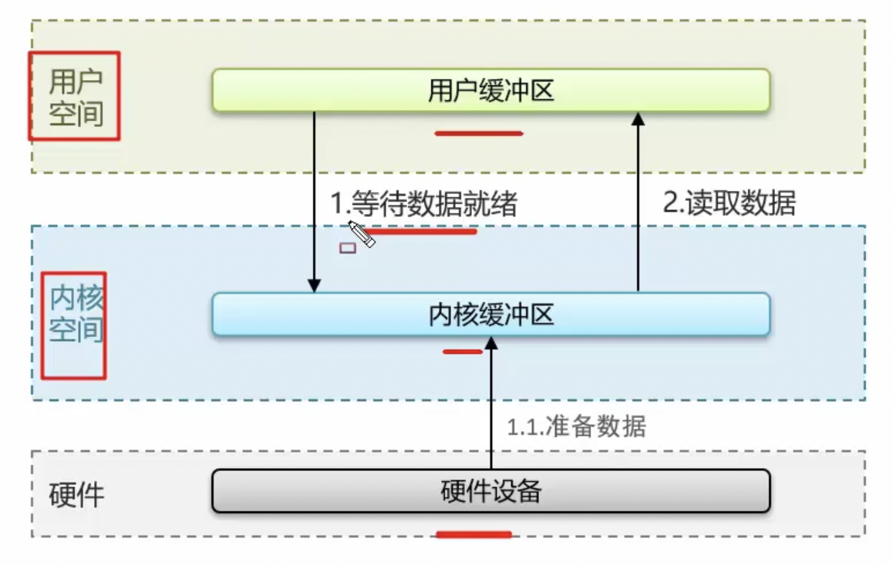

数据拷贝和等待数据会浪费时间。

**阻塞IO（Java中BIO）：**调用一次recvtrom函数


**非阻塞IO（Java中NIO）：**反复调用recvtrom函数，获取数据。


**IO多路复用（前面IO中的解释更清晰）：**


**通知方式：**`select`, `poll`, `epoll`

**差异：**

- select和poll只会通知用户进程有Socket就绪，但不确定具体是哪个Socket，需要用户进程逐个遍历Socket来确认
- epoll则会在通知用户进程Socket就绪的同时，把已就绪的Socket写入用户空间

**在Redis6.0之后：**

| 阶段                           | 多线程             | 描述                             |
| ------------------------------ | ------------------ | -------------------------------- |
| **命令请求处理器中的命令转换** | ✅ 支持（I/O 线程） | 多线程解析客户端请求（数据转换） |
| **命令执行器（核心逻辑）**     | ❌ 不支持（主线程） | 单线程执行命令逻辑，保证一致性   |
| **命令回复处理器**             | ✅ 支持（I/O 线程） | 多线程写回客户端响应             |

> [!IMPORTANT]
>
> **Redis是单线程的，但是为什么还那么快？**
>
> - 完全基于内存的，C语言编写。
> - 采用单线程，避免不必要的上下文切换和竞争条件。多线程还要考虑线程安全问题。
> - 使用多路I/O复用模型。
>
>  **能解释一下I/O多路复用模型？**
>
> I/O多路复用是指利用单个线程来同时监听多个Socket，并且在某个Socket可读、可写时得到通知，从而避免无效的等待，充分利用CPU资源。目前的I/O多路复用都是采用的epoll模式实现，它会在通知用户进程Socket就绪的同时，把已就绪的Socket写入用户空间，不需要挨个遍历Socket来判断是否就绪，提升了性能。
>
> 其中Redis的网络模型就是使用**I/O多路复用**+**事件的处理器**来应对多个Socket请求，比如，提供了连接应答处理器、命令回复处理器，命令请求处理器；
>
> > Redis 6.0 引入 IO多线程，专门优化「网络读写 + 协议处理」
>
> > 命令执行仍单线程，确保数据安全

#  mysql

##  优化

###  如何定位慢查询

> [!IMPORTANT]
>
>  **MySQL中，如何定位慢查询？**
>
> MySQL本身也提供了慢查询日志功能。可以在MySQL的系统配置文件中**开启慢查询日志**，并设置SQL执行时间超过多少就记录到日志文件，比如我们之前项目设置的是2秒，超过这个时间的SQL就会记录在日志文件中，我们就可以在那里找到执行慢的SQL。

###  分析sql语句

> [!IMPORTANT]
>
>  **那这个SQL语句执行很慢，如何分析呢？**
>
> 如果一条SQL执行很慢，我们通常会使用MySQL的`EXPLAIN`命令来分析这条SQL的执行情况。
>
> - 通过`key`和`key_len`可以检查**是否命中了索引**，如果已经添加了索引，也可以判断**索引是否有效**。
> - 通过`type`字段可以查看SQL是否有优化空间，比如是否存在**全索引扫**描或**全表扫描**。
> - 通过`extra`建议可以判断**是否出现回表**情况，如果出现，可以尝试添加索引或修改返回字段来优化。

###  索引

> [!IMPORTANT]
>
> **了解过索引吗？（什么是索引）**
>
> 它是一种帮助MySQL高效获取数据的数据结构，主要用来提高数据检索效率，降低数据库的I/O成本。同时，索引列可以对数据进行排序，降低数据排序的成本，也能减少CPU的消耗。
>
>  **索引的底层数据结构了解过吗？**
>
> MySQL的默认存储引擎InnoDB使用的是B+树作为索引的存储结构。选择B+树的原因包括：节点可以有更多子节点，路径更短；磁盘读写代价更低，非叶子节点只存储键值和指针，叶子节点存储数据；B+树适合范围查询和扫描，因为叶子节点形成了一个双向链表。
>
> **B树和B+树的区别是什么呢？**
>
> - B树的非叶子节点和叶子节点都存放数据，而B+树的所有数据只出现在叶子节点，这使得B+树在查询时效率更稳定。
> - B+树在进行范围查询时效率更高，因为所有数据都在叶子节点，并且叶子节点之间形成了双向链表。

####  聚簇索引和非聚簇索引（二级索引）

聚簇索引叶子结点存放的是一整行数据，二级索引叶子结点存放的是索引及对应的主键id（指向数据行的指针）。


> [!IMPORTANT]
>
>  **什么是聚簇索引什么是非聚簇索引？**
>
> 聚簇索引是指数据与索引放在一起，B+树的叶子节点保存了整行数据，通常只有一个聚簇索引，一般是由主键构成。
>
> 非聚簇索引则是数据与索引分开存储，B+树的叶子节点存储的是索引键值以及指向对应数据行的指针。可以有多个非聚簇索引，通常我们自定义的索引都是非聚簇索引。

####  回表查询

eg: id, name在name索引的叶子结点可以找到。（name索引是二级索引，叶子结点存储了对应的主键值）


> [!IMPORTANT]
>
> **知道什么是回表查询吗？**
>
> 回表查询是指通过二级索引找到对应的主键值，然后再通过主键值查询聚簇索引中对应的整行数据的过程。

####  覆盖查询


> [!IMPORTANT]
>
> **知道什么叫覆盖索引吗？**
>
> 覆盖索引是指在`SELECT`查询中，返回的列全部能在索引中找到，避免了回表查询，提高了性能。使用覆盖索引可以减少对主键索引的查询次数，提高查询效率。

####  超大页优化

表 user 有如下结构：

| **id (PK)** | **name (索引)** | **age** | **email** |
| ----------- | --------------- | ------- | --------- |
|             | Alice           |         | …         |
|             | Bob             |         | …         |
| …           | …               | …       | …         |

目标需求 = 查询第 100000 页，每页 10 条，按 id 升序排序。

##### **❶**  **原始写法 (性能差)**

```sql
SELECT * FROM user
ORDER BY id
LIMIT 1000000, 10;
```

> 问题：MySQL 要扫描丢弃 100万行，非常耗时

##### **❷** **优化写法 (覆盖索引 + 子查询)**

```sql
SELECT u.*
FROM user u
JOIN (
  SELECT id 
  FROM user
  ORDER BY id
  LIMIT 1000000, 10
) temp ON u.id = temp.id;
```

| **步骤**  | **说明**                                      |
| --------- | --------------------------------------------- |
| 子查询    | SELECT id … LIMIT 只扫描索引列 (id)，速度极快 |
| 外层 join | 根据 id 直接通过主键快速定位完整数据行        |

> [!IMPORTANT]
>
> **MySQL超大分页怎么处理？**
>
> 超大分页通常发生在数据量大的情况下，使用`LIMIT`分页查询且需要排序时效率较低。
>
> 通过 **覆盖索引 + 子查询** 的方式，可以有效解决 MySQL 超大分页问题。其核心在于：
>
> - **子查询仅查主键或索引列** ，利用覆盖索引减少扫描范围。
> - **外层精准定位** ，通过主键索引快速获取完整数据行。

####  索引创建原则

说出4个重要的即可。


> [!IMPORTANT]
>
> **索引创建原则有哪些？**
>
> - 表中的数据量超过10万以上时考虑创建索引。
> - 选择查询频繁的字段作为索引，如查询条件、排序字段或分组字段。
> - 尽量使用复合索引，覆盖SQL的返回值。
> - 控制索引数量，因为索引虽然可以提高查询速度，但也会影响插入、更新的速度。

####  索引失效

a. 就是联合索引，使用时必须按照索引顺序使用，


b. address列的索引失效。


c. 对索引进行运算操作，索引失效。


d. 字符串不加单引号，自动进行类型转换，索引失效。


e. 以%开头的like模糊查询，索引失效。


like的使用：

- **百分号（`%`）**：代表任意数量（包括零个）的任意字符。
- **下划线（`_`）**：代表单个任意字符。

使用 `%` 通配符

- **以特定字符开头**：查询 `customer_name` 以 `J` 开头的所有客户。

```sql
SELECT *
FROM customers
WHERE customer_name LIKE 'J%';
```

此查询会返回 `customer_name` 以 `J` 开头的所有记录，如 `John`、`Jack` 等。

- **以特定字符结尾**：查询 `customer_name` 以 `son` 结尾的所有客户。

```sql
SELECT *
FROM customers
WHERE customer_name LIKE '%son';
```

该查询会返回 `customer_name` 以 `son` 结尾的记录，如 `Johnson`、`Jackson` 等。

- **包含特定字符**：查询 `customer_name` 包含 `an` 的所有客户。

```sql
SELECT *
FROM customers
WHERE customer_name LIKE '%an%';
```

此查询会返回 `customer_name` 中包含 `an` 的记录，如 `Dan`、`Anna` 等。

> [!IMPORTANT]
>
>  **什么情况下索引会失效？**
>
> - 没有遵循最左匹配原则。
> - 使用了模糊查询且`%`号在前面。
> - 在索引字段上进行了运算或类型转换。
> - 使用了复合索引但在中间使用了范围查询，导致右边的条件索引失效。 

###  sql优化经验


| 特性     | UNION                     | UNION ALL                |
| -------- | ------------------------- | ------------------------ |
| 是否去重 | ✅ 是                      | ❌ 否                     |
| 性能     | ⚠️ 较差（需要排序 + 去重） |                          |
| 结果集   | 不包含重复记录            | 包含所有记录（包括重复） |
| 执行计划 | 需要额外排序和去重步骤    | 直接合并两个结果集       |


> [!IMPORTANT]
>
>  **创建表的时候，你们是如何优化的呢？**
>
> 创建表时，我们主要参考《嵩山版》开发手册，选择字段类型时结合字段内容，比如数值类型选择`TINYINT`、`INT`、`BIGINT`等，字符串类型选择`CHAR`、`VARCHAR`或`TEXT`。（结合项目举例说明，《嵩山版》开发手册不了解就不说了）
>
>  **在使用索引的时候，是如何优化呢？**
>
> 在使用索引时，我们遵循索引创建原则，确保索引字段是查询频繁的，使用复合索引覆盖SQL返回值，避免在索引字段上进行运算或类型转换，以及控制索引数量。
>
>  **你平时对SQL语句做了哪些优化呢？**
>
> 我对SQL语句的优化包括指明字段名称而不是使用`SELECT *`，避免造成索引失效的写法，聚合查询时使用`UNION ALL`代替`UNION`，表关联时优先使用`INNER JOIN`，以及在必须使用`LEFT JOIN`或`RIGHT JOIN`时，确保小表作为驱动表。
>
> **SQL的优化经验有哪些？**
>
> - 建表时选择合适的字段类型。
> - 使用索引，遵循创建索引的原则。
> - 编写高效的SQL语句，比如避免使用`SELECT *`，尽量使用`UNION ALL`代替`UNION`，以及在表关联时使用`INNER JOIN`。
> - 采用主从复制和读写分离提高性能。
> - 在数据量大时考虑分库分表。

##  事务

###  事务的特性（3.2.3，3.2.4是如何实现）

事务是一组操作的集合，要么全部成功，要么全部失败。

| **原子性** | 事务中的操作要么全部完成，要么全部不完成。 |
| ---------- | ------------------------------------------ |
| **一致性** | 事务执行前后，数据库必须保持一致性。       |
| **隔离性** | 多个事务并发执行时，彼此之间相互隔离。     |
| **持久性** | 事务提交后，对数据的修改是永久性的。       |

> [!IMPORTANT]
>
> **事务的特性？**
>
> 事务的特性是ACID，即原子性（Atomicity）、一致性（Consistency）、隔离性（Isolation）、持久性（Durability）。例如，A向B转账500元，这个操作要么都成功，要么都失败，体现了原子性。转账过程中数据要保持一致，A扣除了500元，B必须增加500元。隔离性体现在A向B转账时，不受其他事务干扰。持久性体现在事务提交后，数据要被持久化存储。
>
> **这些特性是如何实现的？**
>
> 持久性，使用`redo log`；原子性和一致性，使用`undo log`；隔离性，使用`MVCC`。

###  并发事务和隔离级别

幻读：假设在解决了`不可重复读`的基础上，即同一事务中，每次查询结果都与第一次相同，因此，事务A第二次查询时，仍然查不到事务B提交的数据。


> [!IMPORTANT]
>
> **并发事务带来哪些问题？**
>
> 并发事务可能导致脏读、不可重复读和幻读。脏读是指一个事务读到了另一个事务未提交的“脏数据”。不可重复读是指在一个事务内多次读取同一数据，由于其他事务的修改导致数据不一致。幻读是指一个事务读取到了其他事务插入的“幻行”。

**隔离级别：**

| 隔离级别             | 特性                                                         |
| -------------------- | ------------------------------------------------------------ |
| **读未提交**         | 允许读取未提及的数据，但**可能导致脏读**。                   |
| **读已提交**         | 只能读取已提交数据，解决了脏读，但**可能导致不可重复读**。   |
| **可重复读（默认）** | 同一事务中多次读取结果一致，解决了脏读和不可重复读，但**可能导致幻读**。 |
| **串行化**           | 最高隔离级别，解决了**所有并发**问题，但性能最低。           |

> [!IMPORTANT]
>
> **怎么解决这些问题呢？MySQL的默认隔离级别是？**
>
> 使用事务隔离。MySQL支持四种隔离级别：
>
> - 未提交读（READ UNCOMMITTED）：解决不了所有问题。
> - 读已提交（READ COMMITTED）：能解决脏读，但不能解决不可重复读和幻读。
> - 可重复读（REPEATABLE READ）：能解决脏读和不可重复读，但不能解决幻读，这也是MySQL的默认隔离级别。
> - 串行化（SERIALIZABLE）：可以解决所有问题，但性能较低。

###  undo log 和 redo log

####  Redo Log（重做日志）

记录了事务对数据页的修改操作，主要用于在系统崩溃后恢复未写入磁盘的数据。

**作用** ：

- **保证事务的持久性** ：当事务提交时，先将修改记录到 Redo Log 中，再更新数据页。如果系统崩溃，可以通过 Redo Log 恢复已提交但未写入磁盘的数据。
- **Write Ahead Log 策略** ：InnoDB 使用 Write Ahead Log 策略，即在修改数据页之前，必须先将修改记录到 Redo Log 中。

**原理：**数据页变化的同时，redo log buffer将变化同步到磁盘的redo log file，避免了buffer pool定时刷新可能带来的数据损失。


####  Undo Log（回滚日志）

Undo Log 是一种逻辑日志，记录了事务开始前的数据状态，主要用于事务回滚和多版本并发控制（MVCC）。


| 特性         | Redo Log                                 | Undo Log                                           |
| ------------ | ---------------------------------------- | -------------------------------------------------- |
| **目的**     | 保证事务的持久性，用于崩溃恢复。         | 保证事务的原子性，一致性，用于事务回滚和 MVCC。    |
| **记录内容** | 数据页的物理变化（修改后的值）。         | 数据的逻辑变化（修改前的值）。                     |
| **使用场景** | 系统崩溃后恢复已提交但未写入磁盘的数据。 | 事务失败时回滚数据，或为其他事务提供一致性读视图。 |
| **日志类型** | 物理日志。                               | 逻辑日志。                                         |

> [!IMPORTANT]
>
> **`undo log`和`redo log`的区别是什么？**
>
> `redo log`记录的是数据页的物理变化，用于服务宕机后的恢复，保证事务的持久性。而`undo log`记录的是逻辑日志，用于事务回滚时恢复原始数据，保证事务的原子性和一致性。

###  mvcc


解决的问题：事务并发情况下，应该操作哪个版本的数据？

#### 关键组成：

InnoDB 中 MVCC 主要依赖以下几个组件：

| 组成          | 说明                                                   |
| ------------- | ------------------------------------------------------ |
| `DB_TRX_ID`   | 每条记录都有一个隐藏字段，记录最后一次修改它的事务 ID  |
| `DB_ROLL_PTR` | 指向该记录的 Undo Log 版本链指针                       |
| `Undo Log`    | 存储旧版本数据，用于回滚和构建历史版本                 |
| `Read View`   | 当前事务执行时的一致性视图，决定哪些版本对当前事务可见 |


不同事务或相同事务对同一条记录进行**修改**，会导致该记录的undolog生成一条记录版本链表，链表的头部是最新的旧记录，链表尾部是最早的旧记录。


#### 示例流程

```sql
-- 表结构
CREATE TABLE users (
    id INT PRIMARY KEY,
    name VARCHAR(50)
) ENGINE=InnoDB;

-- 初始数据
INSERT INTO users (id, name) VALUES (1, 'Alice');
```

| 时间点 | 事务T1(事务ID=100)                                         | 事务T2(事务ID=101)                          |
| ------ | ---------------------------------------------------------- | ------------------------------------------- |
| t1     | BEGIN;                                                     |                                             |
| t2     | SELECT * FROM users WHERE id = 1; → Alice                  |                                             |
| t3     |                                                            | BEGIN;                                      |
| t4     |                                                            | UPDATE users SET name = 'Bob' WHERE id = 1; |
| t5     | SELECT * FROM users WHERE id = 1; → 还是 Alice？还是 Bob？ | SELECT * FROM users WHERE id = 1; → Bob     |
| t6     | COMMIT;                                                    |                                             |
| t7     |                                                            | SELECT * FROM users WHERE id = 1; → Bob     |
| t8     |                                                            | COMMIT;                                     |

 **🧩 数据库内部发生了什么？**

1. **初始状态（插入 Alice）**
2. T1 开始事务（T1 trx_id = 100）
   - 创建 Read View：
     - 可见事务范围：只看到 trx_id ≤ 100 的事务；
     - 此时 T2 还没开始，所以看不到它的修改；
3. T1 查询 Alice
   - 找到记录 `name = 'Alice'`，trx_id = 99 < 100，可见。
   - 返回 Alice。
4. T2 开始事务（T2 trx_id = 101）
   - 创建 Read View：
     - 可见事务范围：只看到 trx_id ≤ 101 的事务；
     - 此时还没有任何事务提交。
5. T2 更新 Alice → Bob
   - 插入新版本数据
   - 旧版本记录被写入 Undo Log
6. **T1 再次查询（仍在事务中）**
   - 查找最新记录：`DB_TRX_ID = 101 > T1.trx_id = 100`，不可见；
   - 通过 `DB_ROLL_PTR` 查找 Undo Log 中的历史版本；
   - 找到 `DB_TRX_ID = 99 < 100`，可见；
   - 返回 **Alice** （一致性视图）；
7. T1 提交事务
   - Read View 被释放；
   - 下次查询将使用新的 Read View。
8. T2 查询（仍处于事务中）
   - 查看最新记录：`DB_TRX_ID = 101 == 自己的事务 ID`，可见；
   - 返回 **Bob**

9. T2 提交事务

- 修改最终持久化到主记录中；
- Undo Log 可能被清理或保留供其他事务使用。

#### 如何判断数据版本的可见性？readview

在 InnoDB 中，每个事务都会有一个 **Read View** ，它包含以下信息：

| 字段             | 含义                 |
| ---------------- | -------------------- |
| `creator_trx_id` | 当前事务的 ID        |
| `min_trx_id`     | 最小活跃事务 ID      |
| `max_trx_id`     | 最大事务 ID + 1      |
| `trx_ids`        | 当前活跃事务 ID 列表 |

##### ✅ 可见性判断规则：

> 如果某条记录的 `DB_TRX_ID` 满足下面任意一条，则对该事务可见： 

1. `DB_TRX_ID < min_trx_id` → 已经提交，可见；
2. `DB_TRX_ID == creator_trx_id` → 自己改的，当然可见；
3. `DB_TRX_ID >= max_trx_id` → 这个版本是在 Read View 创建之后才修改的，不可见；
4. `DB_TRX_ID` 在 `trx_ids` 中 → 该事务还未提交，不可见；


readview（红框）可访问trx_id为3的数据。


#### ✅ MVCC 在不同隔离级别的行为差异

| 隔离级别              | 创建频率                         | 是否能看到其他已提交事务                 |
| --------------------- | -------------------------------- | ---------------------------------------- |
| Read Uncommitted      | ❌ 不创建 Read View               | 可以看到未提交的修改                     |
| Read Committed（RC）  | ✅ 每次查询都新建 Read View       | 只能看到已提交事务的修改                 |
| Repeatable Read（RR） | ✅ 事务第一次查询时创建 Read View | 事务内始终看到同一个快照（所以可重复读） |
| Serializable          | ❌ 使用锁机制                     | 不使用 MVCC                              |

👉 **事务 T1 在 RR 隔离级别下看到的是事务开始时的一致性快照；**
👉 **事务 T2 修改并提交后，T1 仍看不到新版本，直到它自己也提交或重新开启事务。**
👉 **这就是为什么在 RR 隔离级别下，会出现“可重复读”的原因。** 

> [!IMPORTANT]
>
> **面试：事务中的隔离性是如何保证的呢？（你解释一下MVCC）**
>
> > MySQL (InnoDB) 通过**锁**和**MVCC (多版本并发控制)**共同保证事务隔离性
>
> > 其中：**锁 → 主要用于写操作隔离**，**MVCC → 主要用于读写并发优化**
>
> MVCC：MySQL中的多版本并发控制，指维护一个数据的多个版本，使得读写操作没有冲突。
>
> - 隐藏字段：
>
>   - trx_id（事务id），记录每一次操作的事务id，是自增的。
>
>   - roll_pointer（回滚指针），指向上一个版本的事务版本记录地址。
>
> - undo log:
>
>   - 回滚日志，存储老版本数据。
>
>   - 版本链：多个事务并行操作某一行记录，记录不同事务修改数据的版本，通过roll_pointer指针形成一个链表。
>
> - readView（解决的是一个事务查询选择版本的问题）：
>   - 根据readView的匹配规则和当前的一些事务id判断该访问那个版本的数据。
>   - 不同的隔离级别快照读是不一样的，最终的访问的结果不一样。
>     -  RC：每次查询都新建 Read View
>     -  RR：事务第一次查询时创建 Read View

###  主从同步

> [!IMPORTANT]
>
> **MySQL主从同步原理是什么？**
>
> MySQL主从复制的核心是二进制日志（Binlog），步骤如下：
>
> - 主库在事务提交时记录数据记录到Binlog。
> - 从库读取主库的Binlog并写入中继日志（Relay Log）。
> - 从库重做中继日志中的事件，反映到自己的数据中。

###  分库分表

**水平分库**

- 定义 ：

  将同一个表的数据按照一定规则（如哈希或范围）分布到多个数据库中。

| **垂直分库** | 按业务模块拆分（微服务） | 不同数据库存储不同的表，实现专库专用。       |
| ------------ | ------------------------ | -------------------------------------------- |
| **水平分库** | 按数据分布规则拆分       | 数据库结构相同，但数据不同，适合大规模数据。 |
| **垂直分表** | 按字段拆分               | 表的字段不同，但主键相同，适合字段较多的表。 |
| **水平分表** | 按行拆分                 | 表结构相同，但数据不同，适合数据量较大的表。 |

#  框架


##  Spring

###  Bean问题

####  线程安全问题

| **无状态 Bean** | 不保存任何状态信息（只使用局部变量，不修改成员变量） | ✅ 是线程安全的   |
| --------------- | ---------------------------------------------------- | ---------------- |
| **有状态 Bean** | 使用了成员变量或静态变量存储数据                     | ❌ 不是线程安全的 |

##### ✅ 无状态 Bean（线程安全）

```java
@Service
public class UserService {

    public String getUserName(int id) {
        return "User_" + id; // 只使用局部变量，无状态
    }
}
```

- 多个线程调用 `getUserName()` 方法时互不影响；
- 局部变量在每个线程栈中独立存在，不会有并发问题；
- ✅ 这种情况不需要做任何同步处理。

##### ❌ 有状态 Bean（非线程安全）

```java
@Service
public class CounterService {

    private int count = 0;

    public int increment() {
        return ++count;
    }
}
```

- 多个线程调用 `increment()` 会竞争修改 `count`；
- 导致结果不可预测，出现线程安全问题；
- ❌ 必须开发者自己保证线程安全。

####  生命周期


####  循环引用（https://blog.csdn.net/a745233700/article/details/110914620）


> [!NOTE]
>
> **三级缓存不能解决构造函数产生的循环依赖。**
>
> **二级缓存的作用：**
>
> 后面获取A的代理对象（半成品）时，如果不放入二级缓存，每次使用ObjectFactory，可能导致多个代理对象。
>
> **只用两级缓存够吗？** 在没有 AOP 的情况下，确实可以只使用一级和二级缓存来解决循环依赖问题。但是，当涉及到 AOP 时，三级缓存就显得非常重要了，因为它确保了即使在 Bean 的创建过程中有多次对早期引用的请求，也**始终只返回同一个代理对象**，从而避免了同一个 Bean 有多个代理对象的问题。

##### 🧠 三级缓存结构如下：

| 缓存层级 | 名称                    | 存储内容                                                 |
| -------- | ----------------------- | -------------------------------------------------------- |
| 一级缓存 | `singletonObjects`      | 完全初始化好的 Bean                                      |
| 二级缓存 | `earlySingletonObjects` | 提前暴露的“早期 Bean”（未完成属性注入和初始化）          |
| 三级缓存 | `singletonFactories`    | `ObjectFactory<?>`工厂对象（用于生成原始对象或代理对象） |

##### 📌 缓存作用？

1. **二级缓存的作用**：
   - **性能优化**：避免重复执行三级缓存的 `ObjectFactory`。
   - **与代理对象数量无关**（即使无二级缓存，也不会生成多个代理对象）。
2. **三级缓存的必要性**：
   - **无 AOP**：可以简化为两级缓存（但 Spring 未做此优化，保持设计统一性）。
   - **有 AOP**：必须使用三级缓存，因为：
     - 需要延迟生成代理（依赖原始对象）。
     - 确保循环依赖时，**属性注入阶段**和**初始化后**获取的是同一个代理对象。
3. **设计本质**：
   - 三级缓存是 Spring 为**统一处理原始对象和代理对象**而设计的机制，二级缓存是其性能补充。

##### 📌 三个缓存如何协作？

Spring 获取单例 Bean 时，顺序是：

1. 先从一级缓存 singletonObjects 查（初始化完成的 Bean）
2. 没有，再查二级缓存 earlySingletonObjects（半成品 Bean）
3. 没有，再查三级缓存 singletonFactories，调用 ObjectFactory 拿早期引用，同时放入二级缓存、移除三级缓存


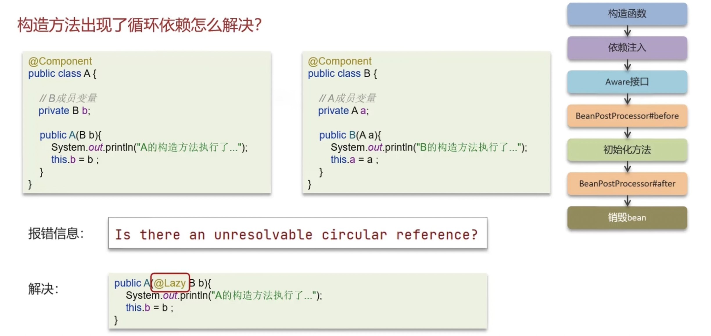

#### 面试题

> [!IMPORTANT]
>
> **Spring框架中的单例bean是线程安全的吗？**
>
> Spring 中的单例 Bean **默认不是线程安全的** ，它的线程安全性完全由开发者控制。  
>
> - 如果是无状态 Bean（不使用成员变量），天然线程安全；
> - 如果是有状态 Bean，需要通过以下方式保障线程安全：
>   - 改成 prototype 作用域（@Scope("prototype")，每次请求都创建一个新的 Bean 实例）
>   - 使用 ThreadLocal 存储线程私有数据（将 Bean 中的状态变量封装到 `ThreadLocal` 中，确保每个线程拥有自己的副本）
>   - 使用 synchronized、Lock 或 CAS进行同步
>
> **Spring的bean的生命周期？**
>
> 1. 通过`BeanDefinition`获取bean的定义信息。
> 2. 调用构造函数实例化bean。
> 3. 进行bean的依赖注入，例如通过setter方法或`@Autowired`注解。
> 4. 处理实现了`Aware`接口的bean。
> 5. 执行`BeanPostProcessor`的前置处理器。
> 6. 调用初始化方法，如实现了`InitializingBean`接口或自定义的`init-method`。
> 7. 执行`BeanPostProcessor`的后置处理器，可能生成代理对象。
> 8. 使用。
> 9. 最后是销毁bean。
>
> **Spring中的循环引用？**
>
> 当两个或多个 Bean 相互引用时，就构成了循环依赖。Spring框架允许循环依赖存在，并通过三级缓存解决大部分循环依赖问题：
>
> - 一级缓存：单例池，缓存已完成初始化的bean对象。
> - 二级缓存：缓存尚未完成生命周期的早期bean对象。
> - 三级缓存：缓存`ObjectFactory`，表示对象工厂，用于创建bean对象（用于生成原始对象或代理对象）。
>
> **那具体解决流程清楚吗？**
>
> 解决循环依赖的流程如下：
>
> 1. 实例化A对象，并创建`ObjectFactory`存入三级缓存。
> 2. A在初始化时需要B对象，开始B的创建逻辑。
> 3. B实例化完成，也创建`ObjectFactory`存入三级缓存。
> 4. B需要注入A，通过三级缓存获取A的`ObjectFactory`生成A对象（可能是原始对象，也可能是代理对象），存入二级缓存，删除三级缓存中A的`ObjectFactory`。
> 5. B通过二级缓存获得A对象后，B创建成功，存入一级缓存。
> 6. A继续初始化，由于B已创建完成，可以直接注入B，A创建成功存入一级缓存。
> 7. 清除二级缓存中的临时A。
>
> **构造方法出现了循环依赖怎么解决？**
>
> **原因分析：**
>
> - 构造器注入发生在 **Bean 实例化阶段（调用构造函数时）**
> - 此时 Bean 还没有放入三级缓存中，无法提前暴露代理对象
> - 所以 Spring 无法解决构造器注入导致的循环依赖
>
> 由于构造函数是bean生命周期中最先执行的，Spring框架无法解决构造方法的循环依赖问题。可以使用`@Lazy`懒加载注解，延迟bean的创建直到实际需要时。
>
> **🧠 `@Lazy` 的原理？**
>
> - 并不是真的 B 或 A 实例被延迟加载；
> - 而是 Spring 为它们创建了一个 **代理对象（Proxy）；**
> - 真正调用时才去获取目标对象；
> - 这样打破了构造函数直接注入导致的强依赖关系。

###  AOP问题

#### ✅ 事务是如何实现的

```
客户端调用 service.method()
   ↓
调用的是 Spring 生成的代理对象
   ↓
AOP 拦截 → 开启事务（begin）
   ↓
执行目标方法（method()）
   ↓
如果没有异常 → 提交事务（commit）
   ↓
如果有异常 → 回滚事务（rollback）
```

#### ✅ 事务传播行为（Transaction Propagation）

| 传播行为           | 含义                                           |
| ------------------ | ---------------------------------------------- |
| `REQUIRED`（默认） | 如果当前存在事务，加入该事务；否则新建一个事务 |
| `REQUIRES_NEW`     | 总是新建事务，并挂起当前事务（如有）           |
| `SUPPORTS`         | 支持当前事务，无事务则不启用事务               |
| ......             | ......                                         |

> [!IMPORTANT]
>
> **什么是AOP？**
>
> AOP，即面向切面编程，在Spring中用于将那些与业务无关但对多个对象产生影响的公共行为和逻辑抽取出来，实现公共模块复用，降低耦合。常见的应用场景包括公共日志保存和事务处理。
>
> **你们项目中有没有使用到AOP？**
>
> 用过，我们在项目中使用AOP来记录系统操作日志。主要思路是使用AOP的环绕通知和切点表达式，找到需要记录日志的方法，然后通过环绕通知的参数获取请求方法的参数，例如类信息、方法信息、注解、请求方式等，并将这些参数保存到数据库。
>
> **Spring中的事务是如何实现的（声明式事务）？**
>
> Spring 的事务管理是基于 **AOP（面向切面编程）** 实现的，底层通过 **动态代理（JDK 或 CGLIB）** 对目标方法进行拦截，并在方法前后加入事务控制逻辑。默认的传播行为是`REQUIRED`。
>
> **🔍 主要流程如下：**
>
> 1. **使用 `@Transactional` 注解标记需要事务的方法；**
> 2. **Spring 在容器启动时，通过 `BeanPostProcessor` 创建代理对象；**
> 3. **当调用被注解标记的方法时，实际调用的是代理对象；**
> 4. **代理对象触发 AOP 拦截器链，其中包含事务拦截器（`TransactionInterceptor`）；**
> 5. **事务拦截器通过事务管理器（`PlatformTransactionManager`）开启事务；**
> 6. 执行目标方法：
>    - 如果没有异常，提交事务；
>    - 如果出现异常且符合回滚规则，回滚事务；
> 7. **事务结束，释放资源。**

###  事务失效

**异常捕获处理：**


**抛出异常检查：**


**非public方法：**


> [!IMPORTANT]
>
> **Spring中事务失效的场景有哪些（你在项目中遇到哪些问题）？**
>
> 在项目中，我遇到过几种导致事务失效的场景（结合项目）：
>
> - 如果方法内部捕获并处理了异常，没有将异常抛出，会导致事务失效。因此，处理异常后应该确保异常能够被抛出。
> - 如果方法抛出检查型异常（checked exception），并且没有在`@Transactional`注解上配置`rollbackFor`属性为`Exception`，那么异常发生时事务可能不会回滚。
> - 如果事务注解的方法不是公开（public）修饰的，也可能导致事务失效。
>
> 比如：在项目中，使用AOP时，发现日志失效了。后面查资料发现，我在方法内部捕获并处理了异常，没有将异常抛出，所以导致事务失效。

##  Springmvc


###  JSP阶段执行流程


###  前后端分离执行流程


> [!IMPORTANT]
>
>  **SpringMVC的执行流程？**
>
> JSP阶段：
>
> 1. 用户发送请求到前端控制器`DispatcherServlet`。
> 2. `DispatcherServlet`调用`HandlerMapping`找到具体处理器。
> 3. `HandlerMapping`返回处理器对象及拦截器（如果有）给`DispatcherServlet`。
> 4. `DispatcherServlet`调用`HandlerAdapter`。
> 5. `HandlerAdapter`适配并调用具体处理器（Controller/Handler）。
> 6. Controller执行并返回`ModelAndView`对象。
> 7. `HandlerAdapter`将`ModelAndView`返回给`DispatcherServlet`。
> 8. `DispatcherServlet`传给`ViewResolver`进行视图解析。
> 9. `ViewResolver`返回具体视图给`DispatcherServlet`。
> 10. `DispatcherServlet`渲染视图并响应用户（HTML）。 
>
> 前后端分离：
>
> 1. 用户发送请求到前端控制器`DispatcherServlet`。
> 2. `DispatcherServlet`调用`HandlerMapping`找到具体处理器。
> 3. `HandlerMapping`返回处理器对象及拦截器（如果有）给`DispatcherServlet`。
> 4. `DispatcherServlet`调用`HandlerAdapter`。
> 5. `HandlerAdapter`适配并调用具体处理器（Controller/Handler）。
> 6. 方法上添加了@ResponseBody注解，Handler通过HttpMessageConverter将结果转成JSON直接写入 HTTP 响应体。

##  Springboot

###  自动配置原理


> [!IMPORTANT]
>
> **Springboot自动配置原理？**
>
>  在Spring Boot项目中的引导类上有一个注解@SpringBootApplication，这个注解是对三个注解进行了封装，分别是：
>
> - @SpringBootConfiguration
> - @EnableAutoConfiguration
> - @ComponentScan
>
> 其中@EnableAutoConfiguration是实现自动化配置的核心注解，通过读取 jar 包中的 `META-INF/spring.factories`文件中的类的全类名，并结合**条件注解**（@ConditionalXXX）按需加载 Bean，最终实现“约定优于配置”的自动装配机制。
>
> 条件判断会有像@ConditionalOnClass这样的注解，判断是否有对应的class文件，如果有则加载该类，把这个配置类的所有的Bean放入spring容器中使用。

##  Spring框架常见注解

###  Spring

@Repository 是 @Component 的一个特化版本，用于标注数据访问层（DAO 层）的类。

> [!TIP]
>
> Spring官方更倾向于通过构造函数注入或 Setter 方法注入。
>
> **@Bean：**


###  Springmvc


###  Springboot

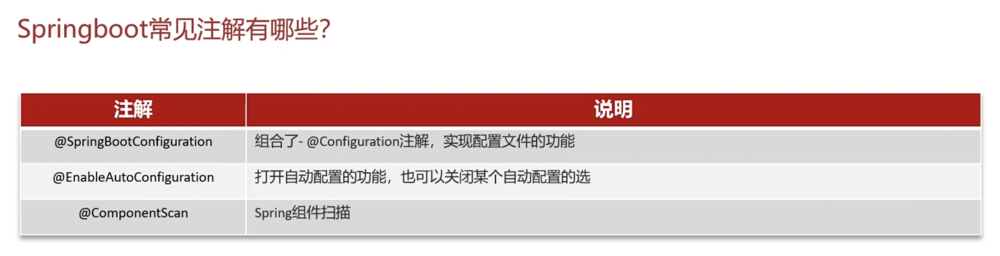

> [!IMPORTANT]
>
> **`@Resource`** 是 JSR-250 标准的一部分，属于 Java 的标准注解，与具体框架无关。默认情况下，`@Resource` 首先按照名称匹配 Bean，如果未找到匹配的名称，则会按照类型匹配。

##  MyBatis

###  执行流程


> [!IMPORTANT]
>
> **MyBatis执行流程？**
>
> 加载mybatis-config.xml
>    ↓
> 构建 SqlSessionFactory
>    ↓
> 创建 SqlSession
>    ↓
> 获取 Mapper 接口的代理对象
>    ↓
> 调用 Mapper 方法（如 selectById）
>    ↓
> 解析 MappedStatement（SQL 和映射规则）
>    ↓
> 参数处理（ParameterHandler 绑定参数）
>    ↓
> Executor 执行 SQL
>    ↓
> 映射结果
>    ↓
> 返回结果

###  延迟加载

**延迟加载即按需加载。**

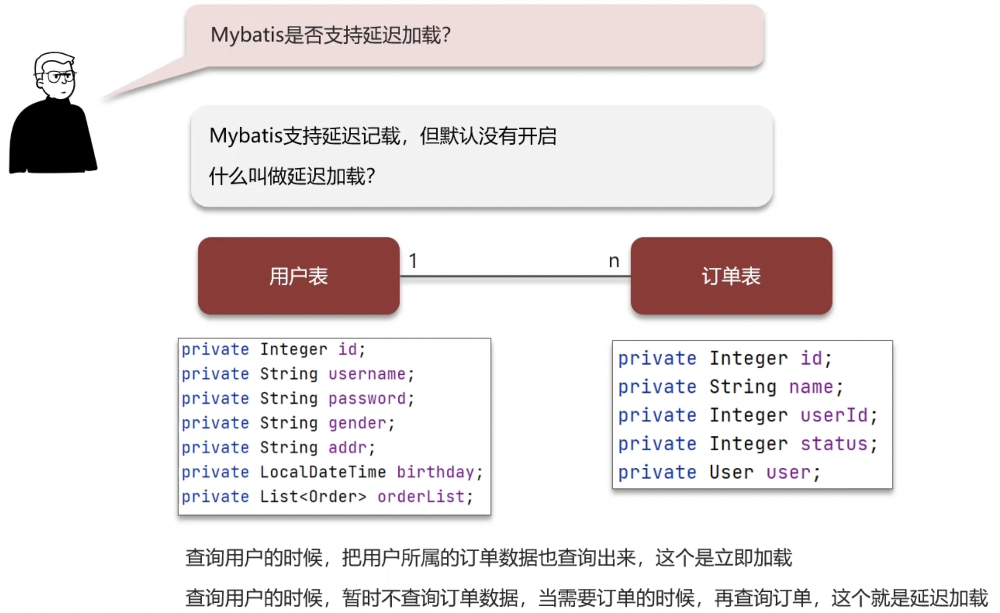


> [!IMPORTANT]
>
>  **Mybatis是否支持延迟加载？**
>
> MyBatis支持延迟加载，即在需要用到数据时才加载。可以通过配置文件中的`lazyLoadingEnabled`配置启用或禁用延迟加载。
>
> **延迟加载的底层原理知道吗？**
>
> 延迟加载的底层原理主要使用CGLIB动态代理实现：
>
> 1. 使用CGLIB创建目标对象的代理对象。
> 2. 调用目标方法时，会调用代理对象的invoke方法，如果发现是null值，则执行SQL查询。
> 3. 获取数据后，设置属性值并继续查询目标方法。

###  一级、二级缓存

session指sqlsession。


- 每次调用 `sqlSession.getMapper(UserMapper.class)` 都会生成一个新的代理对象。因此，`userMapper1` 和 `userMapper2`是两个不同的代理对象。


```java
			 // 第一个 SqlSession
       try (SqlSession sqlSession1 = sqlSessionFactory.openSession()) {
           UserMapper userMapper1 = sqlSession1.getMapper(UserMapper.class);
           // 第一次查询，触发 SQL 执行并将结果存入二级缓存
           // 即User实体类需要实现 Serializable 接口
           User user1 = userMapper1.selectById(1);
           System.out.println("User1: " + user1);
       }
       // 第二个 SqlSession
       try (SqlSession sqlSession2 = sqlSessionFactory.openSession()) {
           UserMapper userMapper2 = sqlSession2.getMapper(UserMapper.class);
           // 第二次查询，直接从二级缓存中获取结果，不会执行 SQL
           User user2 = userMapper2.selectById(1);
           System.out.println("User2: " + user2);
       }
```

#### 缓存什么时候清除

##### 🧩 一级缓存（Local Cache）

| 情况                            | 是否清空                                |
| ------------------------------- | --------------------------------------- |
| **执行 insert、update、delete** | ✅ 是（当前 SqlSession 的缓存全部清空）  |
| **执行 commit 或 rollback**     | ✅ 是（默认行为）                        |
| 执行不同的 Mapper SQL           | ⚠️ 不一定（如果 namespace 相同，则清空） |
| 手动调用 `clearCache()`         | ✅ 是                                    |

#####  🧩 二级缓存（Second Level Cache）

| 情况                                               | 是否清空                                |
| -------------------------------------------------- | --------------------------------------- |
| **同一个 namespace 下执行 insert、update、delete** | ✅ 是（整个 namespace 的缓存都会被清空） |
| 跨 namespace 的更新                                | ❌ 否（除非配置了共享缓存）              |
| **执行 commit（事务提交）**                        | ✅ 是（默认）                            |
| **关闭sqlSession**                                 | ✅ 是                                    |
| 配置 `<select flushCache="true">`                  | ✅ 是（每次查询都清空缓存）              |
| 自定义 Cache 清理策略                              | ✅ 可控（如基于时间、大小等）            |

> [!IMPORTANT]
>
> **Mybatis的一级、二级缓存用过吗？**
>
> MyBatis的一级缓存是基于`PerpetualCache`的HashMap本地缓存，作用域为Session，默认开启。二级缓存需要单独开启，作用域为Namespace或mapper，默认也是采用`PerpetualCache`，HashMap存储。
>
> **Mybatis的二级缓存什么时候会清理缓存中的数据？**
>
> 当作用域（一级缓存Session/二级缓存Namespaces）进行了新增、修改、删除操作后，默认清空该namespace作用域下所有select中的缓存。

##  其他小问题

###  **Spring @Value 里的 ${} vs #{}**

> [!IMPORTANT]
>
> > **“${} 是配置占位符，#{ } 是运行时表达式。一般来说，${} 用于读取配置文件，#{ } 用于动态计算值或操作 Bean。”**
>
> > **“如果两者混用，Spring 会优先解析 ${}，再解析 #{ }。”**

###  **MyBatis 中**  **${} **vs **#{}**

> [!IMPORTANT]
>
> > **#{} 用于安全传参，底层走 PreparedStatement 预编译，防注入，推荐日常用。**
>
> > **${} 是字符串直接拼接，适合动态表名/列名/排序，必须严控传入值，避免注入风险。**
> >
> > > **MyBatis 官方也建议尽量优先 #{}，${} 只在必要时（如动态表名、ORDER BY）慎用。**

###  Spring推荐使用哪种方式注入依赖

| 强依赖（必须存在的依赖）   | ✅ 构造器注入                   |
| -------------------------- | ------------------------------ |
| 可选依赖（可配置、可替换） | ✅ Setter 注入                  |
| 快速开发 / 教学演示        | ✅ 字段注入（但不推荐用于生产） |
| 想要提升可测试性和不变性   | ✅ 构造器注入                   |

```java
public class UserService {

    private final UserRepository userRepository;

    public UserService(UserRepository userRepository) {
        this.userRepository = userRepository;
    }

    public void registerUser(String username) {
        // 必须使用 userRepository 来保存用户，强依赖
        userRepository.save(new User(username));
    }
}
```

```java
public class OrderService {

    private OrderRepository orderRepository;
  	// @Autowired(required = false)
    private Optional<Logger> logger; // 可选依赖，即使没有设置 logger，processOrder() 方法仍然可以正常执行，只是缺少日志记录功能。

    @Autowired
    public OrderService(OrderRepository orderRepository, Optional<Logger> logger) {
        this.orderRepository = orderRepository;
        this.logger = logger;
    }

    public void processOrder(Order order) {
        if (logger != null) {
            logger.log("Processing order: " + order.getId());
        }
        orderRepository.save(order);
    }
}
```

#  微服务


##  SpringCloud

###  服务注册与发现

了解即可，现在基本不用了。主流是nacos


**Nacos不仅能被pull还能主动push，可以主动询问健康状态。**


###  负载均衡

现在，已经使用Spring Cloud LoadBalancer，ribbon了解即可，用于了解流程。


###  服务雪崩

现在使用Sentinel了。


**当下游服务因访问压力过大或响应过慢而出现问题时，上游服务会通过熔断机制停止对下游服务的调用，避免整个系统因连锁反应而崩溃。一旦触发熔断机制，后续请求将直接返回错误或备用结果，而不会继续尝试调用故障服务。熔断器通常会在一段时间后进入“半开”状态，试探性地放行部分请求以检测下游服务是否恢复正常。如果服务恢复，则关闭熔断；否则继续保持熔断状态。**


####  Sentinel 工作原理

通过**拦截**和**监控**后端服务的入口流量和资源调用来实现保护。

主要流程如下：

1. **资源定义:** 你需要在你的后端服务代码中定义需要保护的“资源”。一个资源可以是一个 HTTP API 接口、一个 Java 方法、甚至是一段特定的代码块。通常会使用 Sentinel 提供的注解（如 `@SentinelResource`）或者 API 来显式地定义资源。
2. **埋点与监控:** 当请求到达被 Sentinel 保护的资源时，Sentinel 会进行拦截，并记录该资源的各种运行指标，例如 QPS（每秒查询率）、响应时间、异常比例等。这些指标数据会被 Sentinel 收集和统计。
3. **规则配置:** 你需要为定义的资源配置各种保护规则，例如：
   - **流量控制规则（限流规则）:** 限制单位时间内对资源的访问次数，防止突发流量冲垮服务。
   - **熔断降级规则:** 当资源的错误率或慢调用比例达到一定阈值时，自动切断对该资源的调用，防止故障蔓延。
   - **系统保护规则:** 从系统整体的负载角度进行保护，例如当系统的 CPU 使用率过高时，拒绝新的请求。
   - **热点参数限流规则:** 针对访问非常频繁的热点参数进行更精细化的限流。
4. **规则校验与执行:** 当请求再次到达被保护的资源时，Sentinel 会根据配置的规则对当前的请求进行校验。
   - 如果请求符合规则（例如，没有超过限流阈值，没有触发熔断），则允许通过，后端服务继续处理请求。
   - 如果请求不符合规则（例如，触发了限流或熔断），Sentinel 会立即执行预先定义的处理策略，例如抛出 `BlockException` 异常或者执行降级方法。
5. **降级处理:** 如果请求被 Sentinel 拦截并执行了降级策略，通常会返回一个预设的fallback结果，而不是让请求继续访问可能已经不稳定的后端服务。这保证了即使在服务出现问题时，也能给用户一个相对友好的响应。

###  微服务的监控

如何追踪？


**哪些服务较慢，哪些服务不健康。**


###  服务流程

> [!TIP]
>
> 1. Gateway 和 OpenFeign**都集成**了负载均衡的组件。在Spring Cloud 体系下，他们都集成了Spring Cloud LoadBalancer。

梳理一下客户端发起请求的一次完整流程路线：

1. **客户端发起请求 (Client Request):** 无论是浏览器、移动应用还是其他服务，客户端首先会构建一个 HTTP(S) 请求，目标是你的微服务系统提供的某个 API 接口。
2. **请求到达 API 网关 (Spring Cloud Gateway):**
   - 客户端的请求首先会发送到 **Spring Cloud Gateway**。作为整个微服务系统的流量入口，Gateway 承担着请求路由、鉴权、限流、日志记录等关键职责。
   - Gateway 会根据预先配置的路由规则，例如请求路径、Host、Header 等信息，匹配到相应的后端服务。
3. **服务发现与负载均衡 (Nacos & Spring Cloud LoadBalancer):**
   - Gateway 在确定了目标服务后，会向 **Nacos** 注册中心发起请求，查询该服务的可用实例列表及其网络地址。
   - **Nacos** 会返回目标服务的健康实例列表。
   - **Spring Cloud LoadBalancer** 组件**在 Gateway 内部**发挥作用，它会根据配置的负载均衡策略（如轮询、随机、加权轮询等），从 Nacos 返回的可用实例列表中选择一个具体的服务实例。
4. **后端服务处理请求:**
   - 被调用的后端服务实例接收到来自 Gateway 的请求，并进行业务逻辑处理。这可能涉及到数据库操作、调用其他内部服务等。
5. **服务保护 (Sentinel):**
   - 在后端服务处理请求的过程中，**Sentinel** 会对服务的资源使用情况进行监控，例如接口的并发数、响应时间、错误率等。
   - 如果服务的指标超过预设的阈值，Sentinel 会根据配置的策略（如限流、熔断、降级）采取相应的保护措施，防止服务雪崩。
6. **响应返回:**
   - 后端服务处理完请求后，将结果封装成 HTTP 响应返回给 Gateway。
7. **API 网关处理响应:**
   - Gateway 接收到后端服务的响应后，可能会对响应进行一些处理，例如添加统一的响应头、格式转换等。
8. **响应返回客户端:**
   - 最后，Gateway 将处理后的响应返回给最初发起请求的客户端。
9. **服务之间的调用：**如果一个服务需要调用另一个服务，假设微服务 A 需要调用微服务 B 的某个接口，那么在微服务 A 中，你会引入 **OpenFeign**，定义一个调用微服务 B 的接口，并使用 OpenFeign 的注解进行配置，OpenFeign 会帮你处理底层的 HTTP 通信细节和负载均衡。


###  面试题

> [!IMPORTANT]
>
> - ##### Spring Cloud 5大组件有哪些？
>
>   | 功能               | 主流技术                  |
>   | ------------------ | ------------------------- |
>   | **服务注册与配置** | Nacos                     |
>   | **负载均衡**       | Spring Cloud LoadBalancer |
>   | **服务调用**       | OpenFeign                 |
>   | **服务保护**       | Sentinel                  |
>   | **API 网关**       | Spring Cloud Gateway      |
>
> - ##### 服务注册和发现是什么意思？Spring Cloud 如何实现服务注册发现？
>
>   服务注册与发现主要包含三个核心功能：服务注册、服务发现和服务状态监控。对于Eureka，
>
>   - **服务注册**：服务提供者将自己的信息（如服务名称、IP、端口等）注册到Eureka。
>   - **服务发现**：消费者从Eureka获取服务列表信息，并利用负载均衡算法选择一个服务进行调用。
>   - **服务监控**：服务提供者定期向Eureka发送心跳以报告健康状态；如果Eureka在一定时间内未接收到心跳，将服务实例从注册中心剔除。
>
> - ##### 我看你之前也用过nacos，你能说下nacos与eureka的区别？
>
>   在使用Nacos作为注册中心的项目中，我注意到Nacos与Eureka的共同点和区别：
>
>   - **共同点**：两者都支持服务注册与发现，以及心跳检测作为健康检查机制。
>   - **区别**：
>     - Nacos支持服务端主动检测服务提供者状态，而Eureka依赖客户端心跳。
>     - Nacos区分临时实例和非临时实例，临时实例采用心跳模式，非临时实例采用主动检测。
>     - 临时实例心跳不正常会被剔除，非临时实例不会。
>     - Nacos支持服务列表变更的消息推送，使服务更新更及时。
>     - Nacos集群默认采用AP模式，但存在非临时实例时，会采用CP模式；而Eureka始终采用AP模式。
>     - Nacos还支持配置中心，Eureka只有注册中心。
>
>   （**AP 模式强调系统的高可用性（Availability）和分区容错性（Partition Tolerance）；CP 模式强调一致性和分区容错性。A,C不能同时实现。**）
>
> - ##### 你们项目负载均衡如何实现的？
>
>   当发起远程调用时，Spring Cloud LoadBalancer首先从注册中心获取**服务地址列表**，然后根据预设的路由策略选择一个服务实例进行调用，常用的策略是轮询。
>
> - ##### Ribbon负载均衡策略有哪些？
>
>   - **RoundRobinRule**：简单的轮询策略。
>   - **WeightedResponseTimeRule**：根据响应时间加权选择服务器，响应时间越久，权重越小。
>   - **RandomRule**：随机选择服务器。
>   - **ZoneAvoidanceRule**：区域感知的负载均衡，优先选择同一区域中可用的服务器，然后对区域内的服务作轮询。
>
> - ##### **LoadBalancer负载均衡策略有哪些？**
>
>   - 轮询
>   - 随机
>   - 加权响应时间
>
> - ##### 如果想自定义负载均衡策略如何实现(Ribbon)？
>
>   - 创建一个类实现IRule接口，这将定义全局的负载均衡策略。
>   - 在客户端配置文件中指定特定服务调用的负载均衡策略，这将仅对该服务生效。
>
> - ##### 什么是服务雪崩，怎么解决这个问题？
>
>   - 服务雪崩是指一个服务的失败导致整个链路的服务相继失败。我们通常通过服务降级和服务熔断来解决这个问题：
>     - **服务降级**：在请求量突增时，主动降低服务的级别，确保核心服务可用（对某一个接口）。
>     - **服务熔断**：当服务调用失败率达到一定阈值时，熔断机制会启动，防止系统过载（整个服务）。
>
> - ##### 你们的微服务是怎么监控的？
>
>   - 我们项目中采用了**SkyWalking**进行微服务监控：
>     1. SkyWalking能够监控接口、服务和物理实例的状态，帮助我们识别和优化慢服务。
>     2. 我们还设置了告警规则，一旦检测到异常，系统会通过短信或邮件通知相关负责人。

##  业务相关

###  Nginx限流（理解，会描述）

**漏桶算法：**

- **桶的容量（burst）** ：表示短时间内可以接受的最大突发流量；
- **出水速率（rate）** ：表示每秒允许通过的最大请求数；
- **多余请求** ：如果桶满了，多余的请求会被丢弃或排队等待。

**控制流量：**


**控制并发连接数：**

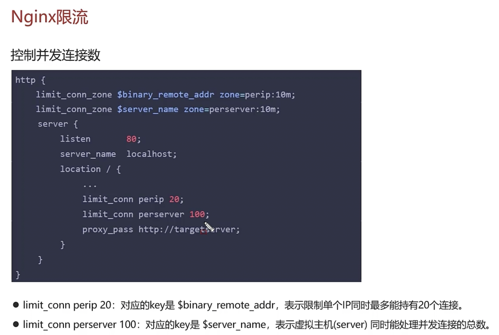

###  网关限流


###  分布式

####  分布式系统理论

#####  CAP定理


#####  BASE理论

###### 1️⃣ **基本可用（Basically Available）**

**🧠 核心思想：**

- 在发生故障或网络分区时，系统仍然能提供服务，但可能会降级；
- 不追求所有功能都可用，而是优先保证核心功能可用。

######  2️⃣ **柔性状态（Soft State）**

**🧠 核心思想：**

- 系统允许数据存在短暂不一致；
- 中间状态不影响系统的整体运行；
- 接受数据同步延迟带来的“不一致窗口期”。

######  3️⃣ **最终一致（Eventually Consistent）**

**🧠 核心思想：**

- 所有节点的数据副本会随着时间推移趋于一致；
- 不要求强一致性，但必须保证在某个时间点之后，数据是统一的。


####  分布式事务


**AT模式用的最多。**


**MQ分布式事务：**


####  分布式服务接口幂等性


 


**分布式锁**+**唯一标识**解决。


####  分布式任务调度


###  面试题

> [!IMPORTANT]
>
> **你们项目中有没有做过限流？怎么做的？**
>
> 在我们的项目中，由于面临可能的突发流量，我们采用了限流策略：
>
> - **版本1**：使用**Nginx**进行限流，通过漏桶算法控制请求处理速率，按照IP进行限流。
> - **版本2**：使用**Spring Cloud Gateway**的**RequestRateLimiter**过滤器进行限流，采用令牌桶算法，可以基于IP或路径进行限流。
>
> **限流常见的算法有哪些？**
>
> - **漏桶算法**：
>   - **原理**：把请求看成是水滴进入一个桶，桶以**固定速率**漏水，表示系统的处理速率。
>   - 如果水滴进入速度太快，桶满了，新请求就会被**直接丢弃**或**排队等待**。
>   - **特点**：
>     - 输出速率恒定，**平滑突发流量**。
>
> - **令牌桶算法**：
>   - **原理**：系统以固定速率往桶中放“令牌”，每个请求来临时尝试获取一个令牌，有令牌才能执行，没有就拒绝或等待。
>   - 令牌可以积累（有上限），支持**突发流量**。
>   - **特点**：
>     - 限制的是**平均速率**，但可以应对短时爆发。
>
>
> **什么是CAP理论？**
>
> CAP理论是分布式系统设计的基础理论，包含一致性(Consistency)、可用性(Availability)和分区容错性(Partition tolerance)。在网络分区发生时（P必然存在），系统只能在一致性和可用性之间选择其一。
>
> **什么是BASE理论？**
>
> BASE理论是分布式系统设计中对CAP理论中AP方案的延伸，强调通过基本可用、软状态和最终一致性来实现系统设计。
>
> **你们采用哪种分布式事务解决方案？**
>
> 我们项目中使用了**Seata**的AT模式来解决分布式事务问题。AP理论，通过undolog来保证事务的最终一致性。
>
> 
>
> **分布式服务的接口幂等性如何设计？**
>
> 我们通过Token和**Redis**来实现接口幂等性。用户操作时，系统生成一个Token并存储在Redis中，当用户提交操作时，系统会验证Token的存在性，并在验证通过后删除Token，确保每个Token只被处理一次。并且这个验证和随后的 Token 删除操作需要保证**原子性**，使用 Redisson 的分布式锁来包裹检查和删除 Token 的逻辑。
>
> **xxl-job路由策略有哪些？**
>
> xxl-job支持多种路由策略，包括轮询、故障转移和分片广播等。
>
>  **xxl-job任务执行失败怎么解决？**
>
> - 选择故障转移路由策略，优先使用健康的实例执行任务。
> - 设置任务重试次数。
> - 通过日志记录和邮件告警通知相关负责人。
>
> **如果有大数据量的任务同时都需要执行，怎么解决？**
>
> 我们可以通过部署多个实例并使用分片广播路由策略来分散任务负载。在任务执行代码中，根据分片信息和总数对任务进行分配。

#  消息中间件


##  RabbitMQ


##  Kafka

#  JVM

##  JVM组成

主要包括以下几个部分：

###  类加载子系统 (Class Loader Subsystem)

**作用:** 将其字节码读取到内存中，并生成对应的 `Class` 对象。

**过程:** 类加载分为三个阶段：加载 (Loading)、链接 (Linking) 和 初始化 (Initialization)。

- **加载:** 查找并读取 `.class` 文件，生成对应的二进制字节流，并将其转换为方法区的数据结构，然后在堆上生成一个 `java.lang.Class` 对象，作为访问方法区中这些数据的入口。
- **链接:**
  - **验证 (Verification):** 验证字节码是否符合 JVM 规范，防止恶意代码执行。
  - **准备 (Preparation):** 为类的静态变量分配内存，并设置默认初始值（例如，int 默认是 0，对象默认是 null）。
  - **解析 (Resolution):** 将字节码中的符号引用（symbolic reference）转换为直接引用（direct reference），例如将类名、方法名、字段名等符号转换为内存地址。
- **初始化:** 执行类的 `<clinit>` 方法，为静态变量赋予程序中指定的值，执行静态代码块。这是类加载的最后一个阶段。

**类加载器种类:** JVM 内置了三种类加载器：Bootstrap ClassLoader (负责加载核心库)、Extension ClassLoader (负责加载扩展库)、Application ClassLoader (负责加载应用程序自身的类)。它们之间遵循父委托机制。

###  运行时数据区域 (Runtime Data Areas / Memory Areas)

> [!TIP]
>
> 线程空间包括：Java虚拟机栈，本地方法栈和程序计数器

**作用:** 这是 JVM 在运行期间管理内存的区域，用于存储程序运行所需的数据。

**主要区域:**

- **堆 (Heap):** 这是 JVM 中最大的一块内存区域，所有**对象实例和数组**都在这里分配内存。它是**线程共享**的区域，也是**垃圾收集器 (Garbage Collector)** 主要工作的地方。
- **方法区 (Method Area):** (在 Java 8 及以后版本被称为 Metaspace) 也是**线程共享**的区域。它存储类的结构信息，例如类的元数据、运行时常量池 (Runtime Constant Pool)、静态变量 (Static Variables) 和即时编译器编译后的代码 (JIT Compiled Code)。
- **Java 虚拟机栈 (Java Virtual Machine Stacks):** 这是**线程私有**的区域。每当一个方法被调用时，JVM 就会为该方法创建一个**栈帧 (Stack Frame)** 并压入虚拟机栈。栈帧中包含局部变量表 (Local Variables)、操作数栈 (Operand Stack)、动态链接 (Dynamic Linking) 和方法返回地址 (Return Address) 等信息。方法的执行就是栈帧的入栈和出栈过程。如果线程请求的栈深度大于虚拟机所允许的深度，会抛出 `StackOverflowError`。
- **本地方法栈 (Native Method Stacks):** 也是**线程私有**的区域。它与虚拟机栈类似，但用于执行本地 (Native) 方法，即通过 JNI (Java Native Interface) 调用的非 Java 代码 (如 C/C++)。
- **程序计数器 (Program Counter Register / PC Register):** 这是最小的一块内存区域，是**线程私有**的。它存储当前线程正在执行的 Java 虚拟机指令的地址。如果正在执行的是本地方法，则 PC 寄存器中的值是 undefined。它是 JVM 中**唯一不会发生 `OutOfMemoryError`** 的区域。

###  **执行引擎 (Execution Engine):**

**作用:** 负责执行 Java 字节码。

组成:

- **解释器 (Interpreter):** 逐行解释执行字节码。启动速度快，但执行效率相对较低。
- **即时编译器 (Just-In-Time Compiler / JIT):** 为了提高执行效率，JVM 会识别热点代码 (Hot Spot Code，即被频繁执行的代码)，并将这些字节码编译成本地机器码，然后缓存起来。下次执行到这段代码时，直接运行本地机器码，无需解释执行。常见的 JIT 编译器有 C1 和 C2。
- **垃圾收集器 (Garbage Collector / GC):** 自动管理堆内存，负责回收不再使用的对象所占用的内存空间，避免内存泄漏。

###  本地方法接口 (Native Method Interface / JNI)

**作用:** 允许 Java 代码与其他语言（如 C/C++）编写的本地代码进行交互。通过 JNI，Java 方法可以调用本地方法，本地方法也可以调用 Java 方法。

###  **本地方法库 (Native Method Libraries):**

**作用:** JNI 需要调用的本地方法库，通常是操作系统提供的一些功能库。

> [!IMPORTANT]
>
> **JVM组成？**
>
> JVM 由 **类加载子系统、运行时数据区、执行引擎、本地方法接口、本地方法库** 构成； 
>
> - **类加载器** 负责加载类；
> - **运行时数据区** 是内存划分的核心；
> - **执行引擎** 负责执行字节码；
> - **本地方法接口（JNI）** 调用 Native 方法；
> - 整个过程体现了 Java “一次编写，到处运行”的核心理念。
>
> **运行流程是什么？**
>
> Java 程序从源代码编译为字节码开始，经过类加载进入 JVM； 
>
> - 然后在运行时数据区中运行；
> - 执行引擎解释或编译执行字节码；
> - 如果涉及 native 方法，则通过 JNI 调用本地库；
> - 最终程序执行完毕，JVM 退出。


##  堆

> [!TIP]
>
> JVM 在 JIT 编译时会做 **逃逸分析（Escape Analysis）**，根据对象的“作用范围”决定内存分配策略：**通过逃逸分析（Escape Analysis），JVM 会判断某个对象是否只在当前方法中使用**，如果是，就可以**不在堆上分配内存，而是在栈上分配**，从而提升性能。


##  虚拟机栈


> [!TIP]
>
> 栈溢出和栈内存溢出的触发条件不一样！！！

| **项目** | **栈溢出（StackOverflowError）** | **栈内存溢出（OutOfMemoryError）**                           |
| -------- | -------------------------------- | ------------------------------------------------------------ |
| 异常类型 | java.lang.StackOverflowError     | java.lang.OutOfMemoryError: unable to create new native thread |
| 触发条件 | 单个线程的调用栈深度超过限制     | 系统无法为新线程分配足够的栈内存                             |
| 常见原因 | 无限递归、方法调用层级过深       | 创建过多线程、系统资源不足                                   |
| 解决方法 | 检查递归逻辑、增加栈大小         | 减少线程数量、优化线程使用、增加系统内存资源                 |

##  方法区


###  常量池与运行时常量池

“常量池和运行时常量池是两个相关但不同的概念，它们存在于 Java 程序生命周期的不同阶段和位置。

1. **常量池 (Constant Pool):**

   - **位置:** 它存在于 **`.class` 文件** 中。

   - 内容：**`.class` **文件中的常量池是一个静态的、结构化的表

     。它主要存放两大类常量：

     - **字面量 (Literal Values):** 包括文本字符串 (String)、声明为 final 的常量值 (如基本类型常量) 等。
     - **符号引用 (Symbolic References):** 包括类和接口的全限定名、字段的名称和描述符、方法的名称和描述符等。

2. **运行时常量池 (Runtime Constant Pool):**

   - **位置:** 它存在于 **JVM 的**运行时数据区域中的**方法区 (Method Area)** 内。（在 Java 8 及以后的版本，方法区的实现是 Metaspace）
   - **生成时机:** JVM 在执行**类加载**时，会将 `.class` 文件中的**常量池信息载入到方法区**，形成运行时常量池。这个过程发生在类加载的**链接阶段**。
   - **内容:** 运行时常量池是常量池在 JVM 内存中的**运行时表示**。它不仅包含了 `.class` 文件常量池中的**字面量**，更重要的是，在类加载的**解析阶段 (Resolution)**，会将常量池中的**符号引用转换为直接引用 (Direct References)**。直接引用是指向目标的指针、偏移量或句柄，是可以直接使用的地址。 


##  直接内存

###  **什么是直接内存？**

直接内存是指**不是在 JVM 的堆内存中分配的内存**，而是直接在**操作系统（Native OS）的本地内存**中分配的。它不受 JVM 堆大小的限制（尽管可以通过 JVM 参数进行最大限制），也不受 JVM 垃圾回收器的直接管理。

###  为什么需要直接内存？

主要原因是为了提高 **I/O 操作的性能**，尤其是在进行**大文件传输或网络通信**时。

传统的基于 JVM 堆内存的 I/O 操作通常涉及以下步骤：

1. 数据从外部设备（如磁盘、网卡）读取到**操作系统内核的缓冲区**。
2. 数据从操作系统内核的缓冲区**复制**到 JVM 堆内存中的字节数组 (`byte[]`)。

写操作则反过来，也涉及一次从 JVM 堆内存到 OS 内核缓冲区的**复制**。

这种**两次数据复制**（用户空间 <=> 内核空间）会带来额外的开销，尤其是在处理大量数据时，效率较低。

###  直接内存如何工作？

Java 提供了 **NIO (New I/O)** 库，其中一个重要特性就是**基于 Channel (通道) 和 Buffer (缓冲区)** 的 I/O。NIO 引入了 `ByteBuffer` 类，它可以用来分配**直接内存缓冲区 (`DirectByteBuffer`)**。

当你使用 `DirectByteBuffer` 分配内存时，这块内存是直接通过 JNI (Java Native Interface) 调用操作系统底层的内存分配函数（如 C 语言的 `malloc`）来申请的，不经过 JVM 的堆。**<u>JVM 仅仅是在堆上维护一个 `DirectByteBuffer` 对象来引用这块本地内存。</u>**

使用 `DirectByteBuffer` 进行 I/O 操作时，操作系统可以直接在**设备和直接内存缓冲区之间传输数据**，从而**避免了数据在 JVM 堆和 OS 内核缓冲区之间的来回复制**。这通常被称为“零拷贝”（尽管不总是完全的零拷贝，但减少了重要的复制步骤），显著提高了 I/O 效率。


##  类加载器

###  双亲委派机制

> [!IMPORTANT]
>
> 双亲委派机制的核心思想是：**“先让父类加载器尝试加载类，只有父类加载器无法加载时，才由子类加载器加载”，**
>
> 它保障了 Java 类加载过程中的 **安全性、一致性、可扩展性** 。 


> [!TIP]
>
> **Student类：AppClassLoader->ExtClassLoader->BootStrap ClassLoader,但是BootStrap ClassLoader无法加载Student（他在AppClassLoader对应的目录下），继续->ExtClassLoader->AppClassLoader，最后加载。**
>
> 有时，需要打破。比如，在插件化架构中，每个插件可能包含自己的类库和类定义。为了保证插件之间的隔离性和独立性，需要为每个插件分配独立的类加载器。如果严格遵循双亲委派机制，可能会导致插件之间的类库冲突或无法加载。
>
> ```mermaid
> graph LR
>     classDef startend fill:#F5EBFF,stroke:#BE8FED,stroke-width:2px;
>     classDef process fill:#E5F6FF,stroke:#73A6FF,stroke-width:2px;
>     classDef decision fill:#FFF6CC,stroke:#FFBC52,stroke-width:2px;
>     classDef io fill:#FFEBEB,stroke:#E68994,stroke-width:2px;
> 
>     A([用户请求加载类]):::startend --> |请求| B(应用类加载器):::process
>     B --> |委派| C(扩展类加载器):::process
>     C --> |委派| D(启动类加载器):::process
>     D --> |尝试加载| E{启动类加载器尝试加载是否成功?}:::decision
>     E -->|失败| F(扩展类加载器):::process
>     E -->|成功| G(返回 Class 对象):::io
>     F --> |尝试加载|H{扩展类加载器尝试加载是否成功?}:::decision
>     H -->|失败| I(应用类加载器):::process
>     H -->|成功| G
>     I --> |尝试加载| J{应用类加载器尝试加载是否成功?}:::decision
>     J -->|成功| G
>     J -->|失败| K(抛出异常):::io
> ```
>
> 


> [!TIP]
>
> **JVM 如何判断类的唯一性？**
>
> 在 JVM 中，类的唯一性不仅由类的全限定名决定，还包括**加载该类的类加载器**。即使两个类具有相同的全限定名，如果它们是由不同的类加载器加载的，JVM 也会将它们视为不同的类。这意味着，双亲委派机制通过确保类加载请求从父加载器开始，避免了同一个类被多个类加载器重复加载，从而保证了类的唯一性和一致性。

###  类加载器执行流程


##  垃圾回收

###  什么时候回收

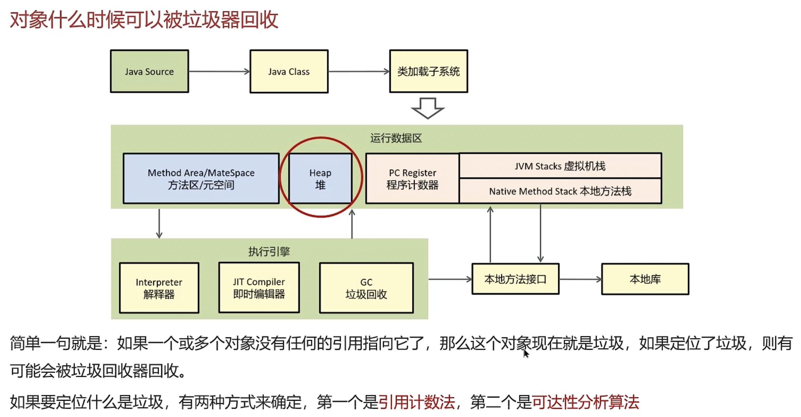


> [!TIP]
>
> **循环引用，引发内存泄漏**


###  垃圾回收算法

####  标记清理算法

**过程**：

1. **标记阶段**：从 GC Roots 出发，标记所有可达的对象。
2. **清除阶段**：遍历堆内存，回收所有未被标记的对象。 

**优点**：

- 实现简单。

**缺点**：

- 会产生大量的内存碎片，可能导致无法为大对象分配连续的内存空间。 


####  标记整理算法

**过程**：

1. **标记阶段**：标记所有存活的对象。
2. **整理阶段**：将存活的对象移动到内存的一端，清理边界以外的内存。

**优点**：

- 解决了内存碎片问题。
- 适用于对象存活率高的场景，如**老年代**。 

**缺点**：

- 对象移动需要耗费较多的时间和资源。 


####  复制算法

**过程**：

- 将内存分为两个等大小的区域，每次只使用其中一个。
- 当使用的区域满时，复制存活的对象到另一个区域，然后清空当前区域。  

**优点**：

- 避免了内存碎片问题。
- 适用于对象存活率低的场景，如**新生代**。 

**缺点**：

- 内存利用率较低，因为总有一半的内存处于空闲状态。


####  分代回收

**内存划分**

- **新生代**：
  - **Eden区**：新对象在此分配。
  - **Survivor区**：分为`From Survivor`和`To Survivor`，用于保存Minor GC后存活的对象。
- **老年代**：存放长期存活的对象。

#####  新生代回收流程

新生代回收（Minor GC）的流程**基于复制算法**，具体步骤如下：

1. **触发时机:** 当 Eden 空间不足，无法为新的对象分配内存时，会触发一次 Minor GC。
2. **标记 (Marking):** 垃圾收集器首先从 GC Roots 开始，通过可达性分析算法，遍历并标记所有在 Eden 区和当前“From”幸存区 (假设是 S0) 中仍然存活的对象。
3. **复制 (Copying):**
   - 将 Eden 区中**所有被标记为存活的对象**，复制到当前**空的“To”幸存区** (假设是 S1)。
   - 将“From”幸存区 (S0) 中**所有被标记为存活的对象**，也复制到“To”幸存区 (S1)。
   - 在复制过程中，每复制一个存活对象到 Survivor 区，该对象的**年龄 (Age) 会加 1**。对象的年龄初始值为 0。
4. **晋升 (Promotion):**
   - 如果一个对象的年龄达到设定的**年龄阈值 (Tenuring Threshold)** (默认通常是 15)，那么它不会被复制到“To”幸存区，而是直接**晋升 (Promote)** 到老年代 (Old Generation)。
   - 如果“To”幸存区空间不足，无法容纳从 Eden 和“From”幸存区复制过来的存活对象，那么这些对象也会被直接晋升到老年代。
5. **清空 (Clearing):**
   - 将整个 Eden 空间和整个“From”幸存区 (S0) 中的所有对象全部一次性**清空**。由于所有存活对象都已经被复制走了，这一步非常快，不需要单独处理每个对象。
6. **角色互换 (Space Swapping):**
   - 将原先的“From”幸存区 (S0) 和“To”幸存区 (S1) 的角色互换。原先的 S1 变成下一次 Minor GC 的“From”空间，原先的 S0 变成下一次 Minor GC 的“To”空间（此时 S0 是空的）。

#####  老年代回收流程

老年代的垃圾回收通常被称为 **Major GC** 或 **Full GC**（尽管 Full GC 通常也包括新生代和方法区的回收）。由于老年代空间大且对象存活率高，不适合使用复制算法（因为复制成本太高，需要大量存活对象来回复制），所以老年代的回收通常采用**标记-清除 (Mark-Sweep)** 或**标记-整理 (Mark-Compact)** 算法，或者它们的变种。

以下是这两种主要算法在老年代回收中的流程：

1. 标记-清除算法 (Mark-Sweep)
2. 标记-整理算法 (Mark-Compact)

**老年代回收（Major GC）的触发时机：**

- 老年代空间不足，无法容纳从新生代晋升的对象或直接分配的大对象。
- Minor GC 晋升到老年代的对象平均大小大于老年代的剩余空间。

> [!IMPORTANT]
>
>  **新生代回收（Minor GC，复制算法）**
>
> Minor GC 的过程就是：将 Eden 和 From 空间的存活对象复制到 To 空间（并处理晋升到老年代的对象），然后清空 Eden 和 From 空间，最后交换 From 和 To 空间的角色。
> 
> **老年代回收（Major GC，标记-清除/整理算法）**
> 
> 老年代回收是针对存活时间较长对象进行的垃圾回收，主要采用标记-清除或标记-整理算法。标记-清除算法简单但产生碎片；标记-整理算法解决碎片问题但移动对象成本高。不同的垃圾收集器会根据性能目标选择或改进这些算法，Full GC（新生代 + 老年代） 通常涉及到老年代的回收，并且可能带来较长的 STW 停顿。


###  垃圾回收器


####  串行垃圾收集器

> [!IMPORTANT]
>
> 串行垃圾回收器是一个单线程、会暂停所有用户线程的 STW 收集器。它在新生代使用复制算法，在老年代使用标记-整理算法。

串行垃圾回收器在进行垃圾收集工作时，**只会使用一个 CPU 核心**去执行垃圾回收的任务。在串行垃圾回收器工作时（无论是新生代回收 Minor GC 还是老年代回收 Full GC），**所有用户线程（即运行应用程序代码的线程）都会被强制暂停**。

**使用的算法：**

- **新生代：** 串行收集器在新生代采用**复制算法 (Copying Algorithm)**。
- **老年代：** 串行收集器在老年代采用**标记-整理算法 (Mark-Compact Algorithm)**。


####  并行垃圾收集器

> [!IMPORTANT]
>
> 并行垃圾回收器是一种多线程、STW 的收集器，主要目标是提高应用程序的吞吐量。它在新生代使用并行复制算法，在老年代（Parallel Old）使用并行标记-整理算法。

> [!TIP]
>
> **新生代**： **Parallel Scavenge（复制算法）**

- 并行垃圾回收器在进行垃圾收集工作时，**会启动多个垃圾回收线程**，同时在多个 CPU 核心上并行执行。
- 尽管 GC 工作本身是并行的，但并行收集器**在执行垃圾回收期间，依然会暂停所有用户线程（STW）**。
- **STW 停顿的时间长度通常比串行收集器要短**（在多核处理器上）。
- 并行收集器在新生代采用**并行复制算法**，老年代收集器通常是**并行标记-整理算法 (Parallel Mark-Compact)**。


####  并发垃圾收集器

> [!IMPORTANT]
>
> 并发垃圾回收器通过让 GC 线程与用户线程大部分时间并发运行，来最大程度地降低应用程序的停顿时间。尽管仍有短暂的 STW 阶段，但其停顿总时长远低于串行和并行收集器。典型的并发垃圾回收器包括：CMS垃圾收集器和G1垃圾收集器。

核心特点：**GC 线程与用户线程并发执行**，但**依然会有短暂的 STW 阶段**。

##### **CMS 垃圾收集器：**

CMS 的回收过程分为四个阶段，其中**初始标记**和**重新标记**需要暂停应用线程（STW），而**并发标记**和**并发清除**与用户线程并发执行：

1. **初始标记（Initial Mark）**
   - **目的**：标记所有与 **GC Roots 直接关联（孩子节点）**的老年代对象（如静态变量、活动线程栈中的对象）。
   - **STW 时间**：极短（仅扫描直接引用）。
2. **并发标记（Concurrent Mark）**
   - **目的**：从初始标记的对象出发，**并发**遍历整个对象图，标记所有存活对象。
   - **特点**：与用户线程并行执行，不暂停应用，但可能因对象图变化产生漏标（需后续处理）。
3. **重新标记（Remark）**
   - **目的**：修正并发标记期间因用户线程修改对象引用导致的**漏标问题**（如使用增量更新或原始快照算法）。
   - **STW 时间**：比初始标记长，但远低于传统 Full GC。
4. **并发清除（Concurrent Sweep）**
   - **目的**：**并发**清除未被标记的垃圾对象，释放内存空间。
   - **特点**：用户线程可继续运行，回收过程不会暂停应用


#####  G1垃圾收集器

> [!IMPORTANT]
>
> G1 是一种分区域、分代、并行与并发结合的垃圾收集器，其核心目标是通过“垃圾优先”原则和控制回收区域数量来满足用户设定的停顿时间目标，同时解决内存碎片问题，非常适合作为管理大堆内存的通用收集器。核心设计特点：堆划分为**固定大小的Region**，逻辑上保留分代。

核心设计围绕**低停顿时间**和**大堆内存管理**展开，旨在替代CMS。

###### **核心设计特点**

1. **内存分区（Region）**
   - 将堆划分为**固定大小的Region**（1MB~32MB），支持动态分配为Eden、Survivor、Old或Humongous区。
   - **Humongous区**：专用于存储超过Region容量50%的大对象，若需连续存储多个Region可能触发Full GC。
2. **分代与逻辑隔离**
   - 逻辑上保留分代（年轻代、老年代），但物理上不要求连续。年轻代占比动态调整（默认初始5%~最大60%）。
3. **可预测的停顿时间模型**
   - 通过参数`-XX:MaxGCPauseMillis`（默认200ms）设置目标停顿时间，G1基于**衰减平均值算法**优先回收高收益Region（垃圾多、回收快）

###### **工作流程**

G1的回收过程分为**Young GC**和**Mixed GC**，主要步骤包括：

1. **初始标记（Initial Mark）**
   - **STW**阶段，标记GC Roots直接关联的对象，耗时短。
2. **并发标记（Concurrent Mark）**
   - 遍历对象图标记存活对象，与用户线程并行，可能产生**浮动垃圾**。
3. **最终标记（Final Mark）**
   - **STW**修正并发标记期间引用变化，使用**SATB（原始快照）**解决漏标问题。
4. **筛选回收（Evacuation）**
   - 根据Region回收价值排序，选择部分Region复制存活对象到空闲Region，实现局部压缩。

**触发条件**：

- **Young GC**：Eden区满时触发，复制存活对象至Survivor或晋升Old区。
- **Mixed GC**：老年代占用达阈值（默认45%，`-XX:InitiatingHeapOccupancyPercent`），回收年轻代+部分老年代Region。


#####  **ZGC**

#####  Shenandoah

####  强引用 软引用 弱引用 虚引用（见ThradLocal，四种引用类型）


 

| **引用类型** | **回收时机**                | **典型应用场景**             | **是否可获取对象** |
| :----------- | :-------------------------- | :--------------------------- | :----------------- |
| 强引用       | 永不回收（除非手动置 null） | 普通对象创建                 | 是                 |
| 软引用       | 内存不足时回收              | 内存敏感缓存（如图片缓存）   | 是                 |
| 弱引用       | 下一次 GC 必然回收          | 弱关联缓存（如 WeakHashMap） | 是                 |
| 虚引用       | 对象被回收后触发通知        | 资源清理（如堆外内存管理）   | 否                 |

##  JVM实践

###  调优

####  调优参数

> [!TIP]
>
> **现在用Docker，在DockerFIle文件中设置。**
>
> **实际应用中，通常会将 `-Xms` 和 `-Xmx` 设置为相同的值。这样可以避免在运行时动态调整堆内存大小，从而减少内存抖动对性能的影响。**


####  调优工具

> [!TIP]
>
> **阿里的工具Arthas**


###  内存泄漏排查

> [!TIP]
>
> **内存泄漏（Memory Leak）确实是导致内存溢出（OutOfMemoryError，简称 OOM）的一种常见原因。**
>
> 内存泄漏：指程序中**不再使用的对象仍然被引用，无法被 GC 回收。**
>
> 内存溢出：指程序**所需的内存超出了 JVM 所能分配的最大内存**限制。


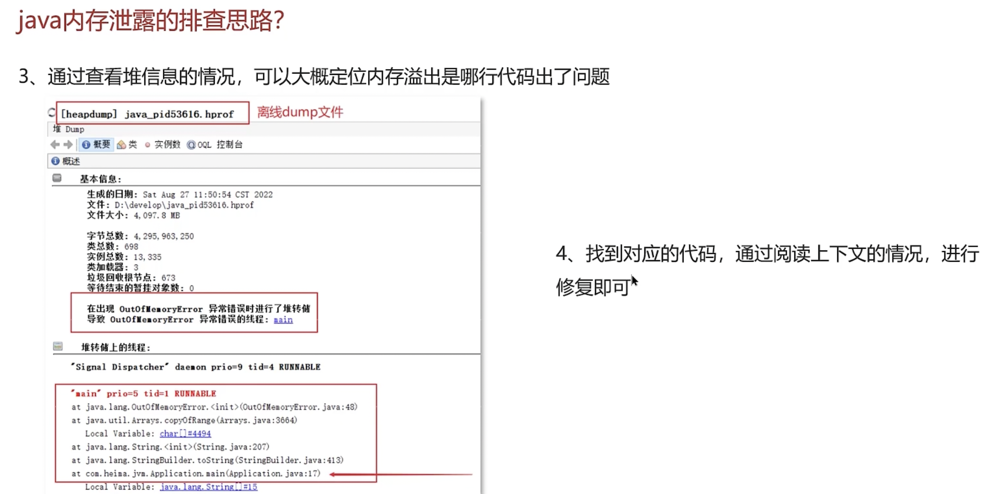

###  CPU飙高


#  企业场景

##  设计模式

###  工厂设计模式

**开闭原则：扩展开放，修改关闭，即不修改原代码。**


####  简单工厂模式

> [!TIP]
>
> 并不是设计模式，SimpleCoffeFactory仍然是耦合的，只是多包装了一层。
>
> >  类图中的符号
> >
> > - +：表示public
> > - -：表示private
> > - \#：表示protected
>
>  泛化关系(继承)用带空心三角箭头的实线来表示
>
>  实现用带空心三角箭头的虚线来表示
>
>  依赖关系使用带箭头的虚线来表示


####  工厂方法模式

> [!TIP]
>
> **这样，只需要增加产品和对应的产品工厂，而不需要修改原代码，实现解耦。**


####  抽象工厂模式

> [!TIP]
>
> **不同接口基于产品等级，工厂基于产品族。**


```java
// 抽象产品：按钮接口
interface Button {
    void render();
}

// 抽象产品：文本框接口
interface TextBox {
    void display();
}

// 具体产品：Windows风格按钮
class WindowsButton implements Button {
    @Override
    public void render() {
        System.out.println("渲染Windows风格按钮");
    }
}

// 具体产品：Windows风格文本框
class WindowsTextBox implements TextBox {
    @Override
    public void display() {
        System.out.println("显示Windows风格文本框");
    }
}

// 具体产品：MacOS风格按钮
class MacOSButton implements Button {
    @Override
    public void render() {
        System.out.println("渲染MacOS风格按钮");
    }
}

// 具体产品：MacOS风格文本框
class MacOSTextBox implements TextBox {
    @Override
    public void display() {
        System.out.println("显示MacOS风格文本框");
    }
}

// 抽象工厂接口
interface GUIFactory {
    Button createButton();
    TextBox createTextBox();
}

// 具体工厂：Windows工厂
class WindowsFactory implements GUIFactory {
    @Override
    public Button createButton() {
        return new WindowsButton();
    }

    @Override
    public TextBox createTextBox() {
        return new WindowsTextBox();
    }
}

// 具体工厂：MacOS工厂
class MacOSFactory implements GUIFactory {
    @Override
    public Button createButton() {
        return new MacOSButton();
    }

    @Override
    public TextBox createTextBox() {
        return new MacOSTextBox();
    }
}

// 客户端代码
public class Client {
    public static void main(String[] args) {
        // 创建Windows风格UI组件
        GUIFactory windowsFactory = new WindowsFactory();
        Button winButton = windowsFactory.createButton();
        TextBox winTextBox = windowsFactory.createTextBox();
        winButton.render();    // 输出：渲染Windows风格按钮
        winTextBox.display();  // 输出：显示Windows风格文本框

        // 创建MacOS风格UI组件
        GUIFactory macFactory = new MacOSFactory();
        Button macButton = macFactory.createButton();
        TextBox macTextBox = macFactory.createTextBox();
        macButton.render();    // 输出：渲染MacOS风格按钮
        macTextBox.display();  // 输出：显示MacOS风格文本框
    }
}
```

###  策略模式

> [!TIP]
>
> 1. **消除条件分支**
>    - 避免在代码中使用大量`if-else`判断支付方式，提升可维护性。
> 2. **运行时动态切换**
>    - 通过`setStrategy()`方法实时切换算法逻辑，灵活应对业务变化。
> 3. 开闭原则
>
> **策略模式与工厂模式有何区别？**
>
> - **策略模式**：关注算法替换，行为型模式，运行时动态选择逻辑。
> - **工厂模式**：关注对象创建，创建型模式，隐藏实例化细节。
>
> **如何避免策略类数量爆炸？**
>
> - 使用Lambda表达式简化（Java 8+）


```java
// 策略接口：定义算法族
interface PaymentStrategy {
    void pay(double amount);
}

// 具体策略类：支付宝支付
class AlipayStrategy implements PaymentStrategy {
    @Override
    public void pay(double amount) {
        System.out.printf("使用支付宝支付：%.2f元\n", amount);
        // 实际调用支付宝API的逻辑...
    }
}

// 具体策略类：微信支付
class WechatPayStrategy implements PaymentStrategy {
    @Override
    public void pay(double amount) {
        System.out.printf("使用微信支付：%.2f元\n", amount);
        // 实际调用微信支付API的逻辑...
    }
}

// 具体策略类：银行卡支付
class BankCardStrategy implements PaymentStrategy {
    private final String cardNumber;
    
    public BankCardStrategy(String cardNumber) {
        this.cardNumber = cardNumber;
    }
    
    @Override
    public void pay(double amount) {
        System.out.printf("使用银行卡(%s)支付：%.2f元\n", cardNumber, amount);
        // 实际调用银行网关的逻辑...
    }
}

// 上下文类：封装策略调用
class PaymentContext {
    private PaymentStrategy strategy;

    public PaymentContext(PaymentStrategy strategy) {
        this.strategy = strategy;
    }

    public void setStrategy(PaymentStrategy strategy) {
        this.strategy = strategy;
    }

    public void executePayment(double amount) {
        strategy.pay(amount);
    }
}

// 客户端代码
public class Client {
    public static void main(String[] args) {
        // 使用支付宝支付
        PaymentContext context = new PaymentContext(new AlipayStrategy());
        context.executePayment(100.50);  // 输出：使用支付宝支付：100.50元
        
        // 动态切换为微信支付
        context.setStrategy(new WechatPayStrategy());
        context.executePayment(200.00);  // 输出：使用微信支付：200.00元
        
        // 使用银行卡支付（需传递参数）
        context.setStrategy(new BankCardStrategy("6226-1234-5678-9012"));
        context.executePayment(300.00);  // 输出：使用银行卡(6226-1234-5678-9012)支付：300.00元
    }
}
```

###  综合案例（登录功能）

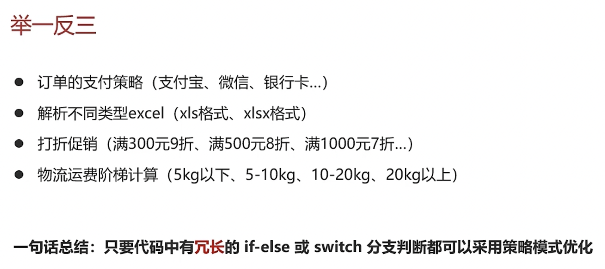

> [!TIP]
>
> 改造前，登录方式由if-else完成，耦合度高，违反开闭原则
>
> **配置文件中，type类型和对应的策略方式在Spring容器中的Bean名称，策略交给Spring容器管理。**
>
> **后续增加功能只需修改配置文件，增加对应的Bean策略。**


#### 具体实现

**请求参数：LoginReq**

```java
@Data
 public class LoginReq {
 
     private String name;
     private String password;
 
     private String phone;
     private String validateCode;//手机验证码
 
     private String wxCode;//用于微信登录
     /**
      * account : 用户名密码登录
      * sms : 手机验证码登录
      * we_chat : 微信登录
      */
     private String type;
 }
```

**响应参数：LoginResp**

```java
 @Data
 public class LoginResp{
     private Integer userId;
     private String userName;
     private String roleCode;
     private String token; //jwt令牌
     private boolean success;
 
 }
```

**控制层LoginController**

```java
 @RestController
 @RequestMapping("/api/user")
 public class LoginController {
 
     @Autowired
     private UserService userService;
 
 
     @PostMapping("/login")
     public LoginResp login(@RequestBody LoginReq loginReq){
         return userService.login(loginReq);
     }
 }
```

**改造service代码**

```java
 @Service
 public class UserService {
 
     @Autowired
     private UserLoginFactory factory;
 
     public LoginResp login(LoginReq loginReq){
 
         UserGranter granter = factory.getGranter(loginReq.getType());
         if(granter == null){
             LoginResp loginResp = new LoginResp();
             loginResp.setSuccess(false);
             return loginResp;
         }
         LoginResp loginResp = granter.login(loginReq);
         return loginResp;
     }
 }
```

**抽象策略类：UserGranter**

```java
/**
 * 抽象策略类
 */
public interface UserGranter{

   /**
    * 获取数据
    * @param loginReq 传入的参数
    * @return map值
    */
   LoginResp login(LoginReq loginReq);
}
```

**具体的策略：AccountGranter、SmsGranter、WeChatGranter（分成三个类）**

```java
/**
 * 策略：账号登录
 **/
@Component
public class AccountGranter implements UserGranter{

        @Override
        public LoginResp login(LoginReq loginReq) {

                System.out.println("登录方式为账号登录" + loginReq);
                // TODO
                // 执行业务操作 
                
                return new LoginResp();
        }
}
/**
 * 策略:短信登录
 */
@Component
public class SmsGranter implements UserGranter{

        @Override
        public LoginResp login(LoginReq loginReq)  {

                System.out.println("登录方式为短信登录" + loginReq);
                // TODO
                // 执行业务操作

                return new LoginResp();
        }
}
/**
 * 策略:微信登录
 */
@Component
public class WeChatGranter implements UserGranter{

        @Override
        public LoginResp login(LoginReq loginReq)  {

                System.out.println("登录方式为微信登录" + loginReq);
                // TODO
                // 执行业务操作
                
                return new LoginResp();
        }
}
```

**工程类：UserLoginFactory**

```java
/**
 * 操作策略的上下文环境类 工具类
 * 将策略整合起来 方便管理
 */
@Component
public class UserLoginFactory implements ApplicationContextAware {

    private static Map<String, UserGranter> granterPool = new ConcurrentHashMap<>();

    @Autowired
    private LoginTypeConfig loginTypeConfig;

    /**
     * 从配置文件中读取策略信息存储到map中
     * {
     * account:accountGranter,
     * sms:smsGranter,
     * we_chat:weChatGranter
     * }
     *
     * @param applicationContext
     * @throws BeansException
     */
    @Override
    public void setApplicationContext(ApplicationContext applicationContext) throws BeansException {
        loginTypeConfig.getTypes().forEach((k, y) -> {
            granterPool.put(k, (UserGranter) applicationContext.getBean(y));
        });
    }

    /**
     * 对外提供获取具体策略
     *
     * @param grantType 用户的登录方式，需要跟配置文件中匹配
     * @return 具体策略
     */
    public UserGranter getGranter(String grantType) {
        UserGranter tokenGranter = granterPool.get(grantType);
        return tokenGranter;
    }

}
```

**读取数据配置类**

```java
 @Getter
 @Setter
 @Configuration
 @ConfigurationProperties(prefix = "login")
 public class LoginTypeConfig {
 
     private Map<String,String> types;
 
 }
```

**在application.yml文件中新增自定义配置**

```yaml
login:
  types:
    account: accountGranter
    sms: smsGranter
    we_chat: weChatGranter
```

###  责任链模式

> [!TIP]
>
> **鸡翅club中的提交题解的文本或者博客审核！！！**


#### 具体实现


**抽象处理者**

```java
package com.itheima.designpattern.chain;

/**
 * 抽象处理者
 */
public abstract class Handler {

    protected Handler handler;

    public void setNext(Handler handler) {
        this.handler = handler;
    }

    /**
     * 处理过程
     * 需要子类进行实现
     */
    public abstract void process(OrderInfo order);
}
```

**订单信息类：**

```java
package com.itheima.designpattern.chain;


import java.math.BigDecimal;

public class OrderInfo {

    private String productId;
    private String userId;

    private BigDecimal amount;

    public String getProductId() {
        return productId;
    }

    public void setProductId(String productId) {
        this.productId = productId;
    }

    public String getUserId() {
        return userId;
    }

    public void setUserId(String userId) {
        this.userId = userId;
    }

    public BigDecimal getAmount() {
        return amount;
    }

    public void setAmount(BigDecimal amount) {
        this.amount = amount;
    }
}
```

**具体处理者：**

```java
/**
 * 订单校验
 */
public class OrderValidition extends Handler {

    @Override
    public void process(OrderInfo order) {
        System.out.println("校验订单基本信息");
        //校验
        handler.process(order);
    }

}

/**
 * 补充订单信息
 */
public class OrderFill extends Handler {
    @Override
    public void process(OrderInfo order) {
        System.out.println("补充订单信息");
        handler.process(order);
    }

}

/**
 * 计算金额
 */
public class OrderAmountCalcuate extends Handler {
    @Override
    public void process(OrderInfo order) {
        System.out.println("计算金额-优惠券、VIP、活动打折");
        handler.process(order);
    }

}

/**
 * 订单入库
 */
public class OrderCreate extends Handler {
    @Override
    public void process(OrderInfo order) {
        System.out.println("订单入库");
    }
}

```

**客户类：**

```java
public class Application {

    public static void main(String[] args) {
        //检验订单
        Handler orderValidition = new OrderValidition();
        //补充订单信息
        Handler orderFill = new OrderFill();
        //订单算价
        Handler orderAmountCalcuate = new OrderAmountCalcuate();
        //订单落库
        Handler orderCreate = new OrderCreate();

        //设置责任链路
        orderValidition.setNext(orderFill);
        orderFill.setNext(orderAmountCalcuate);
        orderAmountCalcuate.setNext(orderCreate);

        //开始执行
        orderValidition.process(new OrderInfo());
    }

}
```

##  技术场景

###  单点登录


###  权限认证


###  上传数据的安全性


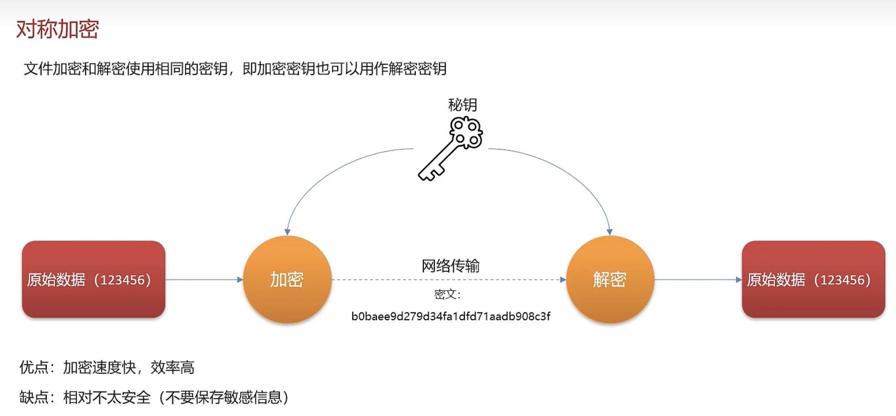


###  遇到的问题

> [!TIP]
>
> 准备1，3


###  日志采集


###  常见的日志命令

> [!TIP]
>
> head -n 200 logfile.log | tail -n 101
>
> - head -n 200：获取前 200 行。
> - tail -n 101：从上述结果中提取最后 101 行，即第 100 到第 200 行。 


###  生产问题排查


###  快速定位系统性能瓶颈


